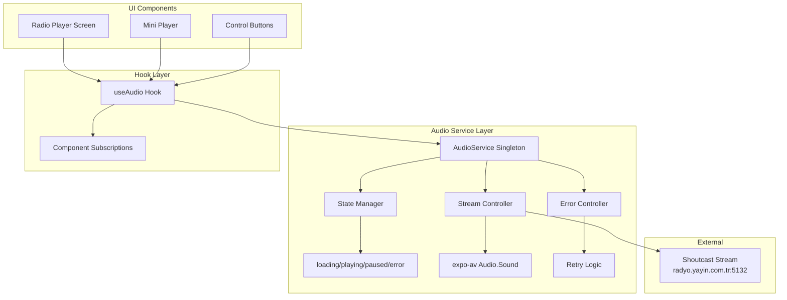
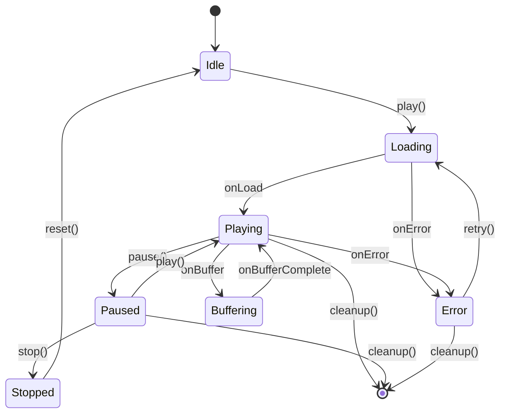

# Design: Audio Streaming Service

## Overview
This design document details the technical implementation of an audio streaming service for Trend Ankara radio app, featuring a singleton service pattern, Shoutcast stream integration, and robust state management with expo-av library.

## Architecture

### Service Architecture



### State Management Flow



## Detailed Design

### 1. Audio Service Singleton

**File:** `services/audio/AudioService.ts`

```typescript
import { Audio, AVPlaybackStatus } from 'expo-av';

export type AudioState =
  | 'idle'
  | 'loading'
  | 'playing'
  | 'paused'
  | 'stopped'
  | 'buffering'
  | 'error';

export interface AudioStatus {
  state: AudioState;
  isPlaying: boolean;
  duration?: number;
  position?: number;
  error?: string;
}

class AudioService {
  private static instance: AudioService;
  private sound: Audio.Sound | null = null;
  private listeners: Set<(status: AudioStatus) => void> = new Set();
  private currentStatus: AudioStatus = {
    state: 'idle',
    isPlaying: false,
  };

  private readonly STREAM_URL = 'https://radyo.yayin.com.tr:5132/';

  private constructor() {
    this.initializeAudio();
  }

  public static getInstance(): AudioService {
    if (!AudioService.instance) {
      AudioService.instance = new AudioService();
    }
    return AudioService.instance;
  }

  private async initializeAudio(): Promise<void> {
    try {
      await Audio.setAudioModeAsync({
        staysActiveInBackground: true,
        playsInSilentModeIOS: true,
        shouldDuckAndroid: true,
        playThroughEarpieceAndroid: false,
      });
    } catch (error) {
      console.error('Failed to initialize audio mode:', error);
    }
  }

  public async play(): Promise<void> {
    // Implementation details below
  }

  public async pause(): Promise<void> {
    // Implementation details below
  }

  public async stop(): Promise<void> {
    // Implementation details below
  }

  public subscribe(listener: (status: AudioStatus) => void): () => void {
    this.listeners.add(listener);
    return () => this.listeners.delete(listener);
  }

  private notifyListeners(): void {
    this.listeners.forEach(listener => listener(this.currentStatus));
  }
}

export default AudioService;
```

### 2. Audio Hook Implementation

**File:** `hooks/useAudio.ts`

```typescript
import { useEffect, useState, useCallback } from 'react';
import AudioService, { AudioStatus } from '@/services/audio/AudioService';

export function useAudio() {
  const [status, setStatus] = useState<AudioStatus>({
    state: 'idle',
    isPlaying: false,
  });

  const audioService = AudioService.getInstance();

  useEffect(() => {
    const unsubscribe = audioService.subscribe((newStatus) => {
      setStatus(newStatus);
    });

    return unsubscribe;
  }, []);

  const play = useCallback(async () => {
    try {
      await audioService.play();
    } catch (error) {
      console.error('Play failed:', error);
    }
  }, [audioService]);

  const pause = useCallback(async () => {
    try {
      await audioService.pause();
    } catch (error) {
      console.error('Pause failed:', error);
    }
  }, [audioService]);

  const stop = useCallback(async () => {
    try {
      await audioService.stop();
    } catch (error) {
      console.error('Stop failed:', error);
    }
  }, [audioService]);

  return {
    status,
    play,
    pause,
    stop,
    isPlaying: status.isPlaying,
    state: status.state,
  };
}
```

### 3. Stream Controller Implementation

**File:** `services/audio/StreamController.ts`

```typescript
import { Audio, AVPlaybackStatus } from 'expo-av';

export class StreamController {
  private sound: Audio.Sound | null = null;
  private retryCount = 0;
  private readonly MAX_RETRIES = 3;
  private readonly RETRY_DELAY = 2000;

  async loadStream(url: string, onStatusUpdate: (status: AVPlaybackStatus) => void): Promise<Audio.Sound> {
    try {
      if (this.sound) {
        await this.unloadStream();
      }

      const { sound } = await Audio.Sound.createAsync(
        { uri: url },
        { shouldPlay: false },
        onStatusUpdate
      );

      this.sound = sound;
      this.retryCount = 0;
      return sound;
    } catch (error) {
      if (this.retryCount < this.MAX_RETRIES) {
        this.retryCount++;
        await this.delay(this.RETRY_DELAY);
        return this.loadStream(url, onStatusUpdate);
      }
      throw error;
    }
  }

  async unloadStream(): Promise<void> {
    if (this.sound) {
      await this.sound.unloadAsync();
      this.sound = null;
    }
  }

  private delay(ms: number): Promise<void> {
    return new Promise(resolve => setTimeout(resolve, ms));
  }

  getSound(): Audio.Sound | null {
    return this.sound;
  }
}
```

### 4. Error Handling Strategy

**File:** `services/audio/ErrorHandler.ts`

```typescript
export enum AudioError {
  NETWORK_ERROR = 'NETWORK_ERROR',
  STREAM_UNAVAILABLE = 'STREAM_UNAVAILABLE',
  PERMISSION_DENIED = 'PERMISSION_DENIED',
  AUDIO_FOCUS_LOST = 'AUDIO_FOCUS_LOST',
  UNKNOWN_ERROR = 'UNKNOWN_ERROR',
}

export class AudioErrorHandler {
  static handleError(error: any): { type: AudioError; message: string } {
    if (error.message?.includes('network')) {
      return {
        type: AudioError.NETWORK_ERROR,
        message: 'İnternet bağlantısı yok',
      };
    }

    if (error.message?.includes('404') || error.message?.includes('stream')) {
      return {
        type: AudioError.STREAM_UNAVAILABLE,
        message: 'Yayın şu anda kullanılamıyor',
      };
    }

    if (error.message?.includes('permission')) {
      return {
        type: AudioError.PERMISSION_DENIED,
        message: 'Ses izni gerekli',
      };
    }

    return {
      type: AudioError.UNKNOWN_ERROR,
      message: 'Bir hata oluştu. Lütfen tekrar deneyin',
    };
  }

  static shouldRetry(errorType: AudioError): boolean {
    return errorType === AudioError.NETWORK_ERROR ||
           errorType === AudioError.STREAM_UNAVAILABLE;
  }
}
```

### 5. Configuration Constants

**File:** `constants/audio.ts`

```typescript
export const AudioConfig = {
  STREAM_URL: 'https://radyo.yayin.com.tr:5132/',

  // Audio Mode Settings
  AUDIO_MODE: {
    staysActiveInBackground: true,
    playsInSilentModeIOS: true,
    shouldDuckAndroid: true,
    playThroughEarpieceAndroid: false,
    interruptionModeIOS: Audio.INTERRUPTION_MODE_IOS_DO_NOT_MIX,
    interruptionModeAndroid: Audio.INTERRUPTION_MODE_ANDROID_DO_NOT_MIX,
  },

  // Retry Configuration
  MAX_RETRIES: 3,
  RETRY_DELAY: 2000,

  // Buffer Configuration
  BUFFER_CONFIG: {
    minBufferMs: 15000,
    maxBufferMs: 50000,
    bufferForPlaybackMs: 2500,
    bufferForPlaybackAfterRebufferMs: 5000,
  },
} as const;
```

## Implementation Patterns

### Pattern 1: Service Initialization
```typescript
// In app startup or root component
import AudioService from '@/services/audio/AudioService';

// Initialize singleton early
const audioService = AudioService.getInstance();
```

### Pattern 2: Using Audio in Components
```typescript
import { useAudio } from '@/hooks/useAudio';

export function PlayButton() {
  const { play, pause, isPlaying, state } = useAudio();

  const handlePress = () => {
    if (isPlaying) {
      pause();
    } else {
      play();
    }
  };

  return (
    <TouchableOpacity onPress={handlePress}>
      <IconSymbol
        name={isPlaying ? 'pause.circle.fill' : 'play.circle.fill'}
        size={64}
        color="#DC2626"
      />
      {state === 'loading' && <ActivityIndicator />}
    </TouchableOpacity>
  );
}
```

### Pattern 3: Error Display
```typescript
import { useAudio } from '@/hooks/useAudio';

export function ErrorMessage() {
  const { status } = useAudio();

  if (status.state !== 'error') return null;

  return (
    <ThemedText style={styles.error}>
      {status.error || 'Bir hata oluştu'}
    </ThemedText>
  );
}
```

## State Management

### Internal State Management
- AudioService maintains its own state internally
- Uses observer pattern for state updates
- Components subscribe via useAudio hook
- No external state management library required initially

### State Transitions
1. **Idle → Loading**: When play() is called
2. **Loading → Playing**: When stream loads successfully
3. **Loading → Error**: When stream fails to load
4. **Playing → Paused**: When pause() is called
5. **Playing → Buffering**: When stream buffers
6. **Paused → Playing**: When play() resumes
7. **Any → Stopped**: When stop() is called
8. **Error → Loading**: When retry is attempted

## API Design

### AudioService Public API
```typescript
interface IAudioService {
  play(): Promise<void>;
  pause(): Promise<void>;
  stop(): Promise<void>;
  getStatus(): AudioStatus;
  isPlaying(): boolean;
  subscribe(listener: (status: AudioStatus) => void): () => void;
}
```

### useAudio Hook API
```typescript
interface UseAudioReturn {
  status: AudioStatus;
  play: () => Promise<void>;
  pause: () => Promise<void>;
  stop: () => Promise<void>;
  isPlaying: boolean;
  state: AudioState;
}
```

## Testing Strategy

### Unit Tests
- Test AudioService singleton pattern
- Test state transitions
- Test error handling logic
- Mock expo-av for testing

### Integration Tests
- Test audio playback with real stream
- Test network interruption handling
- Test background playback
- Test audio interruptions

### Manual Testing
- Test on iOS device
- Test on Android device
- Test background modes
- Test with poor network

## Migration Plan

### Phase 1: Core Service
1. Install expo-av
2. Create AudioService singleton
3. Implement basic play/pause

### Phase 2: Hook Integration
1. Create useAudio hook
2. Connect to Radio Player screen
3. Add loading states

### Phase 3: Error Handling
1. Implement error handler
2. Add retry logic
3. Add user feedback

### Phase 4: Polish
1. Background playback
2. Interruption handling
3. Performance optimization

## Security Considerations
- Stream URL uses HTTPS when available
- No sensitive data in audio service
- Proper cleanup to prevent memory leaks
- Rate limiting on retry attempts

## Performance Implications
- Singleton pattern: Single instance, low memory
- Event listeners: Proper cleanup required
- Background mode: Battery usage consideration
- Network usage: ~128kbps for stream

## Accessibility
- Audio state announced to screen readers
- Visual feedback for all states
- Alternative text for play/pause buttons
- Error messages in Turkish

## Edge Cases

### Network Changes
- WiFi to Cellular: Automatic stream continuation
- Network Loss: Buffering state, then retry
- Network Recovery: Automatic reconnection

### App Lifecycle
- Background: Continue playing with notification
- Foreground Return: Update UI with current state
- Termination: Proper cleanup

### Audio Interruptions
- Phone Call: Pause and resume after
- Other Audio App: Handle based on priority
- Notification Sound: Duck audio temporarily

## Dependencies on Existing Code
- `hooks/` directory structure exists
- TypeScript configured
- Expo Router for navigation
- Theme system for UI components

## Future Considerations
1. **Volume Control**: Add volume slider
2. **Metadata Display**: Show current song/program
3. **Recording**: Save stream segments
4. **Multiple Streams**: Support for different quality streams
5. **Analytics**: Track listening statistics
6. **Offline Caching**: Cache recent segments for replay