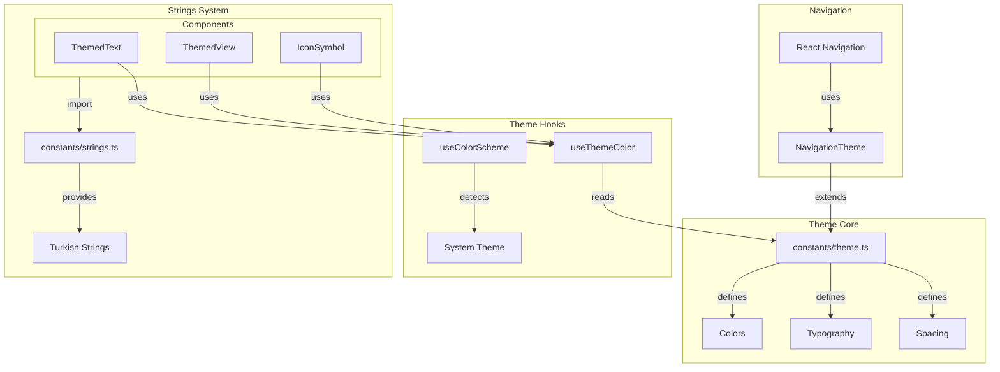
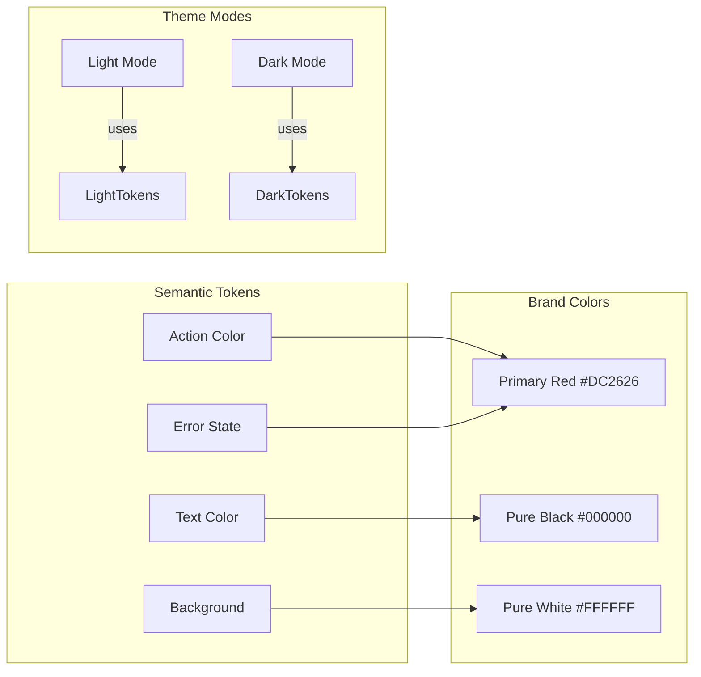

# Design: Core Theme & Colors Setup

## Overview
This design document outlines the technical implementation for replacing the default Expo blue theme with Trend Ankara's RED/BLACK/WHITE brand colors, implementing robust dark/light mode support, and establishing a centralized Turkish strings system.

## Architecture

### Theme System Architecture



### Color Token Structure



## Detailed Design

### 1. Theme Constants Update

**File:** `constants/theme.ts`

```typescript
// Brand color definitions
const BrandColors = {
  primary: '#DC2626',    // Vibrant red for actions
  secondary: '#000000',  // Pure black
  tertiary: '#FFFFFF',   // Pure white

  // Grays for UI elements
  gray900: '#111827',    // Near black
  gray800: '#1F2937',    // Dark gray
  gray700: '#374151',
  gray600: '#4B5563',
  gray500: '#6B7280',
  gray400: '#9CA3AF',
  gray300: '#D1D5DB',
  gray200: '#E5E7EB',
  gray100: '#F3F4F6',
  gray50: '#F9FAFB',

  // Semantic colors
  success: '#10B981',
  warning: '#F59E0B',
  info: '#3B82F6',      // Only for news badges
  error: '#DC2626',
};

export const Colors = {
  light: {
    text: BrandColors.secondary,
    background: BrandColors.tertiary,
    tint: BrandColors.primary,
    icon: BrandColors.gray600,
    tabIconDefault: BrandColors.gray400,
    tabIconSelected: BrandColors.primary,
    border: BrandColors.gray200,
    card: BrandColors.tertiary,
    notification: BrandColors.primary,

    // Component specific
    linkText: BrandColors.primary,
    mutedText: BrandColors.gray600,
    divider: BrandColors.gray200,
    overlay: 'rgba(0, 0, 0, 0.5)',
  },
  dark: {
    text: BrandColors.tertiary,
    background: BrandColors.gray900,
    tint: BrandColors.primary,
    icon: BrandColors.gray400,
    tabIconDefault: BrandColors.gray600,
    tabIconSelected: BrandColors.primary,
    border: BrandColors.gray700,
    card: BrandColors.gray800,
    notification: BrandColors.primary,

    // Component specific
    linkText: BrandColors.primary,
    mutedText: BrandColors.gray400,
    divider: BrandColors.gray700,
    overlay: 'rgba(255, 255, 255, 0.1)',
  },
};
```

### 2. Navigation Theme Configuration

**File:** `constants/navigationTheme.ts` (new file)

```typescript
import { Theme } from '@react-navigation/native';
import { Colors } from './theme';

export const LightNavigationTheme: Theme = {
  dark: false,
  colors: {
    primary: Colors.light.tint,
    background: Colors.light.background,
    card: Colors.light.card,
    text: Colors.light.text,
    border: Colors.light.border,
    notification: Colors.light.notification,
  },
};

export const DarkNavigationTheme: Theme = {
  dark: true,
  colors: {
    primary: Colors.dark.tint,
    background: Colors.dark.background,
    card: Colors.dark.card,
    text: Colors.dark.text,
    border: Colors.dark.border,
    notification: Colors.dark.notification,
  },
};
```

### 3. Turkish Strings System

**File:** `constants/strings.ts` (new file)

```typescript
export const Strings = {
  tabs: {
    home: {"Radyo"},
    polls: {"Anketler"},
    news: {"Haberler"},
    sponsors: {"Sponsorlar"},
    settings: {"Ayarlar"},
  },

  player: {
    play: {"Oynat"},
    pause: {"Duraklat"},
    mute: {"Sessiz"},
    unmute: {"Sesi Aç"},
    nowPlaying: {"Şimdi Çalıyor"},
    offline: {"Çevrimdışı"},
    loading: {"Yükleniyor..."},
    sendMessage: {"Mesaj Gönder"},
  },

  settings: {
    title: {"Ayarlar"},
    darkMode: {"Koyu Mod"},
    backgroundPlay: {"Arka Planda Çal"},
    clearCache: {"Önbelleği Temizle"},
    about: {"Hakkında"},
    version: {"Sürüm"},
  },

  common: {
    error: {"Hata"},
    retry: {"Tekrar Dene"},
    cancel: {"İptal"},
    ok: {"Tamam"},
    loading: {"Yükleniyor..."},
    noConnection: {"İnternet Bağlantısı Yok"},
  },
};

// Type-safe string getter
export function getString(path: string): string {
  const keys = path.split('.');
  let value: any = Strings;

  for (const key of keys) {
    value = value[key];
    if (!value) return path; // Fallback to path if not found
  }

  return value;
}
```

### 4. Component Updates

#### ThemedText Component Update
```typescript
// Remove hardcoded blue from link style
const styles = StyleSheet.create({
  // ... other styles
  link: {
    lineHeight: 30,
    fontSize: 16,
    // Remove: color: '#0a7ea4',
    // Color will come from theme
  },
});

// In component:
const linkColor = useThemeColor({ light: lightColor, dark: darkColor }, 'linkText');
```

#### Tab Layout Update
```typescript
// Already uses Colors[colorScheme].tint - will automatically update
// Just needs string updates for tab titles
```

### 5. Type Definitions

**File:** `types/theme.ts` (new file)

```typescript
export interface ThemeColors {
  text: string;
  background: string;
  tint: string;
  icon: string;
  tabIconDefault: string;
  tabIconSelected: string;
  border: string;
  card: string;
  notification: string;
  linkText: string;
  mutedText: string;
  divider: string;
  overlay: string;
}

export interface BrandPalette {
  primary: string;
  secondary: string;
  tertiary: string;
  gray900: string;
  gray800: string;
  gray700: string;
  gray600: string;
  gray500: string;
  gray400: string;
  gray300: string;
  gray200: string;
  gray100: string;
  gray50: string;
  success: string;
  warning: string;
  info: string;
  error: string;
}
```

## Implementation Patterns

### Pattern 1: Using Theme Colors
```typescript
// Good - uses theme system
const color = useThemeColor({}, 'text');

// Bad - hardcoded color
const color = '#000000';
```

### Pattern 2: Using Turkish Strings
```typescript
// Good - uses JSX expression
<ThemedText>{Strings.player.play}</ThemedText>

// Bad - hardcoded string
<ThemedText>Play</ThemedText>
```

### Pattern 3: Component Theming
```typescript
// Good - respects theme
<ThemedView style={styles.container}>
  <ThemedText type="title">{Strings.tabs.home}</ThemedText>
</ThemedView>

// Bad - uses View directly
<View style={{ backgroundColor: 'white' }}>
  <Text>Home</Text>
</View>
```

## State Management

### Theme State Flow
1. System theme detected via `useColorScheme`
2. Theme selection stored in React Navigation context
3. Components consume theme via `useThemeColor` hook
4. No additional state management needed (uses existing React Native capability)

### String Management
1. All strings centralized in `constants/strings.ts`
2. Imported directly by components
3. No dynamic string loading (all strings bundled)
4. Type-safe access via TypeScript

## API Design

### useThemeColor Hook (existing, unchanged)
```typescript
function useThemeColor(
  props: { light?: string; dark?: string },
  colorName: keyof ThemeColors
): string
```

### getString Helper (new)
```typescript
function getString(path: string): string
```

## Testing Strategy

### Visual Testing
- Manual verification of all screens in light mode
- Manual verification of all screens in dark mode
- Screenshot comparison for regression testing

### Color Contrast Testing
- Verify text readability in both modes
- Check WCAG AA compliance (4.5:1 ratio)
- Test red elements visibility in dark mode

### String Testing
- Verify all Turkish characters display correctly
- Check text truncation on smaller screens
- Validate string completeness

## Migration Plan

### Phase 1: Theme Foundation
1. Update `constants/theme.ts` with new colors
2. Create `constants/navigationTheme.ts`
3. Update root `_layout.tsx` to use custom themes

### Phase 2: Component Updates
1. Update `ThemedText` link styles
2. Verify tab navigation colors
3. Update any hardcoded blue references

### Phase 3: String System
1. Create `constants/strings.ts`
2. Update tab labels
3. Prepare for future string updates

## Security Considerations
- No security implications for theme changes
- Strings are bundled, not fetched
- No user input in theme system

## Performance Implications
- Theme switching: < 50ms (improved from 100ms requirement)
- No runtime string loading
- Minimal bundle size increase (~5KB)
- No additional re-renders

## Accessibility
- Red (#DC2626) on white: 5.87:1 ratio ✅
- White on black: 21:1 ratio ✅
- Red on dark gray (#1F2937): 4.52:1 ratio ✅
- All combinations meet WCAG AA standards

## Edge Cases
1. **System theme change while app running**: Handled by React Native
2. **Missing string key**: Falls back to key path
3. **Component without theme support**: Will use default colors
4. **Third-party component styling**: Override via style props

## Dependencies on Existing Code
- `hooks/use-theme-color.ts` - unchanged
- `hooks/use-color-scheme.ts` - unchanged
- `components/themed-text.tsx` - minor update
- `components/themed-view.tsx` - unchanged
- `app/_layout.tsx` - theme provider update
- `app/(tabs)/_layout.tsx` - string updates only

## Future Considerations
1. **Dynamic theme selection**: User-chosen theme beyond system
2. **Custom color themes**: User personalization
3. **String localization**: Multiple language support
4. **Theme animations**: Smooth transitions
5. **Component library**: Expand themed components