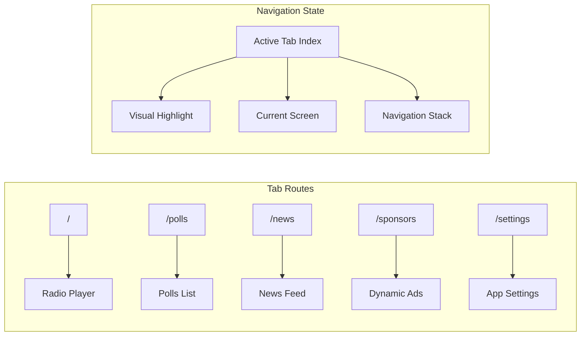

# Design: Navigation Structure

## Overview
This design document details the technical implementation of a 5-tab bottom navigation system for the Trend Ankara radio app, extending the existing 2-tab expo-router setup with Turkish localization, appropriate icons, and proper screen routing.

## Architecture

### Navigation Architecture

```mermaid
graph TB
    subgraph "App Entry"
        Root[app/_layout.tsx] --> TabNav[(tabs)/_layout.tsx]
    end

    subgraph "Bottom Tabs Navigation"
        TabNav --> Radio[index.tsx - Radyo]
        TabNav --> Polls[polls.tsx - Anketler]
        TabNav --> News[news.tsx - Haberler]
        TabNav --> Sponsors[sponsors.tsx - Sponsorlar]
        TabNav --> Settings[settings.tsx - Ayarlar]
    end

    subgraph "Navigation Components"
        TabNav --> HapticTab[HapticTab Component]
        TabNav --> IconSymbol[IconSymbol Component]
        HapticTab --> Haptics[expo-haptics]
        IconSymbol --> SFSymbols[SF Symbols iOS]
        IconSymbol --> MaterialIcons[Material Icons Android]
    end

    subgraph "Theme Integration"
        TabNav --> Colors[constants/theme.ts]
        TabNav --> Strings[constants/strings.ts]
        Colors --> ActiveColor[Red #DC2626]
        Colors --> InactiveColor[Gray Colors]
    end
```

### Screen Routing Flow



## Detailed Design

### 1. Tab Navigation Configuration

**File:** `app/(tabs)/_layout.tsx`

```typescript
import { Tabs } from 'expo-router';
import React from 'react';

import { HapticTab } from '@/components/haptic-tab';
import { IconSymbol } from '@/components/ui/icon-symbol';
import { Colors } from '@/constants/theme';
import { Strings } from '@/constants/strings';
import { useColorScheme } from '@/hooks/use-color-scheme';

export default function TabLayout() {
  const colorScheme = useColorScheme();

  return (
    <Tabs
      screenOptions={{
        tabBarActiveTintColor: Colors[colorScheme ?? 'light'].tint,
        tabBarInactiveTintColor: Colors[colorScheme ?? 'light'].tabIconDefault,
        headerShown: false,
        tabBarButton: HapticTab,
        tabBarStyle: {
          backgroundColor: Colors[colorScheme ?? 'light'].background,
          borderTopColor: Colors[colorScheme ?? 'light'].border,
        },
      }}>
      <Tabs.Screen
        name="index"
        options={{
          title: Strings.tabs.home,
          tabBarIcon: ({ color }) => (
            <IconSymbol size={28} name="play.circle.fill" color={color} />
          ),
        }}
      />
      <Tabs.Screen
        name="polls"
        options={{
          title: Strings.tabs.polls,
          tabBarIcon: ({ color }) => (
            <IconSymbol size={28} name="chart.bar.fill" color={color} />
          ),
        }}
      />
      <Tabs.Screen
        name="news"
        options={{
          title: Strings.tabs.news,
          tabBarIcon: ({ color }) => (
            <IconSymbol size={28} name="newspaper.fill" color={color} />
          ),
        }}
      />
      <Tabs.Screen
        name="sponsors"
        options={{
          title: Strings.tabs.sponsors,
          tabBarIcon: ({ color }) => (
            <IconSymbol size={28} name="megaphone.fill" color={color} />
          ),
        }}
      />
      <Tabs.Screen
        name="settings"
        options={{
          title: Strings.tabs.settings,
          tabBarIcon: ({ color }) => (
            <IconSymbol size={28} name="gearshape.fill" color={color} />
          ),
        }}
      />
    </Tabs>
  );
}
```

### 2. Icon Mapping Extension

**File:** `components/ui/icon-symbol.tsx` (update)

```typescript
const MAPPING = {
  // Existing mappings
  'house.fill': 'home',
  'paperplane.fill': 'send',

  // New tab icon mappings
  'play.circle.fill': 'play-circle-filled',
  'chart.bar.fill': 'bar-chart',
  'newspaper.fill': 'article',
  'megaphone.fill': 'campaign',
  'gearshape.fill': 'settings',

  // Additional utility icons
  'chevron.left.forwardslash.chevron.right': 'code',
  'chevron.right': 'chevron-right',
} as IconMapping;
```

### 3. Screen Components Structure

#### Radio Player Screen (index.tsx)
```typescript
import React from 'react';
import { StyleSheet } from 'react-native';
import { ThemedView } from '@/components/themed-view';
import { ThemedText } from '@/components/themed-text';
import { Strings } from '@/constants/strings';

export default function RadioScreen() {
  return (
    <ThemedView style={styles.container}>
      <ThemedText type="title">{Strings.player.title}</ThemedText>
      {/* Player implementation will come later */}
    </ThemedView>
  );
}

const styles = StyleSheet.create({
  container: {
    flex: 1,
    alignItems: 'center',
    justifyContent: 'center',
  },
});
```

#### Similar structure for other screens:
- `polls.tsx` - Polls listing screen
- `news.tsx` - News feed screen
- `sponsors.tsx` - Dynamic ads screen
- `settings.tsx` - Settings screen

### 4. String Definitions Update

**File:** `constants/strings.ts` (extend existing)

```typescript
export const Strings = {
  tabs: {
    home: "Radyo",
    polls: "Anketler",
    news: "Haberler",
    sponsors: "Sponsorlar",
    settings: "Ayarlar",
  },
  // ... rest of strings
} as const;
```

### 5. Navigation Types

**File:** `types/navigation.ts` (new)

```typescript
export type TabParamList = {
  index: undefined;
  polls: undefined;
  news: undefined;
  sponsors: undefined;
  settings: undefined;
};

export type TabScreenProps<T extends keyof TabParamList> = {
  navigation: BottomTabNavigationProp<TabParamList, T>;
  route: RouteProp<TabParamList, T>;
};
```

## Implementation Patterns

### Pattern 1: Screen Component Structure
```typescript
// Consistent screen component pattern
export default function ScreenName() {
  const colorScheme = useColorScheme();

  return (
    <ThemedView style={styles.container}>
      <SafeAreaView style={styles.safeArea}>
        {/* Screen content */}
      </SafeAreaView>
    </ThemedView>
  );
}
```

### Pattern 2: Tab Configuration
```typescript
// Consistent tab configuration pattern
<Tabs.Screen
  name="routeName"
  options={{
    title: Strings.tabs.tabName,
    tabBarIcon: ({ color }) => (
      <IconSymbol size={28} name="icon.name" color={color} />
    ),
  }}
/>
```

### Pattern 3: Icon Usage
```typescript
// Platform-aware icon rendering
<IconSymbol
  size={28}
  name="sf.symbol.name"
  color={color}
  weight="regular" // or "bold", "semibold"
/>
```

## State Management

### Navigation State
- Managed by React Navigation internally
- Current tab index tracked automatically
- Screen focus/blur events available via hooks
- Tab press events can be intercepted if needed

### Screen State Preservation
- Each tab maintains its own navigation stack
- Screen state preserved when switching tabs
- Use React Context or global state for shared data
- Audio playback state persists across navigation

## API Design

### Navigation Hooks
```typescript
// Available navigation hooks
import { useNavigation, useRoute, useFocusEffect } from '@react-navigation/native';

// Tab-specific navigation
const navigation = useNavigation<BottomTabNavigationProp<TabParamList>>();

// Current route info
const route = useRoute<RouteProp<TabParamList, 'index'>>();

// Screen focus handling
useFocusEffect(
  useCallback(() => {
    // Screen focused
    return () => {
      // Screen blurred
    };
  }, [])
);
```

### Tab Bar Customization
```typescript
// Tab bar options available
screenOptions={{
  tabBarActiveTintColor: string,
  tabBarInactiveTintColor: string,
  tabBarActiveBackgroundColor: string,
  tabBarInactiveBackgroundColor: string,
  tabBarShowLabel: boolean,
  tabBarLabelStyle: TextStyle,
  tabBarIconStyle: TextStyle,
  tabBarItemStyle: ViewStyle,
  tabBarStyle: ViewStyle,
}}
```

## Testing Strategy

### Navigation Testing
- Test all tab navigation paths
- Verify correct screen rendering
- Check tab highlighting logic
- Test haptic feedback on iOS

### Visual Testing
- Verify icons display correctly
- Check Turkish label rendering
- Test dark/light theme adaptation
- Validate active/inactive states

### Platform Testing
- iOS: Test SF Symbols rendering
- Android: Test Material Icons fallback
- Both: Verify tab bar positioning
- Both: Check safe area handling

## Migration Plan

### Phase 1: Extend Tab Structure
1. Update `_layout.tsx` with 5 tabs
2. Create placeholder screen files
3. Extend icon mappings

### Phase 2: Implement Screens
1. Create basic screen components
2. Add proper headers
3. Implement safe area handling

### Phase 3: Polish & Testing
1. Verify all navigation paths
2. Test theme integration
3. Validate Turkish labels
4. Check icon rendering

## Security Considerations
- No security implications for navigation
- Screen access is unrestricted
- No authentication required for tabs
- Deep linking disabled by default

## Performance Implications
- Tab switching: < 50ms
- Icon loading: Bundled, instant
- Memory: ~5 screens in memory
- Bundle size: +10KB for new screens

## Accessibility
- Tab labels announced by screen readers
- Focus indicators provided by framework
- Touch targets meet minimum sizes
- Keyboard navigation supported on web

## Edge Cases

### Small Screen Devices
- Labels may truncate with ellipsis
- Consider `tabBarShowLabel: false` option
- Icons remain at 28px size

### Tablet Layout
- Tab bar scales appropriately
- Additional padding on larger screens
- Same navigation structure maintained

### RTL Support
- Not required (Turkish is LTR)
- Framework handles if needed

## Dependencies on Existing Code
- `expo-router` - File-based routing
- `@react-navigation/bottom-tabs` - Tab navigation
- `components/haptic-tab.tsx` - Haptic feedback
- `components/ui/icon-symbol.tsx` - Icon rendering
- `hooks/use-color-scheme.ts` - Theme detection
- `constants/theme.ts` - Color definitions
- `constants/strings.ts` - Turkish labels

## Future Considerations
1. **Badge Support**: Add notification badges to tabs
2. **Dynamic Tabs**: Show/hide tabs based on user role
3. **Tab Animations**: Custom transition effects
4. **Deep Linking**: Enable URL-based navigation
5. **Analytics**: Track tab usage patterns