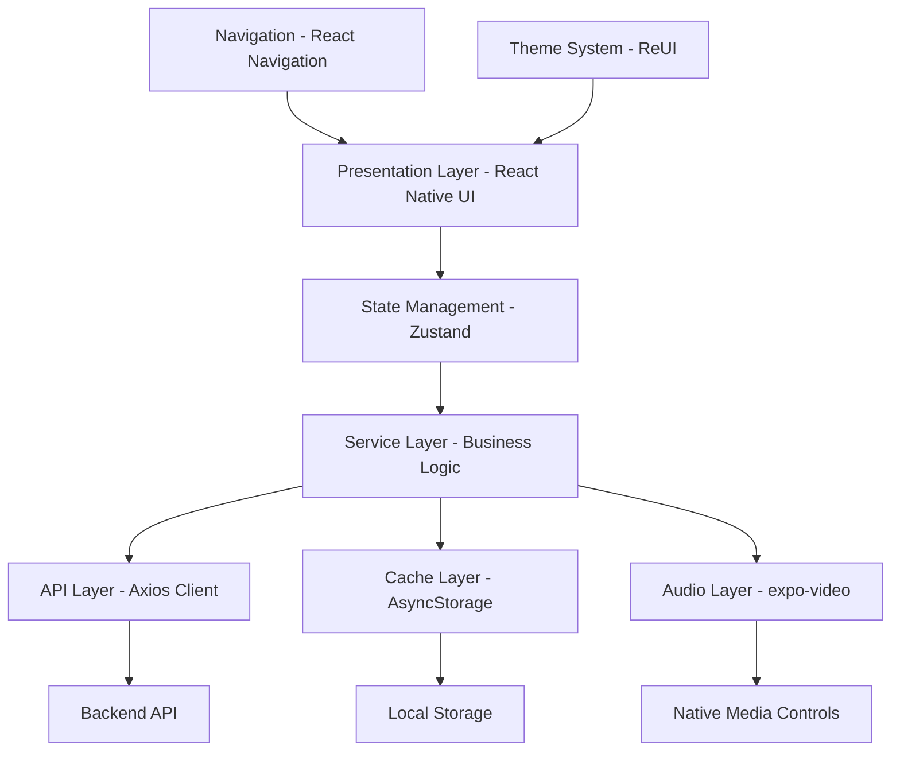
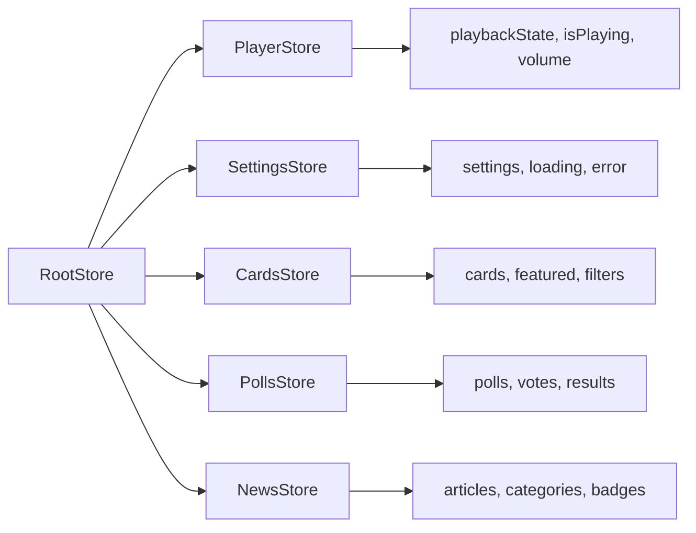
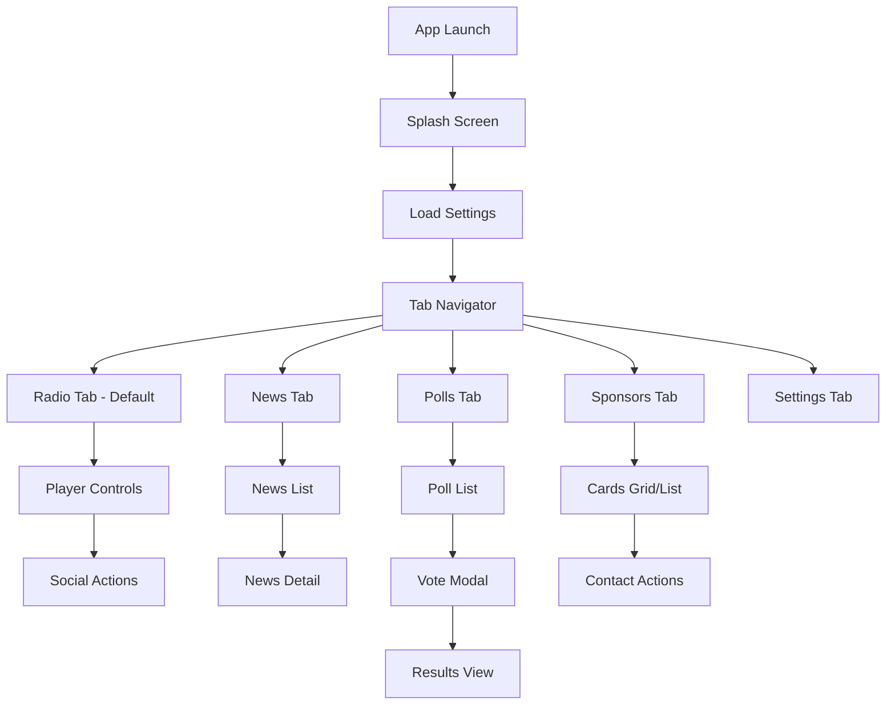

# mobile-app-implementation - Task 26

Execute task 26 for the mobile-app-implementation specification.

## Task Description
Create PollCard component in components/polls/PollCard.tsx

## Code Reuse
**Leverage existing code**: components/themed-view.tsx

## Requirements Reference
**Requirements**: 4.2, 4.4

## Usage
```
/Task:26-mobile-app-implementation
```

## Instructions

Execute with @spec-task-executor agent the following task: "Create PollCard component in components/polls/PollCard.tsx"

```
Use the @spec-task-executor agent to implement task 26: "Create PollCard component in components/polls/PollCard.tsx" for the mobile-app-implementation specification and include all the below context.

# Steering Context
## Steering Documents Context

No steering documents found or all are empty.

# Specification Context
## Specification Context (Pre-loaded): mobile-app-implementation

### Requirements
# Requirements Document - Trend Ankara Mobile Application

## Metadata
- **Feature Name**: mobile-app-implementation
- **Version**: 1.0.0
- **Status**: Draft
- **Created**: 2025-09-28
- **Last Updated**: 2025-09-28

## Introduction

The Trend Ankara Mobile Application is a comprehensive radio streaming and content platform built with React Native. This document outlines the complete requirements for implementing a mobile application that provides live radio streaming with native media controls, dynamic content management, interactive polls, news feeds, and sponsorship integration. The application follows the ReUI design philosophy for consistent user experience across iOS and Android platforms.

## Alignment with Product Vision

This implementation directly supports the product vision of delivering a simple, elegant radio station mobile app that:
- Provides continuous audio streaming entertainment with minimal friction
- Respects users' device resources and data usage through efficient caching and battery-conscious operations
- Enables brand loyalty through consistent, quality streaming experience
- Facilitates sponsor/advertiser reach through dynamic content management
- Engages listeners through interactive polls and media industry news
- Maintains professional brand presence on mobile platforms with RED/BLACK/WHITE color scheme

## Requirements

### Requirement 1: Radio Player with Native Controls

**User Story:** As a radio listener, I want to stream Trend Ankara radio with native media controls, so that I can control playback from my device's lock screen and notification center.

#### Acceptance Criteria

1. WHEN the user opens the app THEN the radio player SHALL display prominently on the main screen with the station logo
2. WHEN the user taps the play button THEN the audio stream SHALL start within 3 seconds
3. WHEN audio is playing THEN native media controls SHALL appear in the device's notification center and lock screen
4. WHEN the user backgrounds the app AND audio is playing THEN playback SHALL continue uninterrupted
5. WHEN the user interacts with native media controls THEN the player state SHALL update accordingly in the app
6. WHEN network connectivity changes THEN the player SHALL handle reconnection gracefully with automatic retry
7. IF the stream URL fails THEN the player SHALL attempt fallback URLs automatically
8. WHEN the user receives a phone call THEN the audio SHALL pause and resume after the call ends

### Requirement 2: Mobile Settings Configuration

**User Story:** As an administrator, I want to configure app settings remotely, so that I can control features and content without app updates.

#### Acceptance Criteria

1. WHEN the app launches THEN it SHALL fetch mobile settings from the `/api/admin/mobile/settings` endpoint
2. IF settings fetch fails THEN the app SHALL use cached settings or defaults
3. WHEN settings are received THEN the app SHALL enable/disable features accordingly (polls, news, live info)
4. WHEN playerLogoUrl is provided THEN the player SHALL display the custom logo
5. WHEN social media URLs are configured THEN the player SHALL show corresponding social buttons
6. IF maintenanceMode is true THEN the app SHALL display a maintenance message
7. WHEN cardDisplayMode is set THEN cards SHALL render in the specified layout (grid/list)
8. WHEN maxFeaturedCards is configured THEN only that number of featured cards SHALL display

### Requirement 3: Dynamic Content Cards

**User Story:** As a user, I want to view and interact with sponsored content cards, so that I can discover relevant services and promotions.

#### Acceptance Criteria

1. WHEN the user navigates to the cards section THEN active cards SHALL load from `/api/mobile/v1/content/cards`
2. WHEN a card has contact options THEN buttons SHALL display for phone, WhatsApp, email, Instagram
3. WHEN the user taps a contact button THEN the appropriate action SHALL launch (dial, WhatsApp, email, Instagram)
4. IF a card has location data THEN a map button SHALL open the device's map application
5. WHEN a card is time-limited AND expired THEN it SHALL not display to users
6. IF a card is featured THEN it SHALL display with a distinctive badge and border
7. WHEN cards are loading THEN a loading indicator SHALL display
8. IF network is unavailable THEN cached cards SHALL display with an offline indicator

### Requirement 4: Interactive Polls System

**User Story:** As a listener, I want to participate in weekly polls, so that I can vote for my favorite content and see results.

#### Acceptance Criteria

1. WHEN polls are enabled in settings THEN the polls tab SHALL be visible
2. WHEN the user opens the polls section THEN current active polls SHALL load
3. IF showOnlyLastActivePoll is true THEN only the most recent poll SHALL display
4. WHEN the user selects an option THEN a vote confirmation SHALL appear
5. WHEN the user submits a vote THEN the device ID SHALL be used to prevent duplicate voting
6. AFTER voting THEN real-time results SHALL display with percentages and counts
7. WHEN polls are loading THEN appropriate loading states SHALL show
8. IF voting fails THEN an error message SHALL display with retry option

### Requirement 5: News Feed Integration

**User Story:** As a user, I want to read media industry news, so that I can stay informed about entertainment and media trends.

#### Acceptance Criteria

1. WHEN news is enabled in settings THEN the news tab SHALL be visible
2. WHEN the user opens news THEN articles SHALL load with pagination support
3. WHEN new articles are available THEN a badge indicator SHALL appear on the tab
4. WHEN the user taps an article THEN the full content SHALL display
5. IF maxNewsCount is set THEN only that many articles SHALL be cached
6. WHEN offline THEN cached news SHALL be available for reading
7. WHEN the user pulls to refresh THEN new content SHALL fetch from the server
8. IF an article has images THEN they SHALL load progressively with placeholders

### Requirement 6: Social Media Integration

**User Story:** As a listener, I want to connect with the radio station on social media, so that I can send messages and follow updates.

#### Acceptance Criteria

1. WHEN social media URLs are configured THEN corresponding buttons SHALL appear in the player
2. WHEN the user taps the WhatsApp button THEN WhatsApp SHALL open with the configured number
3. WHEN the user taps the Instagram button THEN Instagram SHALL open to the station's profile
4. WHEN the user taps the Facebook button THEN Facebook SHALL open to the station's page
5. IF liveCallPhoneNumber is configured THEN a call button SHALL enable on-air calling
6. WHEN social buttons are tapped AND apps aren't installed THEN web fallbacks SHALL open

### Requirement 7: Offline Support & Caching

**User Story:** As a user, I want to access cached content offline, so that I can view previously loaded content without internet.

#### Acceptance Criteria

1. WHEN content is fetched THEN it SHALL be cached locally using AsyncStorage
2. WHEN the app detects offline status THEN cached content SHALL display automatically
3. WHEN returning online THEN the app SHALL sync and update cached content
4. IF cache exceeds size limits THEN oldest content SHALL be purged automatically
5. WHEN cached content is displayed THEN an offline indicator SHALL show
6. WHEN settings are cached THEN they SHALL persist for 7 days maximum
7. IF the user manually refreshes while offline THEN an appropriate message SHALL display

### Requirement 8: Theme & Branding

**User Story:** As a brand stakeholder, I want the app to reflect Trend Ankara's visual identity, so that users have a consistent brand experience.

#### Acceptance Criteria

1. WHEN the app displays THEN it SHALL use only RED (#DC2626), BLACK (#000000), and WHITE (#FFFFFF) as primary colors
2. IF blue is needed THEN it SHALL only be used for news badges (#3B82F6)
3. WHEN in dark mode THEN backgrounds SHALL be black with white text
4. WHEN in light mode THEN backgrounds SHALL be white with black text
5. WHEN buttons are active THEN they SHALL use the brand red color
6. ALL text SHALL use the Inter font family or system defaults
7. WHEN animations occur THEN they SHALL be smooth at 60fps
8. ALL touch targets SHALL be at least 44x44 pixels for accessibility

## Non-Functional Requirements

### Performance
- Audio stream SHALL start within 3 seconds of user interaction
- App launch time SHALL be under 2 seconds on average devices
- UI transitions SHALL maintain 60 fps for smooth animations
- Background audio playback SHALL use minimal battery (< 5% per hour)
- Memory usage SHALL not exceed 150MB during normal operation
- Network data usage SHALL be optimized with compression and caching

### Security
- All API communications SHALL use HTTPS protocol
- No sensitive user data SHALL be stored on the device
- Device ID for polls SHALL be anonymized and non-traceable
- Deep links SHALL be validated before launching external apps
- Input validation SHALL prevent injection attacks

### Reliability
- Audio playback SHALL handle network interruptions with automatic reconnection
- The app SHALL gracefully degrade when backend services are unavailable
- Cached content SHALL persist across app restarts
- Error states SHALL provide clear user feedback and recovery options
- The app SHALL handle audio focus changes (calls, other media apps)

### Usability
- All UI text SHALL be in Turkish using proper localization
- Touch targets SHALL meet minimum size requirements (44x44 iOS, 48x48 Android)
- Loading states SHALL provide visual feedback within 100ms
- Error messages SHALL be user-friendly and actionable
- Navigation SHALL be intuitive with bottom tab structure
- The app SHALL support both portrait and landscape orientations

### Compatibility
- The app SHALL support iOS 13.0+ and Android 6.0+ (API 23+)
- The app SHALL work on both phones and tablets
- The app SHALL handle different screen sizes responsively
- The app SHALL support both WiFi and cellular data connections
- The app SHALL integrate with native OS features (notifications, media controls)

---

### Design
# Design Document - Trend Ankara Mobile Application

## Metadata
- **Feature Name**: mobile-app-implementation
- **Version**: 1.0.0
- **Status**: Draft
- **Created**: 2025-09-28
- **Last Updated**: 2025-09-28

## Overview

This design document outlines the comprehensive architecture for the Trend Ankara Mobile Application, a React Native application built with Expo SDK 54. The application implements a radio streaming platform with native media controls, dynamic content management, interactive polling, and news integration. The design follows the ReUI design philosophy with a RED/BLACK/WHITE color scheme and leverages existing audio services, theme configurations, and component patterns already established in the codebase.

## Steering Document Alignment

### Technical Standards (tech.md)
The design follows documented technical patterns:
- **Expo SDK 54** with React Native 0.81.4 for cross-platform development
- **TypeScript 5.9.2** for type safety with no `any` types
- **React Navigation** for navigation with bottom tabs structure
- **Reanimated 3** for 60fps animations and smooth transitions
- **AsyncStorage** for offline caching and persistence
- **Simple solutions over complexity** - using expo-video for audio with native controls instead of complex custom implementations

### Project Structure (structure.md)
The implementation follows project organization conventions:
- **app/** directory for Expo Router pages with (tabs) layout
- **components/** for reusable UI components organized by feature
- **services/** for business logic with audio, api, cache, and messaging
- **hooks/** for custom React hooks following use* naming
- **constants/** for theme, strings, and configuration
- **types/** for TypeScript definitions
- **PascalCase** for components, **camelCase** for services and utilities

## Code Reuse Analysis

### Existing Components to Leverage
- **VideoPlayerService**: Already implements expo-video with showNowPlayingNotification for native controls
- **Theme Constants**: Complete ReUI color system with BrandColors already defined
- **Navigation Theme**: Tab navigation styling with brand colors configured
- **Animated Components**: SpotlightOrb, AnimatedLogoContainer for player visuals
- **Audio Hooks**: useAudioWithNativeControls for player state management
- **Error Handlers**: AudioService error handling patterns

### Integration Points
- **Audio System**: Extends existing VideoPlayerService for streaming
- **Theme System**: Uses existing BrandColors and theme constants
- **Navigation**: Integrates with existing tab navigation structure
- **State Management**: Will add Zustand stores following existing patterns
- **API Layer**: Will create axios client following service patterns

## Architecture

The application follows a layered architecture with clear separation of concerns:



## Components and Interfaces

### Component 1: RadioPlayerScreen
- **Purpose:** Main radio player interface with native controls integration
- **Interfaces:**
  - `play()`, `pause()`, `togglePlayback()`
  - `onPlaybackStateChange`, `onError`
- **Dependencies:** VideoPlayerService, useAudioWithNativeControls, theme
- **Reuses:** AnimatedLogoContainer, SpotlightOrb for visual effects

### Component 2: SettingsService
- **Purpose:** Manages remote configuration and feature flags
- **Interfaces:**
  - `fetchSettings()`, `getCachedSettings()`, `getDefaultSettings()`
  - `isPollsEnabled()`, `isNewsEnabled()`, `getSocialLinks()`
- **Dependencies:** AsyncStorage, API client
- **Reuses:** Existing cache patterns from services/audio

### Component 3: ContentCardComponent
- **Purpose:** Displays sponsored content with contact actions
- **Interfaces:**
  - `onContactPress(type, value)`, `handleExpiration()`
- **Dependencies:** Linking API, theme system
- **Reuses:** ThemedView, ThemedText components

### Component 4: PollsManager
- **Purpose:** Handles poll voting and results display
- **Interfaces:**
  - `submitVote(pollId, optionId)`, `getResults(pollId)`
  - `preventDuplicateVoting(deviceId)`
- **Dependencies:** Device API, AsyncStorage
- **Reuses:** Error handling patterns from AudioService

### Component 5: NewsListComponent
- **Purpose:** Paginated news feed with offline support
- **Interfaces:**
  - `loadNews(page)`, `refreshNews()`, `getCachedNews()`
- **Dependencies:** FlatList, AsyncStorage, API client
- **Reuses:** Loading and error states from existing patterns

### Component 6: CacheManager
- **Purpose:** Unified caching strategy for all content
- **Interfaces:**
  - `set(key, data, ttl)`, `get(key)`, `purgeOld()`, `clear()`
- **Dependencies:** AsyncStorage
- **Reuses:** Storage patterns from existing services

## Data Models

### MobileSettings Model
```typescript
interface MobileSettings {
  // Poll Settings
  enablePolls: boolean;
  showOnlyLastActivePoll: boolean;

  // News Settings
  enableNews: boolean;
  maxNewsCount: number;

  // Player Settings
  playerLogoUrl: string | null;
  enableLiveInfo: boolean;
  playerFacebookUrl: string | null;
  playerInstagramUrl: string | null;
  playerWhatsappNumber: string | null;
  liveCallPhoneNumber: string | null;

  // Card Settings
  maxFeaturedCards: number;
  cardDisplayMode: 'grid' | 'list';
  enableCardAnimation: boolean;

  // App Settings
  minimumAppVersion: string;
  maintenanceMode: boolean;

  lastUpdated: string;
}
```

### ContentCard Model
```typescript
interface ContentCard {
  id: number;
  title: string;
  description: string;
  imageUrl: string | null;
  redirectUrl: string | null;
  redirectType: 'website' | 'app' | 'internal';

  // Contact Information
  contactEmail: string | null;
  contactPhone: string | null;
  contactWhatsapp: string | null;

  // Social Media
  socialInstagram: string | null;
  socialTiktok: string | null;

  // Location
  locationLatitude: number | null;
  locationLongitude: number | null;
  locationAddress: string | null;

  // Time Limits
  isTimeLimited: boolean;
  validFrom: string | null;
  validUntil: string | null;

  // Display Properties
  isFeatured: boolean;
  displayOrder: number;
  isActive: boolean;
  createdAt: string;
  updatedAt: string;
}
```

### Poll Model
```typescript
interface Poll {
  id: number;
  question: string;
  description: string | null;
  options: PollOption[];
  isActive: boolean;
  startDate: string;
  endDate: string | null;
  totalVotes: number;
  userHasVoted: boolean;
  createdAt: string;
}

interface PollOption {
  id: number;
  text: string;
  voteCount: number;
  percentage: number;
}
```

### News Model
```typescript
interface NewsArticle {
  id: number;
  slug: string;
  title: string;
  excerpt: string;
  content: string;
  imageUrl: string | null;
  category: string;
  publishedAt: string;
  author: string | null;
  readTime: number;
  isNew: boolean;
}
```

## API Integration Design

### API Client Configuration
```typescript
class ApiClient {
  private baseURL = 'https://trendankara.com/api/mobile/v1';
  private timeout = 30000;
  private retryAttempts = 3;

  // Interceptors for auth, retry logic, and caching
  // Request/response transformation
  // Error handling with fallback to cache
}
```

### Endpoint Structure
- **GET** `/admin/mobile/settings` - Mobile configuration
- **GET** `/radio` - Radio stream configuration
- **GET** `/content/cards` - Content cards with query params
- **GET** `/polls/current` - Active polls
- **POST** `/polls/{id}/vote` - Submit vote
- **GET** `/news` - News list with pagination
- **GET** `/news/{slug}` - News detail

## State Management Architecture

### Zustand Store Structure


## UI/UX Flow Design

### Navigation Flow


## ReUI Design System Implementation

### Color Usage
```typescript
const colors = {
  // Primary Palette (from existing theme.ts)
  brand: {
    primary: '#DC2626',     // Action buttons, active states
    secondary: '#000000',   // Dark backgrounds
    tertiary: '#FFFFFF',    // Light text on dark
  },

  // Dark Mode (Primary Theme)
  dark: {
    bgPrimary: '#000000',
    bgSecondary: '#0A0A0A',
    surfacePrimary: '#1A1A1A',
    textPrimary: '#FFFFFF',
    textSecondary: '#A0A0A0',
  }
};
```

### Component Styling Pattern
```typescript
// Using StyleSheet with theme integration
const styles = StyleSheet.create({
  container: {
    flex: 1,
    backgroundColor: colors.dark.bgPrimary,
    padding: spacing[4], // 16px
  },
  button: {
    minHeight: 44, // iOS touch target
    backgroundColor: colors.brand.primary,
    borderRadius: borderRadius.md, // 8px
  }
});
```

## Error Handling

### Error Scenarios

1. **Stream Connection Failure**
   - **Handling:** Automatic retry with exponential backoff
   - **User Impact:** "Bağlantı kuruluyor..." message with spinner
   - **Reuses:** ErrorHandler from services/audio

2. **API Request Timeout**
   - **Handling:** Fallback to cached data with offline indicator
   - **User Impact:** Content displays with "Çevrimdışı" badge

3. **Invalid Settings Response**
   - **Handling:** Use default settings configuration
   - **User Impact:** App functions with default features enabled

4. **Audio Focus Lost**
   - **Handling:** Pause playback, wait for focus return
   - **User Impact:** Playback pauses during calls/other media
   - **Reuses:** AudioFocusState from services/audio

5. **Cache Storage Full**
   - **Handling:** Purge oldest entries automatically
   - **User Impact:** Seamless, older content removed silently

## Performance Optimization Strategies

### Image Optimization
- Use expo-image with caching and progressive loading
- Implement lazy loading for card images
- Compress images before caching

### List Performance
- Use FlatList with getItemLayout for known heights
- Implement windowSize and initialNumToRender optimizations
- Add removeClippedSubviews for long lists

### Memory Management
- Clear image cache periodically
- Limit AsyncStorage to essential data
- Implement cleanup on component unmount

### Network Optimization
- Batch API requests where possible
- Implement request deduplication
- Use conditional requests with ETags

## Testing Strategy

### Unit Testing
- Service layer methods with mocked dependencies
- Store actions and state transformations
- Utility functions and formatters
- Cache expiration logic

### Integration Testing
- API client with mock server responses
- Audio service with stream states
- Navigation flows between screens
- Cache persistence across app restarts

### End-to-End Testing
- Complete user journey from launch to playback
- Poll voting flow with prevention of duplicates
- Offline mode with cached content
- Social media deep linking
- Background playback scenarios

## Security Considerations

### Data Protection
- No storage of personal information
- Device ID hashing for poll voting
- HTTPS-only API communication
- Certificate pinning for API requests

### Input Validation
- Sanitize all user inputs
- Validate deep links before opening
- Verify API response schemas
- Prevent injection in search/filters

### Error Information
- No sensitive data in error messages
- Generic user-facing error text
- Detailed logging only in development

## Accessibility Features

### Screen Reader Support
- Proper accessibilityLabel on all interactive elements
- accessibilityHint for complex interactions
- accessibilityRole for semantic meaning

### Touch Targets
- Minimum 44x44 points on iOS
- Minimum 48x48 dp on Android
- Adequate spacing between targets

### Visual Accessibility
- High contrast between text and backgrounds
- No reliance on color alone for information
- Support for system font size preferences

## Migration Path

### Phase 1: Core Infrastructure
- Set up API client and cache manager
- Implement settings service
- Configure theme system

### Phase 2: Radio Player
- Integrate VideoPlayerService
- Add native media controls
- Implement social buttons

### Phase 3: Content Features
- Add content cards with contact actions
- Implement polls system
- Integrate news feed

### Phase 4: Polish & Optimization
- Add animations and transitions
- Optimize performance
- Implement analytics

**Note**: Specification documents have been pre-loaded. Do not use get-content to fetch them again.

## Task Details
- Task ID: 26
- Description: Create PollCard component in components/polls/PollCard.tsx
- Leverage: components/themed-view.tsx
- Requirements: 4.2, 4.4

## Instructions
- Implement ONLY task 26: "Create PollCard component in components/polls/PollCard.tsx"
- Follow all project conventions and leverage existing code
- Mark the task as complete using: claude-code-spec-workflow get-tasks mobile-app-implementation 26 --mode complete
- Provide a completion summary
```

## Task Completion
When the task is complete, mark it as done:
```bash
claude-code-spec-workflow get-tasks mobile-app-implementation 26 --mode complete
```

## Next Steps
After task completion, you can:
- Execute the next task using /mobile-app-implementation-task-[next-id]
- Check overall progress with /spec-status mobile-app-implementation
