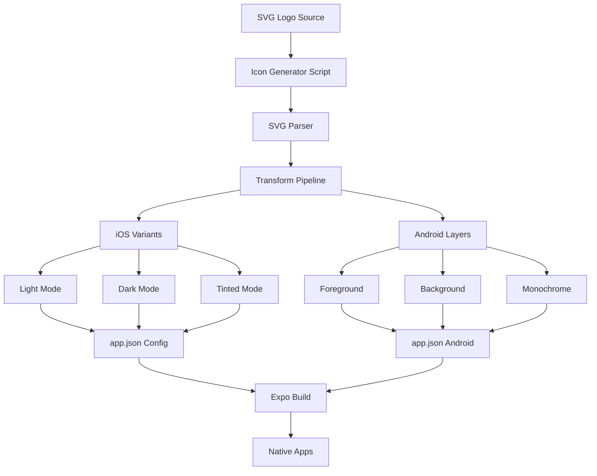

# Design Document - App Icon Implementation

## Overview

This design outlines the technical architecture for implementing adaptive app icons for the Trend Ankara mobile application. The solution leverages the existing SVG logo to generate platform-specific icon variants supporting iOS 18 appearance modes (light, dark, tinted) and Android 13+ Material You theming. The implementation uses a Node.js-based generation script integrated with the Expo build pipeline to ensure icons are automatically created and configured during the build process.

## Steering Document Alignment

### Technical Standards (from Product Vision)
- **Expo SDK 54 Framework**: Utilizes Expo's native icon configuration capabilities through `app.json` and config plugins
- **TypeScript 5.9.2**: Icon generation script and utilities written in TypeScript with strict typing
- **Simple is Better**: Simple Node.js script approach instead of complex third-party services
- **Minimal Dependencies**: Uses only essential packages (sharp for image processing, svgson for SVG parsing)
- **Cross-Platform Parity**: Ensures icons work identically on iOS and Android through Expo's unified configuration
- **Brand Consistency**: Maintains red (#e53e3e), black (#000000), white (#ffffff) color palette

### Project Structure (Existing Patterns)
Following the established directory organization from the codebase:
- Icon assets stored in `assets/icons/` directory (new subdirectory for generated icons)
- Leverage existing `assets/images/` icon files as reference
- Generation script in `scripts/generate-icons.ts` following `android-install.sh` patterns
- Configuration utilities merged into script for simplicity
- Types defined inline in the generation script

## Code Reuse Analysis

### Existing Components to Leverage
- **assets/logo/trendankaralogo.svg**: Source SVG logo that will be processed for all icon variants
- **assets/images/android-icon-*.png**: Existing Android icon files to use as templates and validation references
- **assets/images/icon.png**: Current iOS icon to use as size/quality reference
- **scripts/android-install.sh**: Reference implementation for script structure, error handling, colored output
- **app.json (lines 7, 24-29)**: Existing icon configuration structure to extend and preserve
- **package.json scripts**: Existing script patterns for adding `generate-icons` command

### Integration Points
- **Expo Build System**: Integrates with existing `expo prebuild` workflow
- **Assets Pipeline**: Connects to existing asset management in `assets/` directory
- **Configuration Management**: Extends current `app.json` structure
- **Script Execution**: Follows patterns from existing `scripts/` directory

## Architecture

The icon generation system follows a three-stage pipeline: parsing the SVG source, transforming it into platform-specific variants, and integrating with Expo's configuration system.



## Components and Interfaces

### Component 1: SVG Parser Module
- **Purpose:** Parse and analyze the source SVG to extract visual elements, colors, and structure
- **Interfaces:**
  - `parseSVG(filePath: string): Promise<SVGData>`
  - `extractElements(svg: SVGData): SVGElements`
  - `identifyBrandColors(elements: SVGElements): ColorPalette`
- **Dependencies:** svgson library for SVG parsing, fs for file operations
- **Reuses:** None (new component)

### Component 2: Icon Transformer
- **Purpose:** Transform parsed SVG data into platform-specific icon variants with appropriate modifications
- **Interfaces:**
  - `generateIOSVariants(svg: SVGData): Promise<IOSIconSet>`
  - `generateAndroidLayers(svg: SVGData): Promise<AndroidIconSet>`
  - `applyColorProfile(image: Buffer, profile: ColorProfile): Buffer`
  - `createMonochrome(svg: SVGData): Promise<Buffer>`
- **Dependencies:** sharp for image processing, color manipulation utilities
- **Reuses:** SVG Parser Module output

### Component 3: File Generator
- **Purpose:** Write generated icon files to appropriate directories with correct naming conventions
- **Interfaces:**
  - `writeIconFile(buffer: Buffer, path: string): Promise<void>`
  - `createDirectoryStructure(): Promise<void>`
  - `optimizePNG(buffer: Buffer): Promise<Buffer>`
  - `validateIconDimensions(buffer: Buffer, size: number): boolean`
- **Dependencies:** Node.js fs module, sharp for optimization
- **Reuses:** Project structure patterns from structure.md

### Component 4: Configuration Updater
- **Purpose:** Update app.json with new icon paths and ensure proper Expo configuration
- **Interfaces:**
  - `updateAppConfig(iconPaths: IconPaths): Promise<void>`
  - `validateConfiguration(): Promise<ValidationResult>`
  - `backupConfig(): Promise<void>`
  - `restoreConfig(): Promise<void>`
- **Dependencies:** JSON manipulation, file system operations
- **Reuses:** Existing app.json structure

### Component 5: Generation Script
- **Purpose:** Orchestrate the entire icon generation process with error handling and progress reporting
- **Interfaces:**
  - `generateIcons(options: GenerationOptions): Promise<void>`
  - `validateSource(svgPath: string): Promise<boolean>`
  - `reportProgress(stage: string, progress: number): void`
- **Dependencies:** All other components, command-line argument parser
- **Reuses:** Script patterns from android-install.sh (error handling, colored output)

## Data Models

### IconConfiguration
```typescript
interface IconConfiguration {
  source: string;                    // Path to source SVG
  outputDirectory: string;           // Base directory for generated icons
  platforms: {
    ios: {
      enabled: boolean;
      variants: {
        light: boolean;
        dark: boolean;
        tinted: boolean;
      };
      sizes: number[];               // [20, 29, 40, 58, 60, 76, 80, 87, 120, 152, 167, 180, 1024]
      colorProfile: 'sRGB' | 'DisplayP3';
      tintedColorProfile: 'GrayGamma2.2';  // For tinted mode icons
    };
    android: {
      enabled: boolean;
      adaptiveIcon: {
        foreground: boolean;
        background: boolean;
        monochrome: boolean;
        safeZone: number;            // 66dp safe zone for monochrome
      };
      legacyIcon: boolean;
      dpi: {                         // Specific pixel dimensions
        mdpi: 48,                    // 48x48px
        hdpi: 72,                    // 72x72px
        xhdpi: 96,                   // 96x96px
        xxhdpi: 144,                 // 144x144px
        xxxhdpi: 192                 // 192x192px
      };
    };
  };
  optimization: {
    compress: boolean;
    stripMetadata: boolean;
  };
  migration: {
    backupOriginal: boolean;         // Backup existing app.json
    preserveExisting: boolean;       // Preserve non-icon config
  };
}
```

### SVGData
```typescript
interface SVGData {
  width: number;
  height: number;
  viewBox: string;
  elements: SVGElement[];
  styles: StyleDefinition[];
  colors: {
    primary: string[];               // Brand colors found
    all: Set<string>;                // All unique colors
    hasRed: boolean;                // #e53e3e validation
    hasBlack: boolean;              // #000000 validation
    hasWhite: boolean;              // #ffffff validation
  };
  metadata: {
    hasText: boolean;
    hasGradients: boolean;
    colorCount: number;
    complexity: 'simple' | 'moderate' | 'complex';
  };
}
```

### GeneratedIcon
```typescript
interface GeneratedIcon {
  platform: 'ios' | 'android';
  variant: string;                   // 'light', 'dark', 'tinted', 'foreground', etc.
  size: number;
  path: string;
  buffer: Buffer;
  checksum: string;                  // For validation
  metadata: {
    colorSpace: string;
    hasAlpha: boolean;
    fileSize: number;
  };
}
```

### IconPaths
```typescript
interface IconPaths {
  ios: {
    icon?: string;                    // Legacy single icon
    light?: string;
    dark?: string;
    tinted?: string;
  };
  android: {
    icon?: string;                    // Legacy icon
    adaptiveIcon: {
      foregroundImage: string;
      backgroundImage: string;
      monochromeImage?: string;
      backgroundColor?: string;
    };
  };
  web: {
    favicon: string;
  };
}
```

### ValidationResult
```typescript
interface ValidationResult {
  valid: boolean;
  errors: ValidationError[];
  warnings: string[];
  iconQuality: {
    resolution: boolean;             // Meets minimum resolution
    colorAccuracy: boolean;          // Brand colors preserved
    safeZone: boolean;              // Content within safe zones
    fileSize: boolean;              // Within size limits
  };
}

interface ValidationError {
  type: 'MISSING_FILE' | 'INVALID_SIZE' | 'COLOR_MISMATCH' | 'CONFIG_ERROR';
  message: string;
  file?: string;
  expected?: any;
  actual?: any;
}
```

## Dependencies and Prerequisites

### Required NPM Packages
The following packages need to be added to devDependencies:
```json
{
  "sharp": "^0.33.0",        // Image processing and PNG generation
  "svgson": "^5.3.0",         // SVG parsing and manipulation
  "commander": "^11.0.0"      // CLI argument parsing
}
```

### Installation Command
```bash
npm install --save-dev sharp svgson commander
```

### Node.js Requirements
- Minimum Node.js version: 18.0.0 (for native sharp bindings)
- Platform compatibility: macOS, Linux, Windows (WSL recommended)

## Error Handling

### Error Scenarios

1. **Invalid SVG Source**
   - **Handling:** Validate SVG structure before processing, provide detailed error about what's wrong
   - **User Impact:** Clear error message with instructions to fix the SVG

2. **Color Space Conversion Failure**
   - **Handling:** Fallback to sRGB if Display P3 conversion fails, log warning
   - **User Impact:** Icons generated with standard color space, warning shown

3. **File System Permission Issues**
   - **Handling:** Check write permissions before starting, suggest permission fixes
   - **User Impact:** Helpful error message with chmod command suggestions

4. **Memory Issues with Large SVG**
   - **Handling:** Stream processing for large files, chunked operations
   - **User Impact:** Slower but successful generation with progress indicator

5. **Configuration Update Failure**
   - **Handling:** Backup original config, atomic write operations, rollback on failure
   - **User Impact:** Original configuration preserved, error details provided

6. **Missing Dependencies**
   - **Handling:** Check for required packages, provide npm install instructions
   - **User Impact:** Clear instructions to install missing packages

## Testing Strategy

### Unit Testing
- **SVG Parser**: Test with various SVG structures, malformed SVGs, edge cases
- **Color Transformations**: Verify grayscale conversion, transparency handling
- **File Operations**: Mock file system for testing write operations
- **Configuration Updates**: Test JSON manipulation with various app.json structures

### Integration Testing
- **End-to-End Generation**: Test complete pipeline from SVG to configured icons
- **Platform Compatibility**: Verify generated icons work on iOS simulator and Android emulator
- **Build Integration**: Test with `expo prebuild` to ensure icons are properly included
- **Variant Validation**: Check all variants meet platform requirements

### End-to-End Testing
- **Fresh Installation**: Generate icons on clean project, build, and deploy
- **Update Scenario**: Replace existing icons with newly generated ones
- **CI/CD Integration**: Ensure icon generation works in automated build pipelines
- **Device Testing**: Verify icons appear correctly on physical iOS and Android devices
- **Theme Switching**: Test icon appearance changes with system theme changes