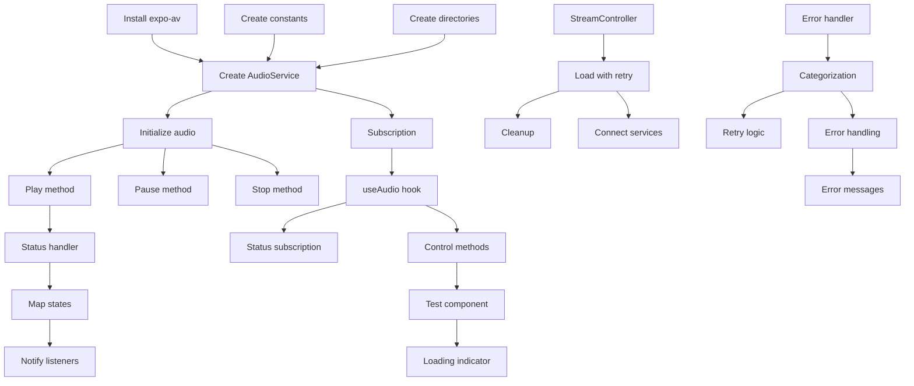

# Tasks: Audio Streaming Service

## Task Checklist

### Phase 1: Setup and Dependencies

- [ ] **Task 1.1: Install expo-av package**
  - **Files:** `package.json`, `package-lock.json`
  - **Requirements:** [Stream Connection, Basic Playback Controls]
  - **Details:** Run npm install expo-av and verify installation
  - **Leverage:** Existing npm/expo setup

- [ ] **Task 1.2: Create audio constants file**
  - **Files:** `constants/audio.ts` (new)
  - **Requirements:** [Stream Connection]
  - **Details:** Define STREAM_URL, audio mode settings, retry configuration
  - **Leverage:** Follow existing constants/ directory pattern

- [ ] **Task 1.3: Create services directory structure**
  - **Files:** Create `services/audio/` directory
  - **Requirements:** [Audio Service Singleton]
  - **Details:** Create services/audio folder for audio-related services
  - **Leverage:** Follow structure.md service organization pattern

### Phase 2: Core Service Implementation

- [ ] **Task 2.1: Create AudioService singleton class**
  - **Files:** `services/audio/AudioService.ts` (new)
  - **Requirements:** [Audio Service Singleton]
  - **Details:** Implement singleton pattern, define AudioState and AudioStatus types
  - **Leverage:** TypeScript patterns from existing code

- [ ] **Task 2.2: Implement audio initialization method**
  - **Files:** `services/audio/AudioService.ts`
  - **Requirements:** [Stream Connection]
  - **Details:** Add initializeAudio() with expo-av audio mode configuration
  - **Leverage:** expo-av Audio.setAudioModeAsync API

- [ ] **Task 2.3: Implement play method**
  - **Files:** `services/audio/AudioService.ts`
  - **Requirements:** [Basic Playback Controls, Stream Connection]
  - **Details:** Create play() method to load and start stream, handle loading state
  - **Leverage:** Audio.Sound.createAsync from expo-av

- [ ] **Task 2.4: Implement pause method**
  - **Files:** `services/audio/AudioService.ts`
  - **Requirements:** [Basic Playback Controls]
  - **Details:** Create pause() method to pause playback, update state
  - **Leverage:** Audio.Sound pauseAsync method

- [ ] **Task 2.5: Implement stop method**
  - **Files:** `services/audio/AudioService.ts`
  - **Requirements:** [Basic Playback Controls]
  - **Details:** Create stop() method to stop and unload stream
  - **Leverage:** Audio.Sound stopAsync and unloadAsync methods

- [ ] **Task 2.6: Add subscription mechanism**
  - **Files:** `services/audio/AudioService.ts`
  - **Requirements:** [Audio Service Singleton]
  - **Details:** Implement subscribe/unsubscribe pattern with Set<listener>
  - **Leverage:** Observer pattern, similar to React state updates

### Phase 3: Stream Controller

- [ ] **Task 3.1: Create StreamController class**
  - **Files:** `services/audio/StreamController.ts` (new)
  - **Requirements:** [Stream Connection, Network Resilience]
  - **Details:** Create class to manage stream loading and retry logic
  - **Leverage:** TypeScript class patterns

- [ ] **Task 3.2: Implement stream loading with retry**
  - **Files:** `services/audio/StreamController.ts`
  - **Requirements:** [Network Resilience]
  - **Details:** Add loadStream() with retry logic (3 attempts, 2s delay)
  - **Leverage:** expo-av Audio.Sound.createAsync

- [ ] **Task 3.3: Add stream cleanup method**
  - **Files:** `services/audio/StreamController.ts`
  - **Requirements:** [Basic Playback Controls]
  - **Details:** Implement unloadStream() for proper resource cleanup
  - **Leverage:** Audio.Sound unloadAsync

### Phase 4: Error Handling

- [ ] **Task 4.1: Create error handler class**
  - **Files:** `services/audio/ErrorHandler.ts` (new)
  - **Requirements:** [Stream State Management]
  - **Details:** Define AudioError enum and AudioErrorHandler class
  - **Leverage:** TypeScript enum patterns

- [ ] **Task 4.2: Implement error categorization**
  - **Files:** `services/audio/ErrorHandler.ts`
  - **Requirements:** [Stream State Management, Network Resilience]
  - **Details:** Add handleError() to categorize errors with Turkish messages
  - **Leverage:** Error handling patterns from existing code

- [ ] **Task 4.3: Add retry decision logic**
  - **Files:** `services/audio/ErrorHandler.ts`
  - **Requirements:** [Network Resilience]
  - **Details:** Implement shouldRetry() method for network/stream errors
  - **Leverage:** Error type checking

### Phase 5: React Hook Integration

- [ ] **Task 5.1: Create useAudio hook**
  - **Files:** `hooks/useAudio.ts` (new)
  - **Requirements:** [Audio Service Singleton]
  - **Details:** Create React hook to interface with AudioService
  - **Leverage:** Existing hooks/ directory, useState/useEffect patterns

- [ ] **Task 5.2: Add status subscription to hook**
  - **Files:** `hooks/useAudio.ts`
  - **Requirements:** [Stream State Management]
  - **Details:** Subscribe to AudioService status updates in useEffect
  - **Leverage:** React subscription pattern with cleanup

- [ ] **Task 5.3: Export control methods from hook**
  - **Files:** `hooks/useAudio.ts`
  - **Requirements:** [Basic Playback Controls]
  - **Details:** Wrap play/pause/stop methods with error handling
  - **Leverage:** useCallback for memoization

### Phase 6: Status Update Integration

- [ ] **Task 6.1: Add playback status handler**
  - **Files:** `services/audio/AudioService.ts`
  - **Requirements:** [Stream State Management]
  - **Details:** Implement onPlaybackStatusUpdate handler for expo-av
  - **Leverage:** AVPlaybackStatus from expo-av

- [ ] **Task 6.2: Map expo-av status to app states**
  - **Files:** `services/audio/AudioService.ts`
  - **Requirements:** [Stream State Management]
  - **Details:** Convert AVPlaybackStatus to AudioState (loading, playing, etc.)
  - **Leverage:** Status properties from expo-av

- [ ] **Task 6.3: Notify listeners on state change**
  - **Files:** `services/audio/AudioService.ts`
  - **Requirements:** [Audio Service Singleton]
  - **Details:** Call notifyListeners() when state changes
  - **Leverage:** Set.forEach for listener notification

### Phase 7: Integration with StreamController

- [ ] **Task 7.1: Connect AudioService to StreamController**
  - **Files:** `services/audio/AudioService.ts`
  - **Requirements:** [Stream Connection]
  - **Details:** Use StreamController in play() method
  - **Leverage:** StreamController.loadStream()

- [ ] **Task 7.2: Add error handling to play method**
  - **Files:** `services/audio/AudioService.ts`
  - **Requirements:** [Stream State Management, Network Resilience]
  - **Details:** Catch errors, use ErrorHandler, update state to 'error'
  - **Leverage:** AudioErrorHandler.handleError()

### Phase 8: Testing and Polish

- [ ] **Task 8.1: Create simple test component**
  - **Files:** `app/(tabs)/index.tsx` (update)
  - **Requirements:** [Basic Playback Controls]
  - **Details:** Add play/pause button using useAudio hook
  - **Leverage:** Existing ThemedView, IconSymbol components

- [ ] **Task 8.2: Add loading indicator**
  - **Files:** `app/(tabs)/index.tsx`
  - **Requirements:** [Stream State Management]
  - **Details:** Show ActivityIndicator when state is 'loading'
  - **Leverage:** React Native ActivityIndicator

- [ ] **Task 8.3: Display error messages**
  - **Files:** `app/(tabs)/index.tsx`
  - **Requirements:** [Stream State Management]
  - **Details:** Show error message using ThemedText when state is 'error'
  - **Leverage:** ThemedText component, Turkish error messages

## Task Dependencies

## Validation Criteria

Each task should be validated against:
1. **Functionality:** Feature works as designed
2. **State Management:** States transition correctly
3. **Error Handling:** Errors are caught and displayed
4. **Type Safety:** TypeScript compilation succeeds
5. **Integration:** Works with existing components

## Implementation Order

**Recommended execution sequence:**
1. Phase 1: Setup (Tasks 1.1-1.3) - Prerequisites
2. Phase 2 & 3 in parallel: Core Service and StreamController
3. Phase 4: Error Handling
4. Phase 5: Hook Creation
5. Phase 6 & 7: Integration
6. Phase 8: Testing and UI

## Estimated Time

- **Phase 1:** ~15 minutes (3 tasks × 5 min)
- **Phase 2:** ~60 minutes (6 tasks × 10 min)
- **Phase 3:** ~30 minutes (3 tasks × 10 min)
- **Phase 4:** ~30 minutes (3 tasks × 10 min)
- **Phase 5:** ~30 minutes (3 tasks × 10 min)
- **Phase 6:** ~30 minutes (3 tasks × 10 min)
- **Phase 7:** ~20 minutes (2 tasks × 10 min)
- **Phase 8:** ~30 minutes (3 tasks × 10 min)
- **Total:** ~4 hours

## Notes

- expo-av must be installed first before any implementation
- Test on real devices for background playback
- iOS simulator doesn't support background audio properly
- Android requires additional manifest configuration for background
- Stream URL should be configurable for future changes
- Consider adding volume control in future iteration