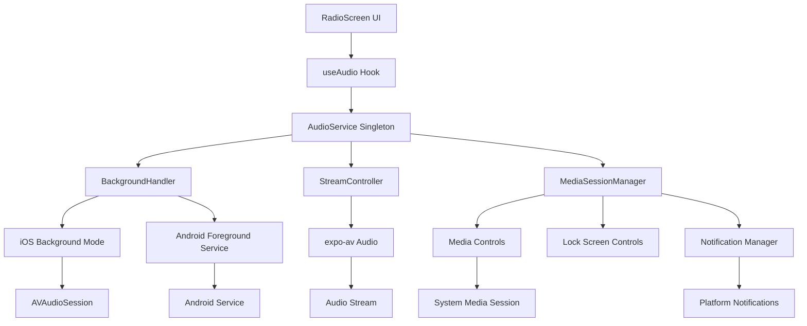

# Design Document

## Overview

The Background Playback feature extends the existing TrendAnkara Radio audio streaming capabilities to enable continuous playback when the app is not in the foreground. This design leverages the existing AudioService architecture while adding platform-specific background mode configurations, media session management, and notification controls. The implementation will maintain the current singleton pattern and event-driven architecture while extending it with background-specific handlers and native platform integrations.

### Required Dependencies
The following packages need to be installed:
- `expo-notifications`: For Android foreground service notifications
- `expo-task-manager`: For managing background tasks
- `@react-native-async-storage/async-storage`: For persisting session state

Platform detection will use React Native's Platform API (`Platform.OS`) to conditionally load platform-specific implementations.

## Steering Document Alignment

### Technical Standards (tech.md)
Since no explicit tech.md exists, this design follows the observed patterns in the codebase:
- TypeScript for type safety
- Singleton pattern for service management (AudioService)
- Event-driven architecture with subscription pattern
- Expo SDK for native functionality
- React hooks for UI state management

### Project Structure (structure.md)
Following the existing project organization:
- Services in `/services/audio/` directory
- Platform-specific implementations using `.ios.ts` and `.android.ts` extensions
- Constants in `/constants/` directory
- Hooks in `/hooks/` directory
- Types defined alongside implementations or in `/types/`

## Code Reuse Analysis

### Existing Components to Leverage
- **AudioService**: Core singleton service managing playback state - will be extended with background capabilities
- **StreamController**: Handles stream loading/unloading - will be reused as-is
- **AudioErrorHandler**: Error handling logic - will handle background-specific errors
- **useAudio hook**: React hook for UI integration - will be enhanced with background state
- **AudioConfig constants**: Configuration values - will add background-specific configs

### Integration Points
- **expo-av Audio module**: Already configured with `staysActiveInBackground: true`
- **Playback status subscription**: Existing event system will propagate background state changes
- **Error retry mechanism**: Current retry logic will handle background network issues
- **State management pattern**: Observer pattern allows seamless background state updates

## Architecture

The background playback implementation extends the existing audio architecture with platform-specific background handlers and media session management while maintaining backward compatibility.



## Components and Interfaces

### BackgroundHandler
- **Purpose:** Manages platform-specific background audio capabilities and lifecycle
- **Interfaces:**
  - `initialize()`: Sets up background modes and permissions
  - `enableBackground()`: Activates background playback mode
  - `disableBackground()`: Deactivates background mode
  - `handleAppStateChange(state)`: Responds to app state transitions
  - `requestAudioFocus()`: Requests exclusive audio focus from system
  - `abandonAudioFocus()`: Releases audio focus when stopping
  - `handleAudioFocusChange(focusState)`: Responds to focus changes from other apps
  - `handleNetworkLoss()`: Triggers existing retry mechanism for background reconnection
- **Dependencies:** expo-av (for audio session), expo-notifications (required installation), expo-task-manager (required installation)
- **Reuses:** AudioConfig constants, AudioErrorHandler for background-specific errors, existing retry mechanism from StreamController

### MediaSessionManager
- **Purpose:** Manages media session metadata and controls for lock screen/notification display
- **Interfaces:**
  - `updateMetadata(title, artist, artwork)`: Updates now-playing information using expo-av's setNowPlayingInfoAsync
  - `setPlaybackState(state)`: Updates playback state in media controls
  - `handleRemoteCommand(command)`: Processes media control commands
  - `clearSession()`: Cleans up media session
  - `persistSessionState(state)`: Saves current playback state to AsyncStorage
  - `restoreSessionState()`: Retrieves and restores saved state on app restart
- **Dependencies:** expo-av (setNowPlayingInfoAsync, setOnPlaybackStatusUpdate), @react-native-async-storage/async-storage for persistence
- **Reuses:** AudioStatus types, existing state management pattern

### NotificationService
- **Purpose:** Creates and manages persistent notification for Android foreground service
- **Interfaces:**
  - `createNotification(status)`: Creates/updates notification with controls
  - `destroyNotification()`: Removes notification and stops service
  - `updateNotificationState(state)`: Updates notification appearance
- **Dependencies:** expo-notifications, expo-task-manager
- **Reuses:** AudioStatus for state display, IconSymbol components for notification actions

### Enhanced AudioService
- **Purpose:** Extended version of existing AudioService with background capabilities
- **Interfaces:** (additions to existing)
  - `initializeBackground()`: Sets up background components
  - `setBackgroundMode(enabled)`: Toggles background mode
  - `handleInterruption(type)`: Manages audio focus changes
- **Dependencies:** BackgroundHandler, MediaSessionManager, NotificationService
- **Reuses:** All existing AudioService code, StreamController, error handling

## Data Models

### BackgroundConfig
```typescript
interface BackgroundConfig {
  // iOS specific
  iosBackgroundModes: string[];  // ['audio']
  iosAudioSessionCategory: string;  // 'playback'
  iosAudioSessionMode: string;  // 'default'

  // Android specific
  androidForegroundService: boolean;
  androidNotificationChannel: string;
  androidNotificationPriority: number;

  // Shared
  mediaSessionEnabled: boolean;
  showLockScreenControls: boolean;
  resumeOnFocusGain: boolean;
}
```

### MediaSessionMetadata
```typescript
interface MediaSessionMetadata {
  title: string;  // "TrendAnkara Radyo"
  artist: string;  // "Canlı Yayın"
  artwork?: string;  // App icon URL
  duration?: number;  // For live stream, undefined
  position?: number;  // Current position if applicable
}
```

### BackgroundState (extends AudioState)
```typescript
type BackgroundState = AudioState | 'background-playing' | 'background-paused' | 'interrupted';

interface EnhancedAudioStatus extends AudioStatus {
  isBackgroundMode: boolean;
  hasAudioFocus: boolean;
  interruptionType?: 'transient' | 'permanent';
}
```

### RemoteCommand
```typescript
interface RemoteCommand {
  command: 'play' | 'pause' | 'stop' | 'togglePlayPause';
  timestamp: number;
  source: 'lockscreen' | 'notification' | 'headset' | 'watch';
}
```

## Error Handling

### Error Scenarios
1. **Background Mode Initialization Failure**
   - **Handling:** Fall back to foreground-only playback, log error
   - **User Impact:** App works normally but stops when backgrounded

2. **Audio Focus Lost**
   - **Handling:** Pause playback, store state for potential resume
   - **User Impact:** Playback pauses when other audio app takes focus

3. **Foreground Service Creation Failure (Android)**
   - **Handling:** Attempt recreation, fall back to basic background mode
   - **User Impact:** May lose persistent notification but audio continues

4. **Media Session Registration Failure**
   - **Handling:** Continue playback without media controls
   - **User Impact:** No lock screen controls but playback continues

5. **Network Loss in Background**
   - **Handling:** Use existing retry mechanism, show status in notification
   - **User Impact:** Brief interruption with automatic recovery attempt

6. **System Memory Pressure**
   - **Handling:** Reduce buffer size, release non-critical resources
   - **User Impact:** Potential brief buffering, but playback continues

## Testing Strategy

### Unit Testing
- BackgroundHandler platform detection and initialization
- MediaSessionManager metadata updates and command handling
- NotificationService notification creation and updates
- Enhanced AudioService background state transitions
- Mock platform-specific APIs for testing

### Integration Testing
- App state transitions (foreground → background → foreground)
- Audio focus handling with mock interruptions
- Media control command processing
- Notification interaction handling
- Background network recovery scenarios

### End-to-End Testing
- Complete user flow: Start playback → background app → control from lock screen → return to app
- Interruption handling: Phone call → pause → resume after call
- Long-duration testing: 8+ hours continuous background streaming
- Platform-specific testing on iOS and Android devices
- Different network conditions (WiFi → cellular transitions)