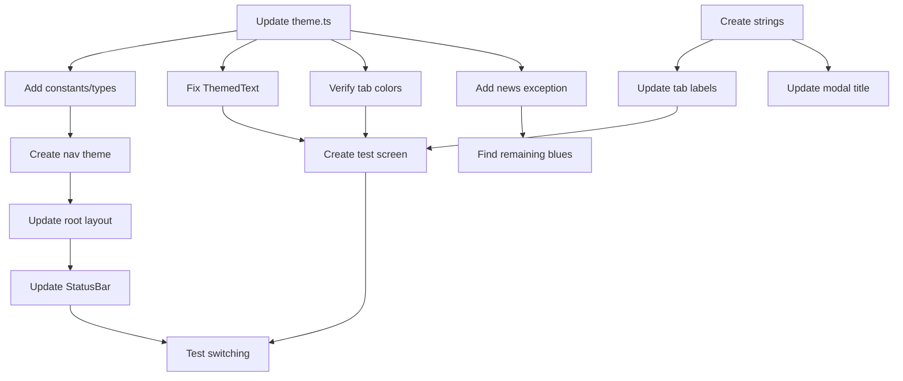

# Tasks: Core Theme & Colors Setup

## Task Checklist

### Phase 1: Theme Foundation

- [x] **Task 1.1: Update theme.ts with brand colors**
  - **Files:** `constants/theme.ts`
  - **Requirements:** [Brand Theme Integration, Dark Mode Support]
  - **Details:** Replace blue tintColors with red (#DC2626), add full gray palette, update all color definitions for light/dark modes
  - **Leverage:** Keep existing Colors structure, only update color values

- [x] **Task 1.2: Add brand color constants and types**
  - **Files:** `constants/theme.ts`, create `types/theme.ts`
  - **Requirements:** [Brand Theme Integration]
  - **Details:** Add BrandColors object, create TypeScript interfaces for ThemeColors and BrandPalette
  - **Leverage:** Extend existing type definitions from React Navigation

- [ ] **Task 1.3: Create navigation theme configuration**
  - **Files:** `constants/navigationTheme.ts` (new)
  - **Requirements:** [Brand Theme Integration, Dark Mode Support]
  - **Details:** Export LightNavigationTheme and DarkNavigationTheme using brand colors
  - **Leverage:** Extend DefaultTheme and DarkTheme from @react-navigation/native

- [ ] **Task 1.4: Update root layout with custom navigation themes**
  - **Files:** `app/_layout.tsx`
  - **Requirements:** [Brand Theme Integration, Dark Mode Support]
  - **Details:** Import and use custom navigation themes instead of default ones
  - **Leverage:** Existing ThemeProvider and useColorScheme hook

### Phase 2: Component Updates

- [ ] **Task 2.1: Remove hardcoded blue from ThemedText link style**
  - **Files:** `components/themed-text.tsx`
  - **Requirements:** [Brand Theme Integration]
  - **Details:** Remove color: '#0a7ea4' from link style, add linkText color from theme
  - **Leverage:** Existing useThemeColor hook

- [x] **Task 2.2: Update tab bar configuration for brand colors**
  - **Files:** `app/(tabs)/_layout.tsx`
  - **Requirements:** [Brand Theme Integration]
  - **Details:** Verify tabBarActiveTintColor uses updated theme.tint (will auto-update)
  - **Leverage:** Already uses Colors[colorScheme].tint pattern

- [ ] **Task 2.3: Create Turkish strings constants file**
  - **Files:** `constants/strings.ts` (new)
  - **Requirements:** [Turkish UI Strings]
  - **Details:** Create Strings object with tabs, player, settings, and common sections
  - **Leverage:** TypeScript const assertions for type safety

- [ ] **Task 2.4: Update tab screen labels to Turkish**
  - **Files:** `app/(tabs)/_layout.tsx`
  - **Requirements:** [Turkish UI Strings]
  - **Details:** Replace 'Home' with {"Radyo"}, 'Explore' with {"Haberler"} using Strings constants
  - **Leverage:** Existing Tabs.Screen options structure

- [x] **Task 2.5: Update modal screen title to Turkish**
  - **Files:** `app/_layout.tsx`
  - **Requirements:** [Turkish UI Strings]
  - **Details:** Replace 'Modal' title with Turkish equivalent from Strings
  - **Leverage:** Existing Stack.Screen options

### Phase 3: Verification & Cleanup

- [x] **Task 3.1: Add news badge blue exception color**
  - **Files:** `constants/theme.ts`
  - **Requirements:** [Brand Theme Integration - blue exception]
  - **Details:** Add info: '#3B82F6' to BrandColors for news badges only
  - **Leverage:** Existing semantic colors pattern

- [x] **Task 3.2: Update StatusBar style for proper theme**
  - **Files:** `app/_layout.tsx`
  - **Requirements:** [Dark Mode Support]
  - **Details:** Ensure StatusBar style adapts to theme (auto or explicit)
  - **Leverage:** Existing expo-status-bar component

- [x] **Task 3.3: Create theme test screen for verification**
  - **Files:** `app/(tabs)/explore.tsx` (temporary update)
  - **Requirements:** [Brand Theme Integration, Dark Mode Support, Turkish UI Strings]
  - **Details:** Add color swatches and text samples to verify all theme changes
  - **Leverage:** Existing ThemedText and ThemedView components

- [ ] **Task 3.4: Search and replace any remaining blue color references**
  - **Files:** Search all .tsx and .ts files
  - **Requirements:** [Brand Theme Integration]
  - **Details:** Find any hardcoded #0a7ea4 or blue references and replace with theme colors
  - **Leverage:** grep/search tools to find occurrences

- [x] **Task 3.5: Test dark/light mode switching**
  - **Files:** N/A (testing task)
  - **Requirements:** [Dark Mode Support]
  - **Details:** Manually test theme switching on iOS and Android simulators
  - **Leverage:** Device settings and useColorScheme hook

## Task Dependencies

## Validation Criteria

Each task should be validated against:
1. **Functionality:** Feature works as designed
2. **No Regressions:** Existing features still work
3. **Theme Compliance:** Uses theme colors, no hardcoded values
4. **String Format:** Turkish strings use JSX expressions
5. **Type Safety:** TypeScript compilation succeeds

## Implementation Order

**Recommended execution sequence:**
1. Start with Task 1.1-1.4 (Theme Foundation) - Critical path
2. Parallel: Tasks 2.1-2.2 (Component fixes) and 2.3-2.5 (Strings)
3. Tasks 3.1-3.2 (Final theme adjustments)
4. Task 3.3 (Verification screen)
5. Tasks 3.4-3.5 (Cleanup and testing)

## Estimated Time

- **Phase 1:** ~45 minutes (4 tasks × 10-15 min)
- **Phase 2:** ~45 minutes (5 tasks × 10 min)
- **Phase 3:** ~30 minutes (5 tasks × 5-10 min)
- **Total:** ~2 hours

## Notes

- All tasks are atomic and can be executed independently within their phase
- Each task modifies 1-3 files maximum
- Tasks include leverage information to maximize code reuse
- Testing task (3.5) is manual but essential for validation
- Task 3.3 (test screen) can be reverted after verification