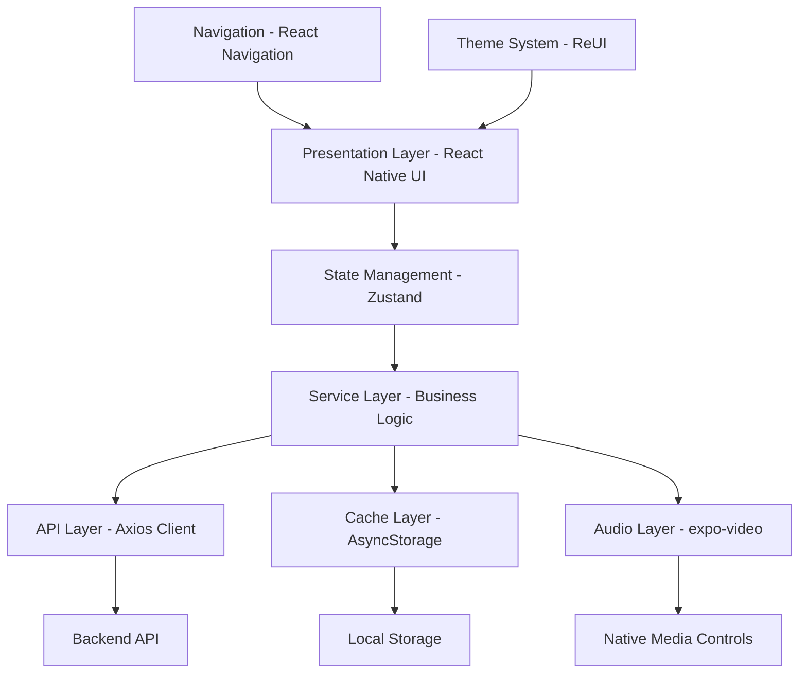
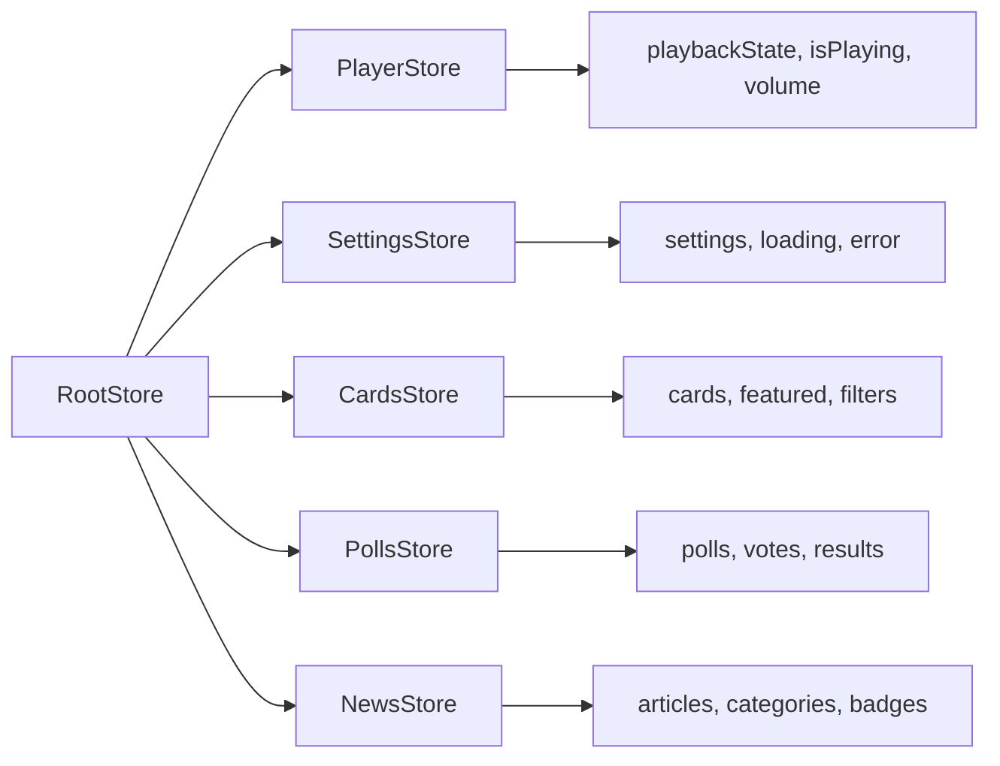
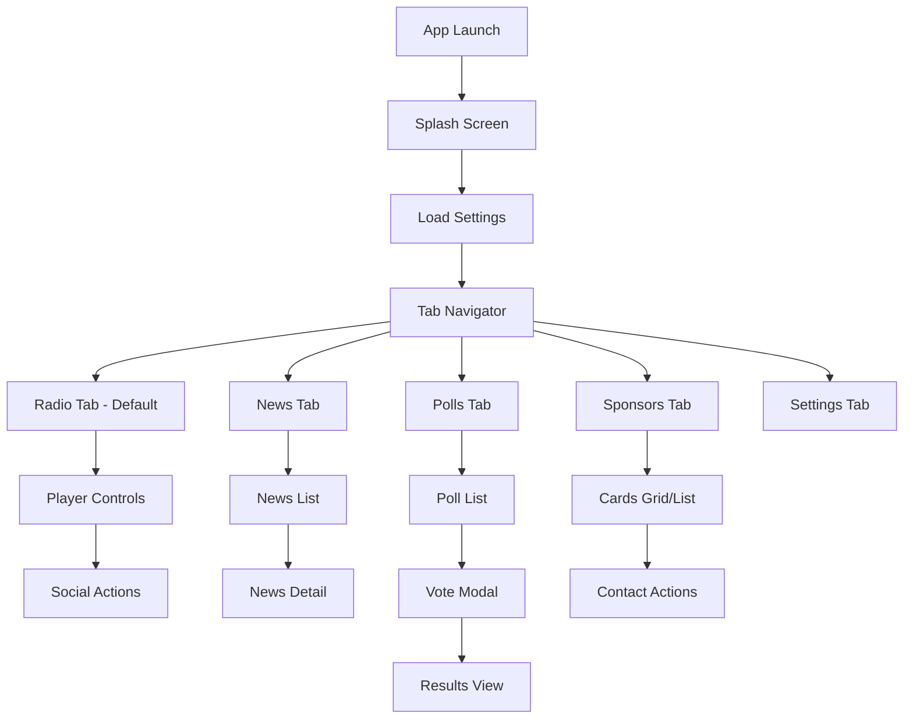

# Design Document - Trend Ankara Mobile Application

## Metadata
- **Feature Name**: mobile-app-implementation
- **Version**: 1.0.0
- **Status**: Draft
- **Created**: 2025-09-28
- **Last Updated**: 2025-09-28

## Overview

This design document outlines the comprehensive architecture for the Trend Ankara Mobile Application, a React Native application built with Expo SDK 54. The application implements a radio streaming platform with native media controls, dynamic content management, interactive polling, and news integration. The design follows the ReUI design philosophy with a RED/BLACK/WHITE color scheme and leverages existing audio services, theme configurations, and component patterns already established in the codebase.

## Steering Document Alignment

### Technical Standards (tech.md)
The design follows documented technical patterns:
- **Expo SDK 54** with React Native 0.81.4 for cross-platform development
- **TypeScript 5.9.2** for type safety with no `any` types
- **React Navigation** for navigation with bottom tabs structure
- **Reanimated 3** for 60fps animations and smooth transitions
- **AsyncStorage** for offline caching and persistence
- **Simple solutions over complexity** - using expo-video for audio with native controls instead of complex custom implementations

### Project Structure (structure.md)
The implementation follows project organization conventions:
- **app/** directory for Expo Router pages with (tabs) layout
- **components/** for reusable UI components organized by feature
- **services/** for business logic with audio, api, cache, and messaging
- **hooks/** for custom React hooks following use* naming
- **constants/** for theme, strings, and configuration
- **types/** for TypeScript definitions
- **PascalCase** for components, **camelCase** for services and utilities

## Code Reuse Analysis

### Existing Components to Leverage
- **VideoPlayerService**: Already implements expo-video with showNowPlayingNotification for native controls
- **Theme Constants**: Complete ReUI color system with BrandColors already defined
- **Navigation Theme**: Tab navigation styling with brand colors configured
- **Animated Components**: SpotlightOrb, AnimatedLogoContainer for player visuals
- **Audio Hooks**: useAudioWithNativeControls for player state management
- **Error Handlers**: AudioService error handling patterns

### Integration Points
- **Audio System**: Extends existing VideoPlayerService for streaming
- **Theme System**: Uses existing BrandColors and theme constants
- **Navigation**: Integrates with existing tab navigation structure
- **State Management**: Will add Zustand stores following existing patterns
- **API Layer**: Will create axios client following service patterns

## Architecture

The application follows a layered architecture with clear separation of concerns:



## Components and Interfaces

### Component 1: RadioPlayerScreen
- **Purpose:** Main radio player interface with native controls integration
- **Interfaces:**
  - `play()`, `pause()`, `togglePlayback()`
  - `onPlaybackStateChange`, `onError`
- **Dependencies:** VideoPlayerService, useAudioWithNativeControls, theme
- **Reuses:** AnimatedLogoContainer, SpotlightOrb for visual effects

### Component 2: SettingsService
- **Purpose:** Manages remote configuration and feature flags
- **Interfaces:**
  - `fetchSettings()`, `getCachedSettings()`, `getDefaultSettings()`
  - `isPollsEnabled()`, `isNewsEnabled()`, `getSocialLinks()`
- **Dependencies:** AsyncStorage, API client
- **Reuses:** Existing cache patterns from services/audio

### Component 3: ContentCardComponent
- **Purpose:** Displays sponsored content with contact actions
- **Interfaces:**
  - `onContactPress(type, value)`, `handleExpiration()`
- **Dependencies:** Linking API, theme system
- **Reuses:** ThemedView, ThemedText components

### Component 4: PollsManager
- **Purpose:** Handles poll voting and results display
- **Interfaces:**
  - `submitVote(pollId, optionId)`, `getResults(pollId)`
  - `preventDuplicateVoting(deviceId)`
- **Dependencies:** Device API, AsyncStorage
- **Reuses:** Error handling patterns from AudioService

### Component 5: NewsListComponent
- **Purpose:** Paginated news feed with offline support
- **Interfaces:**
  - `loadNews(page)`, `refreshNews()`, `getCachedNews()`
- **Dependencies:** FlatList, AsyncStorage, API client
- **Reuses:** Loading and error states from existing patterns

### Component 6: CacheManager
- **Purpose:** Unified caching strategy for all content
- **Interfaces:**
  - `set(key, data, ttl)`, `get(key)`, `purgeOld()`, `clear()`
- **Dependencies:** AsyncStorage
- **Reuses:** Storage patterns from existing services

## Data Models

### MobileSettings Model
```typescript
interface MobileSettings {
  // Poll Settings
  enablePolls: boolean;
  showOnlyLastActivePoll: boolean;

  // News Settings
  enableNews: boolean;
  maxNewsCount: number;

  // Player Settings
  playerLogoUrl: string | null;
  enableLiveInfo: boolean;
  playerFacebookUrl: string | null;
  playerInstagramUrl: string | null;
  playerWhatsappNumber: string | null;
  liveCallPhoneNumber: string | null;

  // Card Settings
  maxFeaturedCards: number;
  cardDisplayMode: 'grid' | 'list';
  enableCardAnimation: boolean;

  // App Settings
  minimumAppVersion: string;
  maintenanceMode: boolean;

  lastUpdated: string;
}
```

### ContentCard Model
```typescript
interface ContentCard {
  id: number;
  title: string;
  description: string;
  imageUrl: string | null;
  redirectUrl: string | null;
  redirectType: 'website' | 'app' | 'internal';

  // Contact Information
  contactEmail: string | null;
  contactPhone: string | null;
  contactWhatsapp: string | null;

  // Social Media
  socialInstagram: string | null;
  socialTiktok: string | null;

  // Location
  locationLatitude: number | null;
  locationLongitude: number | null;
  locationAddress: string | null;

  // Time Limits
  isTimeLimited: boolean;
  validFrom: string | null;
  validUntil: string | null;

  // Display Properties
  isFeatured: boolean;
  displayOrder: number;
  isActive: boolean;
  createdAt: string;
  updatedAt: string;
}
```

### Poll Model
```typescript
interface Poll {
  id: number;
  question: string;
  description: string | null;
  options: PollOption[];
  isActive: boolean;
  startDate: string;
  endDate: string | null;
  totalVotes: number;
  userHasVoted: boolean;
  createdAt: string;
}

interface PollOption {
  id: number;
  text: string;
  voteCount: number;
  percentage: number;
}
```

### News Model
```typescript
interface NewsArticle {
  id: number;
  slug: string;
  title: string;
  excerpt: string;
  content: string;
  imageUrl: string | null;
  category: string;
  publishedAt: string;
  author: string | null;
  readTime: number;
  isNew: boolean;
}
```

## API Integration Design

### API Client Configuration
```typescript
class ApiClient {
  private baseURL = 'https://trendankara.com/api/mobile/v1';
  private timeout = 30000;
  private retryAttempts = 3;

  // Interceptors for auth, retry logic, and caching
  // Request/response transformation
  // Error handling with fallback to cache
}
```

### Endpoint Structure
- **GET** `/admin/mobile/settings` - Mobile configuration
- **GET** `/radio` - Radio stream configuration
- **GET** `/content/cards` - Content cards with query params
- **GET** `/polls/current` - Active polls
- **POST** `/polls/{id}/vote` - Submit vote
- **GET** `/news` - News list with pagination
- **GET** `/news/{slug}` - News detail

## State Management Architecture

### Zustand Store Structure


## UI/UX Flow Design

### Navigation Flow


## ReUI Design System Implementation

### Color Usage
```typescript
const colors = {
  // Primary Palette (from existing theme.ts)
  brand: {
    primary: '#DC2626',     // Action buttons, active states
    secondary: '#000000',   // Dark backgrounds
    tertiary: '#FFFFFF',    // Light text on dark
  },

  // Dark Mode (Primary Theme)
  dark: {
    bgPrimary: '#000000',
    bgSecondary: '#0A0A0A',
    surfacePrimary: '#1A1A1A',
    textPrimary: '#FFFFFF',
    textSecondary: '#A0A0A0',
  }
};
```

### Component Styling Pattern
```typescript
// Using StyleSheet with theme integration
const styles = StyleSheet.create({
  container: {
    flex: 1,
    backgroundColor: colors.dark.bgPrimary,
    padding: spacing[4], // 16px
  },
  button: {
    minHeight: 44, // iOS touch target
    backgroundColor: colors.brand.primary,
    borderRadius: borderRadius.md, // 8px
  }
});
```

## Error Handling

### Error Scenarios

1. **Stream Connection Failure**
   - **Handling:** Automatic retry with exponential backoff
   - **User Impact:** "Bağlantı kuruluyor..." message with spinner
   - **Reuses:** ErrorHandler from services/audio

2. **API Request Timeout**
   - **Handling:** Fallback to cached data with offline indicator
   - **User Impact:** Content displays with "Çevrimdışı" badge

3. **Invalid Settings Response**
   - **Handling:** Use default settings configuration
   - **User Impact:** App functions with default features enabled

4. **Audio Focus Lost**
   - **Handling:** Pause playback, wait for focus return
   - **User Impact:** Playback pauses during calls/other media
   - **Reuses:** AudioFocusState from services/audio

5. **Cache Storage Full**
   - **Handling:** Purge oldest entries automatically
   - **User Impact:** Seamless, older content removed silently

## Performance Optimization Strategies

### Image Optimization
- Use expo-image with caching and progressive loading
- Implement lazy loading for card images
- Compress images before caching

### List Performance
- Use FlatList with getItemLayout for known heights
- Implement windowSize and initialNumToRender optimizations
- Add removeClippedSubviews for long lists

### Memory Management
- Clear image cache periodically
- Limit AsyncStorage to essential data
- Implement cleanup on component unmount

### Network Optimization
- Batch API requests where possible
- Implement request deduplication
- Use conditional requests with ETags

## Testing Strategy

### Unit Testing
- Service layer methods with mocked dependencies
- Store actions and state transformations
- Utility functions and formatters
- Cache expiration logic

### Integration Testing
- API client with mock server responses
- Audio service with stream states
- Navigation flows between screens
- Cache persistence across app restarts

### End-to-End Testing
- Complete user journey from launch to playback
- Poll voting flow with prevention of duplicates
- Offline mode with cached content
- Social media deep linking
- Background playback scenarios

## Security Considerations

### Data Protection
- No storage of personal information
- Device ID hashing for poll voting
- HTTPS-only API communication
- Certificate pinning for API requests

### Input Validation
- Sanitize all user inputs
- Validate deep links before opening
- Verify API response schemas
- Prevent injection in search/filters

### Error Information
- No sensitive data in error messages
- Generic user-facing error text
- Detailed logging only in development

## Accessibility Features

### Screen Reader Support
- Proper accessibilityLabel on all interactive elements
- accessibilityHint for complex interactions
- accessibilityRole for semantic meaning

### Touch Targets
- Minimum 44x44 points on iOS
- Minimum 48x48 dp on Android
- Adequate spacing between targets

### Visual Accessibility
- High contrast between text and backgrounds
- No reliance on color alone for information
- Support for system font size preferences

## Migration Path

### Phase 1: Core Infrastructure
- Set up API client and cache manager
- Implement settings service
- Configure theme system

### Phase 2: Radio Player
- Integrate VideoPlayerService
- Add native media controls
- Implement social buttons

### Phase 3: Content Features
- Add content cards with contact actions
- Implement polls system
- Integrate news feed

### Phase 4: Polish & Optimization
- Add animations and transitions
- Optimize performance
- Implement analytics