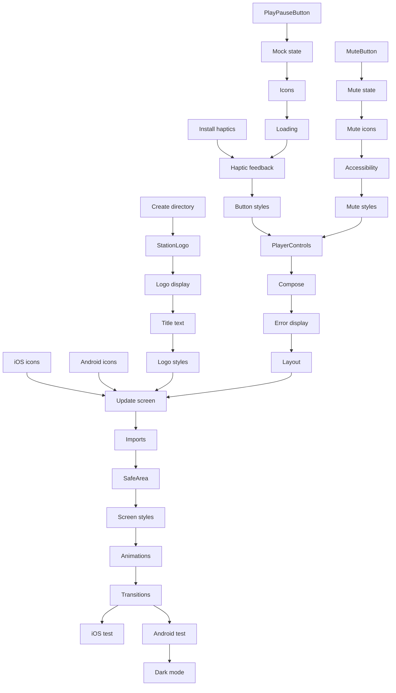

# Tasks: Radio Player UI

## Task Checklist

### Phase 1: Component Structure Setup

- [ ] **Task 1.1: Create player components directory**
  - **Files:** Create `components/player/` directory
  - **Requirements:** [Component Architecture]
  - **Details:** Create folder structure for player-related components
  - **Leverage:** Follow existing components/ directory pattern

- [ ] **Task 1.2: Install expo-haptics if not present**
  - **Files:** `package.json`, `package-lock.json`
  - **Requirements:** [Visual Feedback]
  - **Details:** Run npm install expo-haptics for haptic feedback
  - **Leverage:** Existing expo dependencies

### Phase 2: Station Logo Component

- [ ] **Task 2.1: Create StationLogo component file**
  - **Files:** `components/player/StationLogo.tsx` (new)
  - **Requirements:** [Station Branding]
  - **Details:** Create basic component structure with TypeScript
  - **Leverage:** ThemedText component pattern

- [ ] **Task 2.2: Implement logo display with Image**
  - **Files:** `components/player/StationLogo.tsx`
  - **Requirements:** [Station Branding]
  - **Details:** Add Image component from expo-image, use placeholder icon.png
  - **Leverage:** expo-image for optimized loading

- [ ] **Task 2.3: Add station title text**
  - **Files:** `components/player/StationLogo.tsx`
  - **Requirements:** [Station Branding]
  - **Details:** Add "Trend Ankara" title using ThemedText
  - **Leverage:** ThemedText component, theme colors

- [ ] **Task 2.4: Style logo component**
  - **Files:** `components/player/StationLogo.tsx`
  - **Requirements:** [Responsive Layout]
  - **Details:** Add StyleSheet with 120x120 logo, proper spacing
  - **Leverage:** StyleSheet.create pattern

### Phase 3: Play/Pause Button Component

- [ ] **Task 3.1: Create PlayPauseButton component file**
  - **Files:** `components/player/PlayPauseButton.tsx` (new)
  - **Requirements:** [Play/Pause Control]
  - **Details:** Create component with TouchableOpacity base
  - **Leverage:** Existing button patterns from codebase

- [ ] **Task 3.2: Add mock state management**
  - **Files:** `components/player/PlayPauseButton.tsx`
  - **Requirements:** [Play/Pause Control]
  - **Details:** Add useState for isPlaying, create mock toggle function
  - **Leverage:** React hooks pattern

- [ ] **Task 3.3: Implement play/pause icons**
  - **Files:** `components/player/PlayPauseButton.tsx`
  - **Requirements:** [Play/Pause Control]
  - **Details:** Use IconSymbol with play.circle.fill and pause.circle.fill
  - **Leverage:** IconSymbol component

- [ ] **Task 3.4: Add loading state indicator**
  - **Files:** `components/player/PlayPauseButton.tsx`
  - **Requirements:** [Visual Feedback]
  - **Details:** Add ActivityIndicator for loading state, mock loading state
  - **Leverage:** React Native ActivityIndicator

- [ ] **Task 3.5: Implement haptic feedback**
  - **Files:** `components/player/PlayPauseButton.tsx`
  - **Requirements:** [Visual Feedback]
  - **Details:** Add Haptics.impactAsync on press for iOS
  - **Leverage:** expo-haptics library

- [ ] **Task 3.6: Style play/pause button**
  - **Files:** `components/player/PlayPauseButton.tsx`
  - **Requirements:** [Play/Pause Control]
  - **Details:** Set size to 80x80px minimum, center alignment
  - **Leverage:** StyleSheet patterns

### Phase 4: Mute Button Component

- [ ] **Task 4.1: Create MuteButton component file**
  - **Files:** `components/player/MuteButton.tsx` (new)
  - **Requirements:** [Mute Control]
  - **Details:** Create component with TouchableOpacity
  - **Leverage:** Button patterns from PlayPauseButton

- [ ] **Task 4.2: Add mute state management**
  - **Files:** `components/player/MuteButton.tsx`
  - **Requirements:** [Mute Control]
  - **Details:** Add useState for isMuted, toggle function
  - **Leverage:** React hooks

- [ ] **Task 4.3: Implement mute/unmute icons**
  - **Files:** `components/player/MuteButton.tsx`
  - **Requirements:** [Mute Control]
  - **Details:** Use speaker.wave.2.fill and speaker.slash.fill icons
  - **Leverage:** IconSymbol component

- [ ] **Task 4.4: Add accessibility labels**
  - **Files:** `components/player/MuteButton.tsx`
  - **Requirements:** [Accessibility]
  - **Details:** Add Turkish labels "Sesi Aç" and "Sesi Kapat"
  - **Leverage:** accessibilityLabel prop

- [ ] **Task 4.5: Style mute button**
  - **Files:** `components/player/MuteButton.tsx`
  - **Requirements:** [Mute Control]
  - **Details:** Set icon size to 32px, add padding
  - **Leverage:** StyleSheet patterns

### Phase 5: Player Controls Container

- [ ] **Task 5.1: Create PlayerControls container**
  - **Files:** `components/player/PlayerControls.tsx` (new)
  - **Requirements:** [Component Architecture]
  - **Details:** Create container component for all controls
  - **Leverage:** View component patterns

- [ ] **Task 5.2: Import and compose child components**
  - **Files:** `components/player/PlayerControls.tsx`
  - **Requirements:** [Component Architecture]
  - **Details:** Import PlayPauseButton and MuteButton, arrange layout
  - **Leverage:** Component composition

- [ ] **Task 5.3: Add error message display**
  - **Files:** `components/player/PlayerControls.tsx`
  - **Requirements:** [Visual Feedback]
  - **Details:** Add ThemedText for error messages, mock error state
  - **Leverage:** ThemedText component

- [ ] **Task 5.4: Style controls layout**
  - **Files:** `components/player/PlayerControls.tsx`
  - **Requirements:** [Responsive Layout]
  - **Details:** Center alignment, proper spacing between controls
  - **Leverage:** Flexbox layout

### Phase 6: Icon Mapping Updates

- [ ] **Task 6.1: Update icon-symbol mappings for iOS**
  - **Files:** `components/ui/icon-symbol.ios.tsx`
  - **Requirements:** [Icon Requirements]
  - **Details:** Add play/pause/mute icon names to SymbolView
  - **Leverage:** Existing icon mapping structure

- [ ] **Task 6.2: Update icon-symbol mappings for Android**
  - **Files:** `components/ui/icon-symbol.tsx`
  - **Requirements:** [Icon Requirements]
  - **Details:** Add Material Icons mappings for play/pause/mute
  - **Leverage:** Existing MAPPING object

### Phase 7: Main Screen Integration

- [ ] **Task 7.1: Update Radio screen layout**
  - **Files:** `app/(tabs)/index.tsx`
  - **Requirements:** [Component Architecture]
  - **Details:** Replace placeholder content with player components
  - **Leverage:** Existing screen structure

- [ ] **Task 7.2: Import player components**
  - **Files:** `app/(tabs)/index.tsx`
  - **Requirements:** [Component Architecture]
  - **Details:** Import StationLogo and PlayerControls
  - **Leverage:** ES6 imports

- [ ] **Task 7.3: Add SafeAreaView wrapper**
  - **Files:** `app/(tabs)/index.tsx`
  - **Requirements:** [Responsive Layout]
  - **Details:** Wrap content in SafeAreaView for notch handling
  - **Leverage:** React Native SafeAreaView

- [ ] **Task 7.4: Style main screen container**
  - **Files:** `app/(tabs)/index.tsx`
  - **Requirements:** [Responsive Layout]
  - **Details:** Center content, add padding, flex layout
  - **Leverage:** StyleSheet patterns

### Phase 8: Animation Setup (Optional Polish)

- [ ] **Task 8.1: Add button press animation**
  - **Files:** `components/player/PlayPauseButton.tsx`
  - **Requirements:** [Visual Feedback]
  - **Details:** Add scale animation on press using Animated API
  - **Leverage:** react-native-reanimated

- [ ] **Task 8.2: Add icon transition animation**
  - **Files:** `components/player/PlayPauseButton.tsx`
  - **Requirements:** [Visual Feedback]
  - **Details:** Smooth transition between play/pause icons
  - **Leverage:** withSpring animation

### Phase 9: Testing and Polish

- [ ] **Task 9.1: Test on iOS simulator**
  - **Files:** N/A
  - **Requirements:** [Platform Constraints]
  - **Details:** Verify haptic feedback, layout, and animations
  - **Leverage:** Expo Go or dev build

- [ ] **Task 9.2: Test on Android emulator**
  - **Files:** N/A
  - **Requirements:** [Platform Constraints]
  - **Details:** Verify Material Icons display, layout consistency
  - **Leverage:** Expo Go or dev build

- [ ] **Task 9.3: Verify dark mode appearance**
  - **Files:** N/A
  - **Requirements:** [Visual Design]
  - **Details:** Switch device to dark mode, check contrast
  - **Leverage:** Device settings

## Task Dependencies

## Validation Criteria

Each task should be validated against:
1. **Visual Correctness:** UI matches design specs
2. **Functionality:** Buttons respond correctly
3. **Accessibility:** Labels and roles proper
4. **Performance:** < 100ms response time
5. **Cross-platform:** Works on iOS and Android

## Implementation Order

**Recommended execution sequence:**
1. Phase 1: Setup prerequisites
2. Phases 2-4: Build components in parallel
3. Phase 5: Integrate controls
4. Phase 6: Update icon mappings
5. Phase 7: Screen integration
6. Phase 8: Animations (optional)
7. Phase 9: Testing

## Estimated Time

- **Phase 1:** ~10 minutes (2 tasks)
- **Phase 2:** ~20 minutes (4 tasks × 5 min)
- **Phase 3:** ~30 minutes (6 tasks × 5 min)
- **Phase 4:** ~25 minutes (5 tasks × 5 min)
- **Phase 5:** ~20 minutes (4 tasks × 5 min)
- **Phase 6:** ~10 minutes (2 tasks × 5 min)
- **Phase 7:** ~20 minutes (4 tasks × 5 min)
- **Phase 8:** ~20 minutes (2 tasks × 10 min) - optional
- **Phase 9:** ~15 minutes (3 test tasks × 5 min)
- **Total:** ~2.5-3 hours

## Notes

- Mock states are used initially since audio service is not yet implemented
- Replace mock states with useAudio hook integration when available
- Station logo uses placeholder icon.png - replace with actual logo when provided
- Theme colors assume RED/BLACK/WHITE update is complete
- Haptic feedback only works on physical iOS devices
- Test thoroughly on both platforms before considering complete