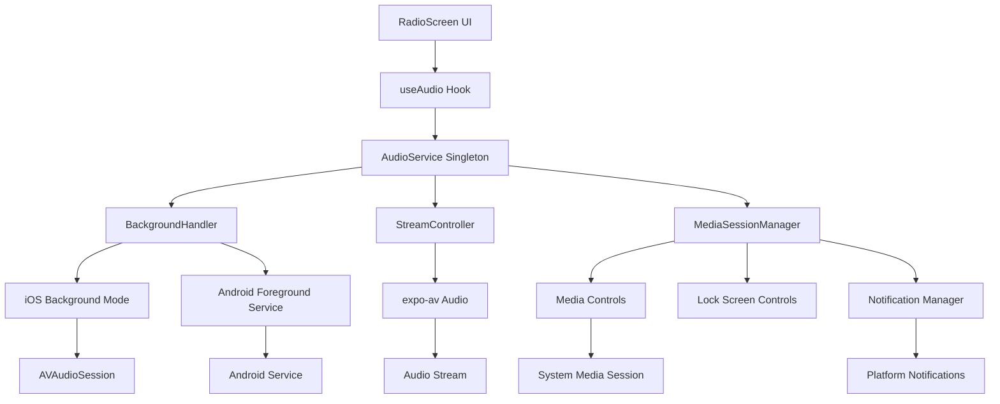

# background-playback - Task 16

Execute task 16 for the background-playback specification.

## Task Description
Update AudioService play() method for background support

## Code Reuse
**Leverage existing code**: existing play() method, BackgroundHandler, MediaSessionManager

## Requirements Reference
**Requirements**: 1.1, 2.1, 3.1

## Usage
```
/Task:16-background-playback
```

## Instructions

Execute with @spec-task-executor agent the following task: "Update AudioService play() method for background support"

```
Use the @spec-task-executor agent to implement task 16: "Update AudioService play() method for background support" for the background-playback specification and include all the below context.

# Steering Context
## Steering Documents Context

No steering documents found or all are empty.

# Specification Context
## Specification Context (Pre-loaded): background-playback

### Requirements
# Requirements Document

## Introduction

The Background Playback feature enables continuous audio playback for the TrendAnkara Radio app when the application is backgrounded or the device screen is locked. This feature allows users to listen to the radio stream while using other apps or when their device is in their pocket, providing an essential user experience for a radio application. The feature includes native media controls in the notification center (Android) and control center (iOS), allowing users to control playback without reopening the app.

## Alignment with Product Vision

This feature is critical for a radio application as it enables the core listening experience expected by users. Background playback is a fundamental requirement that allows users to:
- Continue listening while multitasking on their device
- Control playback from lock screen and system media controls
- Maintain a continuous listening experience without keeping the app in foreground
- Reduce battery consumption by allowing screen to be turned off during playback

## Requirements

### Requirement 1: iOS Background Audio Capability

**User Story:** As an iOS user, I want the radio to continue playing when I switch apps or lock my screen, so that I can listen while doing other tasks.

#### Acceptance Criteria

1. WHEN the app is playing audio AND the user switches to another app THEN the audio SHALL continue playing without interruption
2. WHEN the app is playing audio AND the user locks the device screen THEN the audio SHALL continue playing
3. WHEN background audio is playing AND the user opens the control center THEN the app SHALL display media controls with title "TrendAnkara Radyo"
4. IF the app is terminated by the system while playing THEN the audio SHALL stop gracefully
5. WHEN the user receives a phone call THEN the audio SHALL pause automatically AND resume after the call ends

### Requirement 2: Android Foreground Service

**User Story:** As an Android user, I want the radio to keep playing when I navigate away from the app, so that I can listen continuously.

#### Acceptance Criteria

1. WHEN audio playback starts THEN the app SHALL create a foreground service with a persistent notification
2. WHEN the foreground service is active THEN the notification SHALL display play/pause controls and current status
3. WHEN the user taps the notification THEN the app SHALL open to the radio player screen
4. IF the user swipes away the app from recent apps THEN the foreground service SHALL continue running
5. WHEN the user explicitly stops playback THEN the foreground service SHALL be terminated

### Requirement 3: Media Controls in Notification/Lock Screen

**User Story:** As a user, I want to control radio playback from my lock screen or notification panel, so that I don't need to unlock my device or open the app.

#### Acceptance Criteria

1. WHEN background playback is active THEN media controls SHALL appear in the device's notification center/lock screen
2. WHEN the user taps play/pause in media controls THEN the playback state SHALL update accordingly
3. WHEN the user taps stop/close in media controls THEN the playback SHALL stop AND the service SHALL terminate
4. IF the stream is buffering THEN the media controls SHALL show a loading indicator
5. WHEN media controls are displayed THEN they SHALL show the app icon and "TrendAnkara Radyo" as the title

### Requirement 4: Audio Focus Management

**User Story:** As a user, I want the app to respect other audio apps, so that my music or calls aren't interrupted inappropriately.

#### Acceptance Criteria

1. WHEN another app requests audio focus THEN the radio app SHALL pause playback
2. WHEN audio focus is regained THEN the app SHALL resume playback if it was playing before
3. IF a transient audio interruption occurs (notification sound) THEN the app SHALL duck the volume temporarily
4. WHEN the user explicitly starts playback in another audio app THEN the radio SHALL stop
5. WHEN headphones are disconnected THEN the playback SHALL pause automatically

### Requirement 5: Session Management

**User Story:** As a user, I want my playback session to persist appropriately, so that the app behaves predictably when I return to it.

#### Acceptance Criteria

1. WHEN the app is reopened while background playback is active THEN the UI SHALL reflect the current playback state
2. IF the app was terminated and reopened THEN the playback state SHALL be restored to stopped
3. WHEN background playback is active for more than 30 minutes THEN the session SHALL remain stable
4. IF network connectivity is lost during background playback THEN the app SHALL attempt reconnection with the existing retry logic
5. WHEN the device restarts THEN the app SHALL NOT automatically resume playback

## Non-Functional Requirements

### Performance
- Background playback SHALL consume less than 5% additional CPU compared to foreground playback
- Audio buffer SHALL maintain at least 15 seconds of content to handle network fluctuations
- Media control response time SHALL be under 200ms
- Battery consumption SHALL not exceed 2% per hour of continuous playback

### Security
- Background service SHALL only access necessary permissions (audio, notification)
- No user data SHALL be transmitted while in background mode
- Media session SHALL be properly secured to prevent hijacking by other apps

### Reliability
- Background playback SHALL remain stable for at least 8 hours of continuous streaming
- Service SHALL handle network switches (WiFi to cellular) without interruption
- App SHALL gracefully handle system resource constraints
- Recovery from interruptions SHALL occur within 5 seconds

### Usability
- Media controls SHALL follow platform-specific design guidelines
- Notification SHALL be non-intrusive but easily accessible
- Playback state SHALL be immediately visible in media controls
- Controls SHALL be accessible with one-handed operation

---

### Design
# Design Document

## Overview

The Background Playback feature extends the existing TrendAnkara Radio audio streaming capabilities to enable continuous playback when the app is not in the foreground. This design leverages the existing AudioService architecture while adding platform-specific background mode configurations, media session management, and notification controls. The implementation will maintain the current singleton pattern and event-driven architecture while extending it with background-specific handlers and native platform integrations.

### Required Dependencies
The following packages need to be installed:
- `expo-notifications`: For Android foreground service notifications
- `expo-task-manager`: For managing background tasks
- `@react-native-async-storage/async-storage`: For persisting session state

Platform detection will use React Native's Platform API (`Platform.OS`) to conditionally load platform-specific implementations.

## Steering Document Alignment

### Technical Standards (tech.md)
Since no explicit tech.md exists, this design follows the observed patterns in the codebase:
- TypeScript for type safety
- Singleton pattern for service management (AudioService)
- Event-driven architecture with subscription pattern
- Expo SDK for native functionality
- React hooks for UI state management

### Project Structure (structure.md)
Following the existing project organization:
- Services in `/services/audio/` directory
- Platform-specific implementations using `.ios.ts` and `.android.ts` extensions
- Constants in `/constants/` directory
- Hooks in `/hooks/` directory
- Types defined alongside implementations or in `/types/`

## Code Reuse Analysis

### Existing Components to Leverage
- **AudioService**: Core singleton service managing playback state - will be extended with background capabilities
- **StreamController**: Handles stream loading/unloading - will be reused as-is
- **AudioErrorHandler**: Error handling logic - will handle background-specific errors
- **useAudio hook**: React hook for UI integration - will be enhanced with background state
- **AudioConfig constants**: Configuration values - will add background-specific configs

### Integration Points
- **expo-av Audio module**: Already configured with `staysActiveInBackground: true`
- **Playback status subscription**: Existing event system will propagate background state changes
- **Error retry mechanism**: Current retry logic will handle background network issues
- **State management pattern**: Observer pattern allows seamless background state updates

## Architecture

The background playback implementation extends the existing audio architecture with platform-specific background handlers and media session management while maintaining backward compatibility.



## Components and Interfaces

### BackgroundHandler
- **Purpose:** Manages platform-specific background audio capabilities and lifecycle
- **Interfaces:**
  - `initialize()`: Sets up background modes and permissions
  - `enableBackground()`: Activates background playback mode
  - `disableBackground()`: Deactivates background mode
  - `handleAppStateChange(state)`: Responds to app state transitions
  - `requestAudioFocus()`: Requests exclusive audio focus from system
  - `abandonAudioFocus()`: Releases audio focus when stopping
  - `handleAudioFocusChange(focusState)`: Responds to focus changes from other apps
  - `handleNetworkLoss()`: Triggers existing retry mechanism for background reconnection
- **Dependencies:** expo-av (for audio session), expo-notifications (required installation), expo-task-manager (required installation)
- **Reuses:** AudioConfig constants, AudioErrorHandler for background-specific errors, existing retry mechanism from StreamController

### MediaSessionManager
- **Purpose:** Manages media session metadata and controls for lock screen/notification display
- **Interfaces:**
  - `updateMetadata(title, artist, artwork)`: Updates now-playing information using expo-av's setNowPlayingInfoAsync
  - `setPlaybackState(state)`: Updates playback state in media controls
  - `handleRemoteCommand(command)`: Processes media control commands
  - `clearSession()`: Cleans up media session
  - `persistSessionState(state)`: Saves current playback state to AsyncStorage
  - `restoreSessionState()`: Retrieves and restores saved state on app restart
- **Dependencies:** expo-av (setNowPlayingInfoAsync, setOnPlaybackStatusUpdate), @react-native-async-storage/async-storage for persistence
- **Reuses:** AudioStatus types, existing state management pattern

### NotificationService
- **Purpose:** Creates and manages persistent notification for Android foreground service
- **Interfaces:**
  - `createNotification(status)`: Creates/updates notification with controls
  - `destroyNotification()`: Removes notification and stops service
  - `updateNotificationState(state)`: Updates notification appearance
- **Dependencies:** expo-notifications, expo-task-manager
- **Reuses:** AudioStatus for state display, IconSymbol components for notification actions

### Enhanced AudioService
- **Purpose:** Extended version of existing AudioService with background capabilities
- **Interfaces:** (additions to existing)
  - `initializeBackground()`: Sets up background components
  - `setBackgroundMode(enabled)`: Toggles background mode
  - `handleInterruption(type)`: Manages audio focus changes
- **Dependencies:** BackgroundHandler, MediaSessionManager, NotificationService
- **Reuses:** All existing AudioService code, StreamController, error handling

## Data Models

### BackgroundConfig
```typescript
interface BackgroundConfig {
  // iOS specific
  iosBackgroundModes: string[];  // ['audio']
  iosAudioSessionCategory: string;  // 'playback'
  iosAudioSessionMode: string;  // 'default'

  // Android specific
  androidForegroundService: boolean;
  androidNotificationChannel: string;
  androidNotificationPriority: number;

  // Shared
  mediaSessionEnabled: boolean;
  showLockScreenControls: boolean;
  resumeOnFocusGain: boolean;
}
```

### MediaSessionMetadata
```typescript
interface MediaSessionMetadata {
  title: string;  // "TrendAnkara Radyo"
  artist: string;  // "Canlı Yayın"
  artwork?: string;  // App icon URL
  duration?: number;  // For live stream, undefined
  position?: number;  // Current position if applicable
}
```

### BackgroundState (extends AudioState)
```typescript
type BackgroundState = AudioState | 'background-playing' | 'background-paused' | 'interrupted';

interface EnhancedAudioStatus extends AudioStatus {
  isBackgroundMode: boolean;
  hasAudioFocus: boolean;
  interruptionType?: 'transient' | 'permanent';
}
```

### RemoteCommand
```typescript
interface RemoteCommand {
  command: 'play' | 'pause' | 'stop' | 'togglePlayPause';
  timestamp: number;
  source: 'lockscreen' | 'notification' | 'headset' | 'watch';
}
```

## Error Handling

### Error Scenarios
1. **Background Mode Initialization Failure**
   - **Handling:** Fall back to foreground-only playback, log error
   - **User Impact:** App works normally but stops when backgrounded

2. **Audio Focus Lost**
   - **Handling:** Pause playback, store state for potential resume
   - **User Impact:** Playback pauses when other audio app takes focus

3. **Foreground Service Creation Failure (Android)**
   - **Handling:** Attempt recreation, fall back to basic background mode
   - **User Impact:** May lose persistent notification but audio continues

4. **Media Session Registration Failure**
   - **Handling:** Continue playback without media controls
   - **User Impact:** No lock screen controls but playback continues

5. **Network Loss in Background**
   - **Handling:** Use existing retry mechanism, show status in notification
   - **User Impact:** Brief interruption with automatic recovery attempt

6. **System Memory Pressure**
   - **Handling:** Reduce buffer size, release non-critical resources
   - **User Impact:** Potential brief buffering, but playback continues

## Testing Strategy

### Unit Testing
- BackgroundHandler platform detection and initialization
- MediaSessionManager metadata updates and command handling
- NotificationService notification creation and updates
- Enhanced AudioService background state transitions
- Mock platform-specific APIs for testing

### Integration Testing
- App state transitions (foreground → background → foreground)
- Audio focus handling with mock interruptions
- Media control command processing
- Notification interaction handling
- Background network recovery scenarios

### End-to-End Testing
- Complete user flow: Start playback → background app → control from lock screen → return to app
- Interruption handling: Phone call → pause → resume after call
- Long-duration testing: 8+ hours continuous background streaming
- Platform-specific testing on iOS and Android devices
- Different network conditions (WiFi → cellular transitions)

**Note**: Specification documents have been pre-loaded. Do not use get-content to fetch them again.

## Task Details
- Task ID: 16
- Description: Update AudioService play() method for background support
- Leverage: existing play() method, BackgroundHandler, MediaSessionManager
- Requirements: 1.1, 2.1, 3.1

## Instructions
- Implement ONLY task 16: "Update AudioService play() method for background support"
- Follow all project conventions and leverage existing code
- Mark the task as complete using: claude-code-spec-workflow get-tasks background-playback 16 --mode complete
- Provide a completion summary
```

## Task Completion
When the task is complete, mark it as done:
```bash
claude-code-spec-workflow get-tasks background-playback 16 --mode complete
```

## Next Steps
After task completion, you can:
- Execute the next task using /background-playback-task-[next-id]
- Check overall progress with /spec-status background-playback
