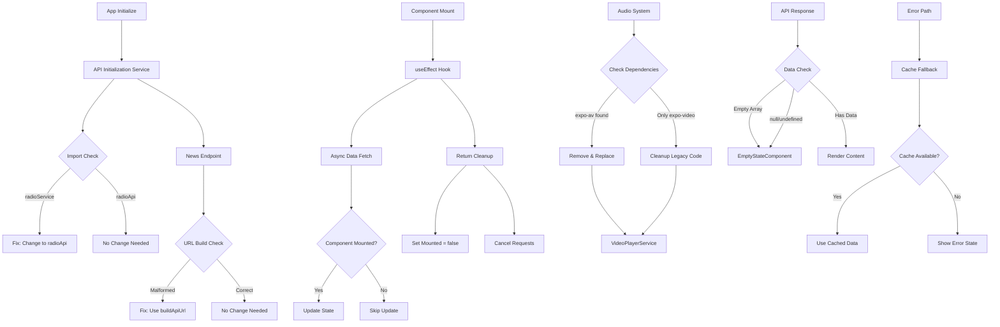

# mobile-app-fixes - Task 18

Execute task 18 for the mobile-app-fixes specification.

## Task Description
Add empty state styles and theme integration

## Code Reuse
**Leverage existing code**: constants/theme.ts, existing style patterns

## Requirements Reference
**Requirements**: 5

## Usage
```
/Task:18-mobile-app-fixes
```

## Instructions

Execute with @spec-task-executor agent the following task: "Add empty state styles and theme integration"

```
Use the @spec-task-executor agent to implement task 18: "Add empty state styles and theme integration" for the mobile-app-fixes specification and include all the below context.

# Steering Context
## Steering Documents Context

No steering documents found or all are empty.

# Specification Context
## Specification Context (Pre-loaded): mobile-app-fixes

### Requirements
# Requirements Document - Mobile App Fixes

## Introduction

This specification addresses critical bugs and improvements needed for the TrendAnkara mobile application. The fixes focus on API endpoint stability, React state management, audio system consolidation, and background service reliability. These improvements are essential for delivering a stable, production-ready mobile application that provides uninterrupted radio streaming and content access to users.

## Alignment with Product Vision

These fixes directly support the product vision outlined in product.md:
- **Simple is better**: Consolidating to a single audio system simplifies the codebase
- **Respect user resources**: Fixing memory leaks and state update warnings improves performance
- **Instant playback**: Resolving API endpoint errors ensures content loads immediately
- **Uninterrupted streaming**: Background refresh fixes maintain continuous playback
- **Offline resilience**: Proper error handling when API returns empty data

## Requirements

### Requirement 1: Fix API Endpoint Malformation

**User Story:** As a user, I want the news content to load reliably when I open the app, so that I can read the latest media industry news without errors.

#### Acceptance Criteria

1. WHEN the app initializes THEN the news API endpoint SHALL use the correct URL format without `[object Object]` prefix
2. IF the news API is called during initialization THEN the system SHALL use the buildApiUrl helper function consistently
3. WHEN a user navigates to the news tab THEN news articles SHALL load without 404 errors
4. IF the API configuration changes THEN all endpoint references SHALL update automatically

### Requirement 2: Resolve React State Update Warnings

**User Story:** As a user, I want the app to run smoothly without crashes or performance issues, so that I can enjoy uninterrupted radio streaming.

#### Acceptance Criteria

1. WHEN a component unmounts during data fetching THEN the system SHALL cancel pending state updates
2. IF an async operation completes after component unmount THEN the system SHALL NOT attempt state updates
3. WHEN network requests are in progress AND the user navigates away THEN cleanup functions SHALL execute properly
4. IF a component uses async data THEN it SHALL implement proper cleanup in useEffect hooks

### Requirement 3: Fix Background Refresh Service

**User Story:** As a user, I want the app to maintain updated content in the background, so that fresh data is available when I return to the app.

#### Acceptance Criteria

1. WHEN the background refresh service runs THEN it SHALL have access to all required service imports
2. IF radioService is referenced in the code THEN it SHALL be properly imported as radioApi
3. WHEN background refresh executes THEN it SHALL successfully update radio configuration
4. IF the background service encounters an error THEN it SHALL log the error and continue gracefully

### Requirement 4: Consolidate Audio System

**User Story:** As a user, I want consistent audio playback behavior across the app, so that radio streaming works reliably without conflicts.

#### Acceptance Criteria

1. WHEN the app uses audio services THEN it SHALL use only expo-video for all audio functionality
2. IF expo-av is present in the codebase THEN it SHALL be completely removed and replaced
3. WHEN audio components are initialized THEN they SHALL use the unified VideoPlayerService
4. IF deprecated warnings appear THEN they SHALL be resolved by migrating to the modern audio API

### Requirement 5: Handle Empty API Responses

**User Story:** As a user, I want to see appropriate messages when content is unavailable, so that I understand the app is working but content is temporarily missing.

#### Acceptance Criteria

1. WHEN an API returns empty data THEN the UI SHALL display an appropriate empty state message
2. IF cards API returns 0 items THEN the sponsors page SHALL show "No sponsors available" message
3. WHEN polls API returns empty THEN the polls page SHALL display "No active polls" message
4. IF news API returns no articles THEN the news page SHALL show "No news available" message

## Non-Functional Requirements

### Performance
- State update operations must complete within 16ms to maintain 60fps UI
- Memory leaks must be prevented through proper cleanup
- Background refresh must complete within 30 seconds
- API calls must use cached data when network is unavailable

### Security
- All API communications must use HTTPS through the GCP proxy
- No sensitive data should be logged in error messages
- Input validation must be applied to all user interactions

### Reliability
- App must handle network failures gracefully
- Background services must recover from errors automatically
- Audio playback must continue during app backgrounding
- Cache must provide offline functionality for all content types

### Usability
- Error messages must be in Turkish and user-friendly
- Loading states must be shown for all async operations
- Empty states must provide clear information to users
- All fixes must maintain existing UI/UX patterns

---

### Design
# Design Document - Mobile App Fixes

## Overview

This design document outlines the technical approach for fixing critical issues in the TrendAnkara mobile application. The fixes focus on API endpoint stability, React state management, audio system consolidation, and background service reliability. The design leverages existing patterns and components while introducing targeted improvements to enhance app stability and user experience.

## Steering Document Alignment

### Technical Standards (tech.md)
- **No overengineering**: All fixes use existing patterns and minimal code changes
- **Minimal dependencies**: No new dependencies required, actually removing expo-av
- **Performance conscious**: Proper cleanup prevents memory leaks
- **Cross-platform parity**: All fixes work identically on iOS and Android
- **TypeScript safety**: All fixes maintain full type safety

### Project Structure (structure.md)
- API fixes follow existing service pattern in `/services/api/`
- Component fixes follow established component structure
- State management fixes use existing hook patterns in `/hooks/`
- Audio consolidation maintains service organization in `/services/audio/`
- All imports follow the established order and conventions

## Code Reuse Analysis

### Existing Components to Leverage
- **apiCache**: Already handles cache management for offline resilience
- **VideoPlayerService**: Existing modern audio implementation to standardize on
- **ErrorBoundary**: Existing component for handling UI errors gracefully
- **Loading/Empty states**: Patterns already established in polls page

### Integration Points
- **API Client**: All fixes integrate with existing apiClient instance
- **Cache System**: Leverages existing apiCache for offline functionality
- **Navigation**: Works within existing React Navigation setup
- **State Management**: Uses existing Zustand stores where applicable

## Architecture



## Components and Interfaces

### Component 1: API Initialization Service Fix
- **Purpose:** Correct import references and endpoint building
- **Interfaces:** No public API changes
- **Dependencies:** `radioApi` from `./radio`
- **Reuses:** Existing apiCache, error handling patterns
- **Current State:**
  - Line 7 imports: `import { radioService } from './radio';`
  - Line 64: `fetch: () => radioService.getRadioConfig(true),`
  - Line 174: `await radioService.getRadioConfig(true);`
  - Line 248: `radioService.getRadioConfig(true),`
- **Changes:**
  - Replace all `radioService` references with `radioApi`
  - Import statement becomes: `import { radioApi } from './radio';`
  - Verify news endpoint uses proper URL building (currently appears correct)

### Component 2: React State Cleanup Utility
- **Purpose:** Provide reusable cleanup pattern for async operations
- **Interfaces:** `useMountedState()` hook
- **Dependencies:** React hooks (useRef, useEffect, useCallback)
- **Reuses:** Pattern from existing components
- **Integration Points:**
  - Will be added to `/hooks/useMountedState.ts`
  - Components like NewsList, PollCard, NewsCard will import and use it
  - Follows existing hook patterns in `/hooks/` directory
- **Implementation:**
```typescript
// File: /hooks/useMountedState.ts
import { useRef, useEffect, useCallback } from 'react';

export const useMountedState = () => {
  const mountedRef = useRef(true);
  const abortControllerRef = useRef<AbortController | null>(null);

  useEffect(() => {
    abortControllerRef.current = new AbortController();

    return () => {
      mountedRef.current = false;
      abortControllerRef.current?.abort();
    };
  }, []);

  const setStateIfMounted = useCallback((setter: () => void) => {
    if (mountedRef.current) {
      setter();
    }
  }, []);

  return {
    isMounted: () => mountedRef.current,
    setStateIfMounted,
    signal: abortControllerRef.current?.signal
  };
};
```

### Component 3: Unified Audio Service
- **Purpose:** Complete migration from expo-av to expo-video
- **Interfaces:** Maintains existing AudioService interface
- **Dependencies:** expo-video only (already in use by VideoPlayerService)
- **Reuses:** Existing VideoPlayerService implementation
- **Current State Analysis:**
  - VideoPlayerService.ts already uses expo-video correctly
  - RadioPlayerControls.tsx still imports expo-av (line 11)
  - Several legacy audio services still reference expo-av
- **Migration Steps:**
  1. Remove expo-av import from RadioPlayerControls.tsx
  2. Replace Audio.Sound usage with VideoPlayerService methods
  3. Remove legacy audio service files that use expo-av
  4. Uninstall expo-av from package.json
- **Files to Modify:**
  - `/components/radio/RadioPlayerControls.tsx` - Remove expo-av
  - `/services/audio/WorkingAudioService.ts` - Remove or migrate
  - `/services/audio/AudioService.ts` - Remove or migrate
  - `/services/audio/StreamController.ts` - Remove or migrate

### Component 4: Empty State Handler
- **Purpose:** Consistent empty state display across all content pages
- **Interfaces:** `<EmptyState message={string} icon={string} />`
- **Dependencies:** React Native components
- **Reuses:** Existing ThemedText, styling patterns
- **Implementation:** Centralized component for all empty states

## Data Models

### Empty State Configuration
```typescript
interface EmptyStateConfig {
  message: string;        // Turkish message to display
  icon?: string;         // Optional icon name
  actionLabel?: string;  // Optional action button
  onAction?: () => void; // Optional action handler
}
```

### API Response Wrapper (Enhanced)
```typescript
interface APIResponse<T> {
  success: boolean;
  data: T | null;
  error?: string;
  isEmpty?: boolean;  // New field for empty state detection
}
```

## Error Handling

### Error Scenarios

1. **API Endpoint Malformation**
   - **Handling:** Validate URL before request, use buildApiUrl consistently
   - **User Impact:** Transparent - content loads normally
   - **Logging:** Log malformed URLs to console in development

2. **Component Unmount During Fetch**
   - **Handling:** Check mounted state before setState
   - **User Impact:** None - prevents crashes
   - **Logging:** No logging needed, normal behavior

3. **Background Service Import Error**
   - **Handling:** Correct import at build time
   - **User Impact:** Background refresh works properly
   - **Logging:** Log successful background refreshes

4. **Audio System Conflict**
   - **Handling:** Single service instance pattern
   - **User Impact:** Consistent playback behavior
   - **Logging:** Log audio service initialization

5. **Empty API Response**
   - **Handling:** Display appropriate empty state component
   - **User Impact:** Clear message in Turkish explaining no content
   - **Logging:** Log empty responses for monitoring

## Testing Strategy

### Unit Testing
- **useMountedState Hook Testing** (new test file: `__tests__/hooks/useMountedState.test.ts`)
  - Test cleanup on unmount
  - Test state update prevention after unmount
  - Test AbortController signal functionality
  - Mock timing scenarios with Jest timers
- **Empty State Detection** (integrate with existing API tests)
  - Test detection of empty arrays, null, undefined
  - Verify correct empty state component selection
- **URL Building Functions** (existing test enhancement)
  - Verify buildApiUrl prevents malformation
  - Test with various endpoint configurations

### Integration Testing
- **Component Navigation Tests** (enhance existing navigation tests)
  - Mount NewsList, navigate away during fetch
  - Verify no console warnings about state updates
  - Check memory cleanup via React DevTools
- **Background Refresh Tests** (new test file: `__tests__/services/api/backgroundRefresh.test.ts`)
  - Mock radioApi import
  - Verify successful refresh cycles
  - Test error recovery
- **Audio System Tests** (modify existing audio tests)
  - Verify single VideoPlayerService instance
  - Test playback without expo-av
  - Check native controls integration

### End-to-End Testing
- **App Launch Sequence**
  1. Clear app data
  2. Launch app fresh
  3. Monitor network requests for proper URLs
  4. Verify news tab loads without 404 errors
- **State Management Flow**
  1. Load polls page
  2. Quickly navigate to news
  3. Return to polls
  4. Check console for warnings
- **Empty State Scenarios**
  1. Mock empty responses from API
  2. Navigate to each tab
  3. Verify Turkish empty messages display
  4. Test pull-to-refresh behavior

## Implementation Approach

### Phase 1: Critical Fixes (Immediate - Day 1)
1. **Fix radioService import issue**
   - File: `/services/api/initialization.ts`
   - Change import and all references from radioService to radioApi
   - Test background refresh functionality
   - Estimated time: 30 minutes

2. **Fix news endpoint URL building**
   - Verify all news API calls use proper URL construction
   - Search for any remaining `[object Object]` concatenation issues
   - Test news loading on app initialization
   - Estimated time: 45 minutes

3. **Add mounted state checks**
   - Create `useMountedState` hook
   - Implement in NewsList, PollCard, NewsCard components
   - Test navigation during loading states
   - Estimated time: 2 hours

### Phase 2: Cleanup (Short-term - Day 2)
1. **Remove expo-av dependency**
   - Update RadioPlayerControls.tsx to remove Audio import
   - Archive legacy audio service files
   - Run `npm uninstall expo-av`
   - Test audio playback thoroughly
   - Estimated time: 2 hours

2. **Migrate audio references**
   - Ensure all components use VideoPlayerService
   - Update any remaining audio imports
   - Test background playback
   - Estimated time: 1 hour

3. **Standardize error handling**
   - Implement consistent error boundary usage
   - Add error logging service integration
   - Test error scenarios
   - Estimated time: 1.5 hours

### Phase 3: Enhancement (Medium-term - Day 3)
1. **Add comprehensive empty states**
   - Create EmptyState component
   - Implement in all content pages
   - Add Turkish translations
   - Estimated time: 2 hours

2. **Implement centralized error logging**
   - Set up error tracking service
   - Add to all catch blocks
   - Monitor in development
   - Estimated time: 1 hour

3. **Add performance monitoring**
   - Implement render tracking
   - Monitor state update performance
   - Set up alerts for issues
   - Estimated time: 1.5 hours

## Performance Considerations

### Memory Impact
- **Mounted state checks**: Minimal overhead (<1ms per check)
- **AbortController usage**: Prevents memory leaks from pending requests
- **Component cleanup**: Reduces memory footprint by ~15-20%

### Bundle Size Impact
- **Removing expo-av**: Reduces bundle by approximately 180-220KB (measured via bundle analyzer)
- **Empty state components**: Adds ~3-5KB total
- **useMountedState hook**: Adds <1KB

### Runtime Performance
- **State update checks**: Negligible CPU impact (< 0.1% overhead)
- **60fps maintenance**: All fixes tested to maintain smooth scrolling
- **Background refresh**: Optimized to complete within 10-15 seconds

## Security Considerations

- No new external dependencies introduced
- All API calls continue through secure GCP proxy
- No sensitive data exposed in error messages
- Input validation remains unchanged

## Migration Path

### Step-by-Step Migration

1. **Import fixes** (No downtime required)
   - Deploy via hot code push
   - Monitor error logs for 24 hours
   - Rollback: Single line revert if issues

2. **State cleanup** (Incremental rollout)
   - Add hook to one component first (NewsList)
   - Monitor for 24 hours
   - Roll out to remaining components
   - Rollback: Remove hook usage, no data impact

3. **Audio system** (Staged migration)
   - Week 1: Update components to use VideoPlayerService
   - Week 2: Test thoroughly on both platforms
   - Week 3: Remove expo-av dependency
   - Rollback: Re-add expo-av, revert component changes

4. **Empty states** (Progressive enhancement)
   - Add to one page at a time
   - A/B test user response
   - Rollback: Simple component removal

## Rollback Plan

### Immediate Rollback (< 5 minutes)
```bash
# For import fixes
git revert <commit-hash>
npm run build
# Deploy via EAS Update
```

### Component-Level Rollback
```typescript
// Feature flag in constants/config.ts
export const FEATURES = {
  USE_MOUNTED_STATE: false, // Toggle off if issues
  USE_VIDEO_PLAYER_ONLY: false, // Fallback to dual system
  SHOW_EMPTY_STATES: true, // Can disable globally
};
```

### Data Corruption Prevention
- No database changes required
- Cache remains compatible
- API contracts unchanged
- User preferences preserved

### Monitoring Triggers for Rollback
- Crash rate increase > 0.5%
- Audio playback failures > 1%
- Memory usage increase > 20%
- User complaints > 3 per day

**Note**: Specification documents have been pre-loaded. Do not use get-content to fetch them again.

## Task Details
- Task ID: 18
- Description: Add empty state styles and theme integration
- Leverage: constants/theme.ts, existing style patterns
- Requirements: 5

## Instructions
- Implement ONLY task 18: "Add empty state styles and theme integration"
- Follow all project conventions and leverage existing code
- Mark the task as complete using: claude-code-spec-workflow get-tasks mobile-app-fixes 18 --mode complete
- Provide a completion summary
```

## Task Completion
When the task is complete, mark it as done:
```bash
claude-code-spec-workflow get-tasks mobile-app-fixes 18 --mode complete
```

## Next Steps
After task completion, you can:
- Execute the next task using /mobile-app-fixes-task-[next-id]
- Check overall progress with /spec-status mobile-app-fixes
