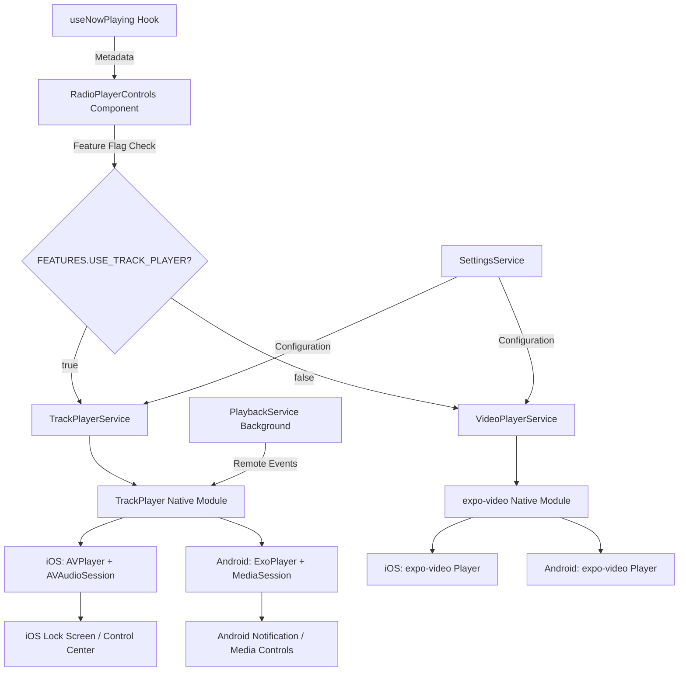
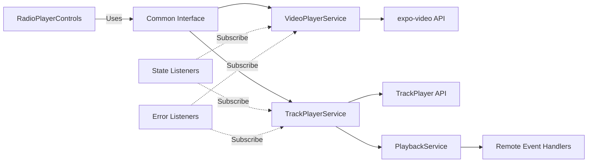
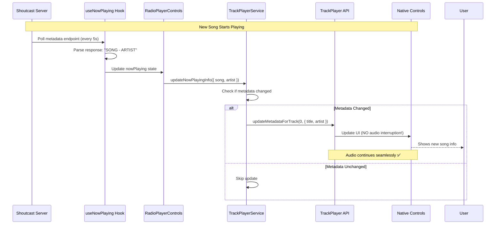
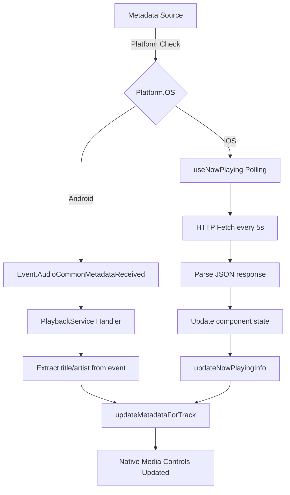

# track-player-migration - Task 29

Execute task 29 for the track-player-migration specification.

## Task Description
Test rollback to VideoPlayerService

## Requirements Reference
**Requirements**: 5.4, 5.8, 5.9

## Usage
```
/Task:29-track-player-migration
```

## Instructions

Execute with @spec-task-executor agent the following task: "Test rollback to VideoPlayerService"

```
Use the @spec-task-executor agent to implement task 29: "Test rollback to VideoPlayerService" for the track-player-migration specification and include all the below context.

# Steering Context
## Steering Documents Context

No steering documents found or all are empty.

# Specification Context
## Specification Context (Pre-loaded): track-player-migration

### Requirements
# Requirements Document - Track Player Migration

## Introduction

This feature implements react-native-track-player as an alternative audio streaming solution for the TrendAnkara mobile app while maintaining expo-video as a fallback. Currently, updating native media controls (iOS lock screen, Control Center, Android notifications) with live "Now Playing" information requires destroying and recreating the player notification system, causing 200-500ms audio interruptions that disrupt the listening experience. This feature solves this by using react-native-track-player's `updateMetadataForTrack()` method, which updates metadata without interrupting playback, enabling seamless dynamic metadata updates on native controls.

## Alignment with Product Vision

This feature directly supports the Product Vision principles:

- **Simple is better**: Maintains existing UI while improving backend audio handling
- **No overengineering**: Implements a proven library (3,600+ GitHub stars) with feature flag for easy rollback
- **Test everything**: Includes comprehensive testing strategy across both platforms
- **Respect user resources**: Eliminates audio stuttering, provides smoother listening experience
- **Uninterrupted streaming**: Core goal - seamless metadata updates without playback disruption

**Key Product Goals Supported**:
- **Instant playback** - TrackPlayer provides better buffering control
- **Uninterrupted streaming** - Solves the metadata update audio cutoff issue
- **Background listening** - Enhanced background playback capabilities
- **Simple navigation** - No UI changes required

## Requirements

### Requirement 1: Install and Configure react-native-track-player

**User Story**: As a developer, I want to install react-native-track-player as an additional dependency, so that I can implement an alternative audio streaming solution without affecting the existing expo-video implementation.

#### Acceptance Criteria

1. WHEN the package is installed THEN the system SHALL add `react-native-track-player@4.1.2` to package.json dependencies
2. WHEN app.json is configured THEN the system SHALL add the react-native-track-player plugin alongside the existing expo-video plugin
3. WHEN the plugin configuration is added THEN the system SHALL specify `playbackServiceName: "PlaybackService"` to register the background service
4. WHEN the app is rebuilt THEN the system SHALL successfully compile on both iOS and Android with both audio libraries available
5. WHEN dependencies are validated THEN the system SHALL ensure compatibility with Expo SDK 54, React Native 0.81.4, and TypeScript 5.9.2

### Requirement 2: Create TrackPlayerService Parallel to VideoPlayerService

**User Story**: As a developer, I want to create a new TrackPlayerService class with the same interface as VideoPlayerService, so that I can switch between implementations using a feature flag without changing component code.

#### Acceptance Criteria

1. WHEN TrackPlayerService is created THEN the system SHALL implement all methods from VideoPlayerService interface (initialize, loadStream, play, pause, stop, setVolume, updateNowPlayingInfo, addStateListener, etc.)
2. WHEN the service is initialized THEN the system SHALL configure TrackPlayer with background playback enabled and native media controls support
3. WHEN the service manages state THEN the system SHALL maintain the same PlayerStateType values ('stopped', 'playing', 'paused', 'buffering', 'error') as VideoPlayerService
4. WHEN error handling is implemented THEN the system SHALL provide the same error listener pattern as VideoPlayerService for consistent error handling

### Requirement 3: Implement Background Playback Service

**User Story**: As a developer, I want to create a background PlaybackService module that handles remote media control events, so that the audio continues playing when the app is backgrounded and responds to lock screen controls.

#### Acceptance Criteria

1. WHEN the PlaybackService is registered THEN the system SHALL export a function that TrackPlayer can invoke in the background
2. WHEN remote play event is received THEN the system SHALL call TrackPlayer.play() to start playback
3. WHEN remote pause event is received THEN the system SHALL call TrackPlayer.pause() to pause playback
4. WHEN remote stop event is received THEN the system SHALL call TrackPlayer.stop() to stop playback
5. WHEN audio becomes noisy (headphones unplugged) THEN the system SHALL automatically pause playback
6. IF platform is Android AND metadata is received from stream THEN the system SHALL automatically update track metadata using updateMetadataForTrack()

### Requirement 4: Implement Seamless Metadata Updates

**User Story**: As a listener, I want the "Now Playing" information on my lock screen and notification to update automatically when songs change, so that I can see what's currently playing without opening the app and WITHOUT hearing any audio interruption.

#### Acceptance Criteria

1. WHEN nowPlaying data changes from useNowPlaying hook THEN the system SHALL call TrackPlayerService.updateNowPlayingInfo() with the new metadata
2. WHEN updateNowPlayingInfo is called THEN the system SHALL invoke TrackPlayer.updateMetadataForTrack() to update the current track's metadata
3. WHEN metadata is updated THEN the system SHALL NOT interrupt audio playback (no stuttering or gaps)
4. WHEN metadata is updated THEN the system SHALL reflect changes on iOS lock screen, Control Center, and Android notification within 1 second
5. IF metadata hasn't changed from previous update THEN the system SHALL skip the update to prevent unnecessary operations
6. IF TrackPlayer encounters an error during metadata update THEN the system SHALL log the error but NOT throw to avoid breaking playback
7. WHEN metadata updates occur more frequently than every 1 second THEN the system SHALL throttle updates to prevent performance degradation
8. WHEN multiple rapid metadata changes occur THEN the system SHALL process only the most recent update and skip intermediate updates

### Requirement 5: Add Feature Flag for Easy Switching

**User Story**: As a developer, I want a feature flag to switch between VideoPlayerService (expo-video) and TrackPlayerService (react-native-track-player), so that I can quickly rollback to the stable implementation if issues are discovered.

#### Acceptance Criteria

1. WHEN the feature flag is added to constants/config.ts THEN the system SHALL define USE_TRACK_PLAYER boolean flag with default value false
2. WHEN RadioPlayerControls initializes THEN the system SHALL check FEATURES.USE_TRACK_PLAYER to determine which service to use
3. WHEN USE_TRACK_PLAYER is true THEN the system SHALL use TrackPlayerService for all audio operations
4. WHEN USE_TRACK_PLAYER is false THEN the system SHALL use VideoPlayerService for all audio operations (current behavior)
5. WHEN switching between services THEN the system SHALL maintain the same component interface and state management patterns
6. WHEN feature flag changes at runtime THEN the system SHALL properly cleanup the previously active service before initializing the new one
7. WHEN feature flag changes THEN the system SHALL preserve current playback position and state where possible
8. WHEN rolling back from TrackPlayerService to VideoPlayerService THEN the system SHALL maintain existing audio playback without interruption
9. WHEN rollback occurs THEN the system SHALL log the rollback event for debugging purposes

### Requirement 6: Maintain API Compatibility with Existing Components

**User Story**: As a developer, I want both audio services to expose the same public API, so that RadioPlayerControls and other components don't need to change when switching implementations.

#### Acceptance Criteria

1. WHEN either service is used THEN the system SHALL provide the same methods: initialize(), loadStream(), play(), pause(), stop(), togglePlayPause(), setVolume(), updateNowPlayingInfo()
2. WHEN either service is used THEN the system SHALL emit state changes through the same listener pattern: addStateListener(), removeStateListener(), onStateChange()
3. WHEN either service is used THEN the system SHALL emit errors through the same pattern: addErrorListener(), removeErrorListener(), onError()
4. WHEN either service is used THEN the system SHALL expose the same getters: isPlaying, currentState, getState(), radioConfig
5. WHEN RadioPlayerControls uses the selected service THEN the system SHALL work identically regardless of which implementation is active

### Requirement 7: Platform-Specific Metadata Handling

**User Story**: As a developer, I want to handle metadata updates differently on iOS and Android based on platform capabilities, so that I can leverage native features where available while providing consistent fallback behavior.

#### Acceptance Criteria

1. WHEN platform is Android THEN the system SHALL use TrackPlayer's Event.AudioCommonMetadataReceived to automatically detect metadata from the stream
2. WHEN Event.AudioCommonMetadataReceived fires THEN the system SHALL extract title and artist from the event and update track metadata
3. WHEN platform is iOS THEN the system SHALL continue using the existing useNowPlaying hook with 5-second polling to fetch metadata from the endpoint
4. WHEN metadata is fetched via polling (iOS) THEN the system SHALL call updateNowPlayingInfo() with the parsed data
5. IF metadata format is "SONG - ARTIST" THEN the system SHALL split and assign correctly to title and artist fields

### Requirement 8: Preserve Existing UI and User Experience

**User Story**: As a listener, I want the radio player controls to look and behave exactly the same, so that I don't notice any changes to the interface when the underlying audio system is upgraded.

#### Acceptance Criteria

1. WHEN TrackPlayerService is enabled THEN the system SHALL maintain the same button layout, colors, and styles in RadioPlayerControls
2. WHEN playback state changes THEN the system SHALL update the UI indicators (CANLI YAYIN, DURAKLATILDI, YÜKLENİYOR, etc.) identically to the current implementation
3. WHEN now playing info updates THEN the system SHALL display song and artist in the same format and position as the current implementation
4. WHEN controls are interacted with THEN the system SHALL provide the same button press animations and feedback
5. WHEN compact mode is used THEN the system SHALL render the same compact player layout

## Non-Functional Requirements

### Performance
- Metadata updates SHALL complete within 500ms from the time new data is received
- Initial stream loading SHALL start playback within 3 seconds on a stable network connection
- State listener notifications SHALL fire within 100ms of actual state changes
- Background service SHALL consume less than 2MB of additional memory
- Audio playback SHALL maintain stable bitrate without stuttering during metadata updates

### Security
- Stream URLs SHALL be validated before passing to TrackPlayer to prevent injection attacks
- Metadata content SHALL be sanitized to prevent potential XSS issues in native controls
- Background service SHALL NOT store sensitive data in memory
- All network requests SHALL use HTTPS when communicating with backend services

### Reliability
- TrackPlayerService SHALL handle network disconnections gracefully and attempt to reconnect
- IF TrackPlayer initialization fails THEN the system SHALL log the error and allow fallback to VideoPlayerService
- IF metadata update fails THEN the system SHALL continue playback and retry on next metadata change
- Background service SHALL automatically restart if terminated by the system (iOS/Android)
- Player state SHALL remain consistent even after app backgrounding and foregrounding

### Usability
- Feature flag change SHALL require only a code constant change and app reload (no rebuild required for switching)
- Error messages SHALL be logged with clear context for debugging (service name, operation, timestamp)
- Both services SHALL provide identical logging patterns for consistent debugging experience
- Developer SHALL be able to identify which service is active through __DEV__ mode indicators

### Maintainability
- TrackPlayerService SHALL follow the same class structure and patterns as VideoPlayerService
- Code comments SHALL explain platform-specific workarounds and decisions
- Both services SHALL use TypeScript with full type safety and no `any` types
- Service switching logic SHALL be centralized in RadioPlayerControls to minimize code changes

### Testing Requirements
- Platform tests SHALL verify both iOS and Android implementations independently
- Integration tests SHALL verify seamless switching between VideoPlayerService and TrackPlayerService
- Performance tests SHALL measure metadata update latency under various network conditions (WiFi, 4G, 5G)
- Regression tests SHALL ensure existing RadioPlayerControls functionality remains unchanged
- End-to-end tests SHALL verify background playback continues during metadata updates on both platforms
- Memory leak tests SHALL confirm proper cleanup when switching between services

### Compatibility
- Solution SHALL work with Expo SDK 54 and React Native 0.81.4
- Solution SHALL support both iOS and Android with feature parity
- Solution SHALL integrate with existing useNowPlaying hook without modifications
- Solution SHALL support both development and production builds without configuration changes

---

### Design
# Design Document - Track Player Migration

## Overview

This design implements react-native-track-player as a parallel audio streaming system alongside the existing expo-video implementation, enabling seamless metadata updates without audio interruption. The solution uses a feature flag pattern to allow instant switching between implementations, providing a safe migration path with easy rollback capability.

**Core Innovation**: TrackPlayer's `updateMetadataForTrack()` API updates native media controls (iOS lock screen, Control Center, Android notifications) without destroying and recreating the player, eliminating the 200-500ms audio gaps that currently occur with expo-video.

## Steering Document Alignment

### Technical Standards (tech.md)

**Framework Compatibility**:
- ✅ Expo SDK 54 and React Native 0.81.4
- ✅ TypeScript 5.9.2 with full type safety
- ✅ No `any` types used in implementation

**Code Standards**:
- ✅ All code and comments in English
- ✅ Turkish UI strings via JSX expressions
- ✅ Functional components with hooks
- ✅ Singleton service pattern (matches VideoPlayerService)

**Development Philosophy**:
- ✅ KISS Principle - Simple feature flag toggle
- ✅ YAGNI - Only implements required functionality
- ✅ DRY - Shared interface between services prevents duplication

**Dependencies**:
- Uses proven library (`react-native-track-player@4.1.2` - 3,600+ stars)
- Minimal new dependencies (only track-player added)
- Maintains existing expo-video for fallback

### Project Structure (structure.md)

**File Organization**:
```
services/audio/
├── VideoPlayerService.ts          # Existing (expo-video)
├── TrackPlayerService.ts          # New (react-native-track-player)
├── PlaybackService.ts             # New (background service)
└── index.ts                       # Service exports

constants/
└── config.ts                      # Feature flag (USE_TRACK_PLAYER)

components/radio/
└── RadioPlayerControls.tsx        # Updated (service selection logic)

hooks/
└── useNowPlaying.ts              # Existing (no changes)
```

**Follows Existing Patterns**:
- Singleton service instances
- Listener-based state management
- TypeScript interfaces for type safety
- Service abstraction layer

## Code Reuse Analysis

### Existing Components to Leverage

#### 1. **VideoPlayerService.ts** (Base Pattern)
- **Reuse**: Entire service interface and architecture
- **How**: TrackPlayerService mirrors all public methods, state management, and listener patterns
- **Methods**: `initialize()`, `loadStream()`, `play()`, `pause()`, `stop()`, `setVolume()`, `updateNowPlayingInfo()`, `addStateListener()`, `addErrorListener()`, etc.

#### 2. **useNowPlaying Hook** (Metadata Fetching)
- **Reuse**: Complete hook without modification
- **How**: iOS continues using polling, Android optionally uses native events
- **Location**: `hooks/useNowPlaying.ts`
- **Purpose**: Fetches metadata from Shoutcast endpoint every 5 seconds

#### 3. **SettingsService** (Configuration)
- **Reuse**: Player logo URL and settings
- **How**: Both services call `SettingsService.getSettings()` for artwork
- **Location**: `services/settings/SettingsService.ts`

#### 4. **RadioPlayerControls Component** (UI)
- **Reuse**: Entire UI component without visual changes
- **How**: Add feature flag check, abstract service selection
- **Location**: `components/radio/RadioPlayerControls.tsx`

#### 5. **Type Definitions** (Models)
- **Reuse**: All existing types
- **Location**: `types/models.ts`
- **Types**: `PlayerStateType`, `RadioConfig`, `TrackInfo`

#### 6. **Feature Flag Pattern** (FEATURES constant)
- **Reuse**: Existing feature flag system
- **How**: Add `USE_TRACK_PLAYER: boolean` alongside `USE_VIDEO_PLAYER_ONLY`
- **Location**: `constants/config.ts`

### Integration Points

#### 1. **RadioPlayerControls ↔ Service Layer**
```typescript
// Service selection based on feature flag
const playerService = FEATURES.USE_TRACK_PLAYER
  ? trackPlayerService
  : videoPlayerService;
```

#### 2. **useNowPlaying Hook ↔ Service Layer**
```typescript
// Metadata updates flow through existing hook
useEffect(() => {
  if (nowPlaying) {
    playerService.updateNowPlayingInfo(nowPlaying);
  }
}, [nowPlaying]);
```

#### 3. **SettingsService ↔ Both Services**
```typescript
// Both services fetch settings identically
const settings = await SettingsService.getSettings();
const artwork = settings.playerLogoUrl;
```

#### 4. **Native Media Controls ↔ TrackPlayer**
- iOS: AVPlayer + AVAudioSession (managed by TrackPlayer)
- Android: ExoPlayer + MediaSession (managed by TrackPlayer)

## Architecture

### High-Level System Architecture



### Service Layer Architecture



### Metadata Update Flow (The Core Problem Solution)



### Platform-Specific Metadata Handling



## Components and Interfaces

### Component 1: TrackPlayerService

**Purpose**: Manages audio streaming using react-native-track-player with seamless metadata updates

**Public Interface**:
```typescript
class TrackPlayerService {
  // Initialization
  async initialize(): Promise<void>
  async cleanup(): Promise<void>

  // Playback Control
  async loadStream(url: string, config?: RadioConfig): Promise<void>
  async play(): Promise<void>
  async pause(): Promise<void>
  async stop(): Promise<void>
  async togglePlayPause(): Promise<void>

  // Volume Control
  async setVolume(value: number): Promise<void>

  // Metadata Updates (CORE FEATURE)
  async updateNowPlayingInfo(nowPlaying: NowPlayingInfo | null): Promise<void>

  // State Management
  addStateListener(listener: (state: PlayerStateType) => void): void
  removeStateListener(listener: (state: PlayerStateType) => void): void
  onStateChange(listener: (state: PlayerStateType) => void): () => void

  // Error Handling
  addErrorListener(listener: (error: Error) => void): void
  removeErrorListener(listener: (error: Error) => void): void
  onError(listener: (error: Error) => void): () => void

  // Getters
  get isPlaying(): boolean
  get currentState(): PlayerStateType
  getState(): PlayerStateType
  get radioConfig(): RadioConfig | null
}
```

**Dependencies**:
- `react-native-track-player` - Audio playback
- `SettingsService` - Configuration (artwork, settings)
- `Platform` from `react-native` - Platform detection

**Reuses**:
- VideoPlayerService interface pattern
- State management approach (listeners)
- PlayerStateType enum
- RadioConfig type

**Implementation Details**:
```typescript
// Singleton instance
const trackPlayerService = new TrackPlayerService();
export default trackPlayerService;

// State mapping from TrackPlayer to PlayerStateType
State.Playing → 'playing'
State.Paused → 'paused'
State.Stopped → 'stopped'
State.Buffering → 'buffering'
State.Error → 'error'
```

### Component 2: PlaybackService

**Purpose**: Background service that handles remote media control events (lock screen, Bluetooth, etc.)

**Public Interface**:
```typescript
// Exported function for TrackPlayer
module.exports = async function() {
  // Event listener registration
  TrackPlayer.addEventListener(Event.RemotePlay, handler);
  TrackPlayer.addEventListener(Event.RemotePause, handler);
  TrackPlayer.addEventListener(Event.RemoteStop, handler);
  TrackPlayer.addEventListener(Event.RemoteDuck, handler);

  // Android-specific: Stream metadata detection
  TrackPlayer.addEventListener(Event.AudioCommonMetadataReceived, handler);

  // Error handling
  TrackPlayer.addEventListener(Event.PlaybackError, handler);
}
```

**Dependencies**:
- `react-native-track-player` - Event system

**Reuses**:
- N/A (new pattern for TrackPlayer)

**Platform-Specific Behavior**:
```typescript
// Android only
Event.AudioCommonMetadataReceived: {
  title: string;
  artist: string;
  // Auto-updates metadata from Shoutcast stream
}

// iOS: No native metadata events
// Continues using useNowPlaying hook polling
```

### Component 3: Updated RadioPlayerControls

**Purpose**: UI component with service selection logic based on feature flag

**New Logic**:
```typescript
// Service selection
const useTrackPlayer = FEATURES.USE_TRACK_PLAYER === true;
const playerService = useTrackPlayer
  ? trackPlayerService
  : videoPlayerService;

// Metadata update handling (works with both services)
useEffect(() => {
  if (nowPlaying && (nowPlaying.song || nowPlaying.title)) {
    playerService.updateNowPlayingInfo(nowPlaying);
  }
}, [nowPlaying, playerService]);

// All playback operations go through selected service
await playerService.play();
await playerService.pause();
await playerService.stop();
```

**Dependencies**:
- `videoPlayerService` - Existing service
- `trackPlayerService` - New service
- `FEATURES` - Feature flag configuration

**Reuses**:
- Entire existing component structure
- All UI components, styles, animations
- useNowPlaying hook integration
- State management patterns

**Changes Required**: Minimal
- Add service selection logic (5 lines)
- Update service reference to use selected service
- No UI changes

### Component 4: Feature Flag Configuration

**Purpose**: Control which audio service is active

**Interface**:
```typescript
// constants/config.ts
export const FEATURES = {
  USE_MOUNTED_STATE: true,
  USE_VIDEO_PLAYER_ONLY: true,
  USE_TRACK_PLAYER: false,  // NEW: Toggle this for migration
  SHOW_EMPTY_STATES: true,
} as const;
```

**Usage**:
```typescript
// Switch to TrackPlayer
USE_TRACK_PLAYER: true

// Rollback to VideoPlayer
USE_TRACK_PLAYER: false
```

**Reuses**:
- Existing FEATURES constant pattern
- Same structure as other feature flags

## Data Models

### NowPlayingInfo (Existing)
```typescript
interface NowPlayingInfo {
  title?: string;   // Full title: "SONG - ARTIST"
  artist?: string;  // Artist name
  song?: string;    // Song name
}
```

### PlayerStateType (Existing)
```typescript
type PlayerStateType =
  | 'stopped'
  | 'playing'
  | 'paused'
  | 'buffering'
  | 'error';
```

### RadioConfig (Existing)
```typescript
interface RadioConfig {
  id: number;
  name: string;
  streamUrl: string;
  logoUrl: string | null;
  description: string | null;
  website: string | null;
  socialLinks: {
    facebook: string | null;
    instagram: string | null;
    twitter: string | null;
  };
  currentProgram: string | null;
  isLive: boolean;
  listenerCount: number | null;
}
```

### Track Object (TrackPlayer Specific - New)
```typescript
// Used internally by TrackPlayerService
interface Track {
  url: string;              // Stream URL
  title: string;            // Display title
  artist: string;           // Display artist
  artwork?: string;         // Album/station artwork
  isLiveStream: boolean;    // Important for live streams!
}
```

## Configuration Setup

### 1. Package Installation

```json
// package.json additions
{
  "dependencies": {
    "react-native-track-player": "4.1.2"
  }
}
```

### 2. Expo Plugin Configuration

```json
// app.json modifications
{
  "expo": {
    "plugins": [
      // Existing expo-video plugin (keep for fallback)
      ["expo-video", {
        "supportsBackgroundPlayback": true,
        "supportsPictureInPicture": false
      }],

      // New react-native-track-player plugin
      ["react-native-track-player", {
        "playbackServiceName": "PlaybackService"
      }]
    ]
  }
}
```

**Note**: Both plugins coexist peacefully, allowing instant switching via feature flag.

### 3. Service Registration

```javascript
// index.js (app entry point)
import { AppRegistry } from 'react-native';
import TrackPlayer from 'react-native-track-player';
import App from './App';
import { name as appName } from './app.json';

// Register PlaybackService for background operation
TrackPlayer.registerPlaybackService(() =>
  require('./services/audio/PlaybackService')
);

AppRegistry.registerComponent(appName, () => App);
```

### 4. iOS Background Modes (Already Configured ✅)

```json
// app.json - Already present
{
  "ios": {
    "infoPlist": {
      "UIBackgroundModes": ["audio"]
    }
  }
}
```

### 5. Android Permissions (Already Configured ✅)

```json
// app.json - Already present
{
  "android": {
    "permissions": [
      "android.permission.INTERNET",
      "android.permission.ACCESS_NETWORK_STATE",
      "android.permission.FOREGROUND_SERVICE",
      "android.permission.FOREGROUND_SERVICE_MEDIA_PLAYBACK",
      "android.permission.WAKE_LOCK"
    ]
  }
}
```

## Error Handling

### Error Scenarios

#### 1. TrackPlayer Initialization Failure

**Description**: TrackPlayer.setupPlayer() fails (device incompatibility, permission issues)

**Handling**:
```typescript
async initialize(): Promise<void> {
  try {
    await TrackPlayer.setupPlayer({...});
    this.isInitialized = true;
  } catch (error) {
    console.error('[TrackPlayerService] Initialization failed:', error);
    this.isInitialized = false;
    this.notifyError(new Error('Failed to initialize player'));
    throw error; // Allows component to fallback to VideoPlayerService
  }
}
```

**User Impact**: Error displayed in UI, user cannot play audio
**Fallback**: Component can catch error and switch to VideoPlayerService

#### 2. Stream Loading Failure

**Description**: Invalid stream URL or network connectivity issues

**Handling**:
```typescript
async loadStream(url: string): Promise<void> {
  try {
    await TrackPlayer.reset();
    await TrackPlayer.add({url, ...});
    this.updatePlayerState('buffering');
  } catch (error) {
    console.error('[TrackPlayerService] Failed to load stream:', error);
    this.updatePlayerState('error');
    this.notifyError(error as Error);
    throw error;
  }
}
```

**User Impact**: "Connection Error" message shown
**Recovery**: User can retry by pressing play again

#### 3. Metadata Update Failure

**Description**: updateMetadataForTrack() fails (corrupted data, TrackPlayer error)

**Handling**:
```typescript
async updateNowPlayingInfo(nowPlaying: NowPlayingInfo): Promise<void> {
  try {
    const currentTrackIndex = await TrackPlayer.getActiveTrackIndex();
    await TrackPlayer.updateMetadataForTrack(currentTrackIndex, {
      title: nowPlaying.song,
      artist: nowPlaying.artist,
    });
  } catch (error) {
    console.error('[TrackPlayerService] Metadata update failed:', error);
    // Don't throw - metadata failure shouldn't break playback
    // Audio continues, just metadata not updated
  }
}
```

**User Impact**: Old song info still shown on lock screen
**Recovery**: Next metadata update attempt (5 seconds later)

#### 4. Background Service Crash

**Description**: PlaybackService terminated by OS (memory pressure, battery optimization)

**Handling**:
- iOS/Android automatically restarts foreground services
- TrackPlayer handles service lifecycle
- App reconnects on foreground

**User Impact**: Minimal - playback may pause briefly
**Recovery**: Automatic on app resume

#### 5. Feature Flag Switch During Playback

**Description**: User changes USE_TRACK_PLAYER while audio playing

**Handling**:
```typescript
// In RadioPlayerControls
useEffect(() => {
  return () => {
    // Cleanup previous service when switching
    playerService.stop();
  };
}, [FEATURES.USE_TRACK_PLAYER]);
```

**User Impact**: Playback stops, user must press play again
**Recovery**: Manual - user restarts playback

## Testing Strategy

### Unit Testing

**Focus**: Individual service methods and logic

**TrackPlayerService Tests**:
```typescript
describe('TrackPlayerService', () => {
  it('should initialize TrackPlayer with correct configuration', async () => {
    await trackPlayerService.initialize();
    expect(TrackPlayer.setupPlayer).toHaveBeenCalledWith({
      autoUpdateMetadata: true,
      autoHandleInterruptions: true,
    });
  });

  it('should update metadata without interrupting playback', async () => {
    const nowPlaying = { song: 'Test Song', artist: 'Test Artist' };
    await trackPlayerService.updateNowPlayingInfo(nowPlaying);

    expect(TrackPlayer.updateMetadataForTrack).toHaveBeenCalledWith(0, {
      title: 'Test Song',
      artist: 'Test Artist',
    });
  });

  it('should map TrackPlayer states to PlayerStateType', () => {
    // Test state conversions
    expect(mapState(State.Playing)).toBe('playing');
    expect(mapState(State.Paused)).toBe('paused');
  });

  it('should throttle rapid metadata updates', async () => {
    // Update metadata 5 times in 500ms
    // Should only call updateMetadataForTrack once
  });
});
```

**PlaybackService Tests**:
```typescript
describe('PlaybackService', () => {
  it('should handle remote play event', () => {
    // Trigger Event.RemotePlay
    // Verify TrackPlayer.play() called
  });

  it('should handle metadata received event on Android', () => {
    Platform.OS = 'android';
    // Trigger Event.AudioCommonMetadataReceived
    // Verify metadata extracted and updated
  });
});
```

### Integration Testing

**Focus**: Service switching and component integration

**RadioPlayerControls Integration Tests**:
```typescript
describe('RadioPlayerControls with TrackPlayer', () => {
  it('should use TrackPlayerService when feature flag enabled', () => {
    FEATURES.USE_TRACK_PLAYER = true;
    render(<RadioPlayerControls streamUrl="..." />);

    // Verify TrackPlayerService methods called
    expect(trackPlayerService.initialize).toHaveBeenCalled();
  });

  it('should use VideoPlayerService when feature flag disabled', () => {
    FEATURES.USE_TRACK_PLAYER = false;
    render(<RadioPlayerControls streamUrl="..." />);

    // Verify VideoPlayerService methods called
    expect(videoPlayerService.initialize).toHaveBeenCalled();
  });

  it('should update metadata through selected service', async () => {
    FEATURES.USE_TRACK_PLAYER = true;
    const { rerender } = render(<RadioPlayerControls />);

    // Simulate metadata change from useNowPlaying
    mockNowPlaying({ song: 'New Song', artist: 'New Artist' });

    await waitFor(() => {
      expect(trackPlayerService.updateNowPlayingInfo).toHaveBeenCalledWith({
        song: 'New Song',
        artist: 'New Artist',
      });
    });
  });
});
```

### End-to-End Testing

**Focus**: Complete user flows on real devices

**Test Scenarios**:

1. **Normal Playback with Metadata Updates**:
   - Open app
   - Press play
   - Wait for metadata update
   - Verify: Lock screen shows new song info
   - Verify: Audio continues without interruption

2. **Background Playback**:
   - Start playback
   - Background app
   - Wait for metadata update
   - Check lock screen
   - Verify: Audio continues, metadata updates

3. **Platform-Specific Behavior**:
   - Android: Verify Event.AudioCommonMetadataReceived fires
   - iOS: Verify useNowPlaying polling works

4. **Feature Flag Switching**:
   - Play audio with USE_TRACK_PLAYER = true
   - Stop playback
   - Change to USE_TRACK_PLAYER = false
   - Restart app
   - Verify: VideoPlayerService works

### Performance Testing

**Metrics to Measure**:

1. **Metadata Update Latency**:
   - Target: < 500ms from metadata change to UI update
   - Test: Measure time between nowPlaying state change and lock screen update

2. **Initial Stream Loading**:
   - Target: < 3 seconds on WiFi
   - Test: Time from play() to 'playing' state

3. **Memory Usage**:
   - Target: < 2MB additional memory vs VideoPlayerService
   - Test: Profile memory over 30-minute playback session

4. **State Change Notifications**:
   - Target: < 100ms from TrackPlayer event to listener callback
   - Test: Timestamp state changes

### Regression Testing

**Ensure Existing Functionality Unchanged**:

1. **UI/UX Preservation**:
   - All buttons work identically
   - Same animations and visual feedback
   - No layout shifts or style changes

2. **useNowPlaying Hook**:
   - Still polls every 5 seconds
   - Parses metadata correctly
   - Handles errors gracefully

3. **SettingsService Integration**:
   - Player logo URL still loaded
   - Settings applied correctly

4. **Network Handling**:
   - Disconnection handled gracefully
   - Reconnection works
   - Error states displayed correctly

## Implementation Notes

### Throttling Rapid Metadata Updates

```typescript
private lastMetadataUpdate: number = 0;
private readonly METADATA_THROTTLE_MS = 1000; // 1 second

async updateNowPlayingInfo(nowPlaying: NowPlayingInfo): Promise<void> {
  const now = Date.now();
  if (now - this.lastMetadataUpdate < this.METADATA_THROTTLE_MS) {
    console.log('[TrackPlayerService] Throttling metadata update');
    return; // Skip updates more frequent than 1 second
  }

  this.lastMetadataUpdate = now;
  // ... proceed with update
}
```

### Metadata Change Detection

```typescript
private lastMetadataTitle: string = '';

async updateNowPlayingInfo(nowPlaying: NowPlayingInfo): Promise<void> {
  const titleString = `${nowPlaying.song} - ${nowPlaying.artist}`;

  if (titleString === this.lastMetadataTitle) {
    console.log('[TrackPlayerService] Metadata unchanged, skipping');
    return;
  }

  this.lastMetadataTitle = titleString;
  // ... proceed with update
}
```

### Debug Mode Indicators

```typescript
// In RadioPlayerControls
{__DEV__ && (
  <Text style={styles.debugText}>
    Player: {useTrackPlayer ? 'TrackPlayer' : 'VideoPlayer'}
  </Text>
)}
```

### Logging Standardization

```typescript
// Consistent log format for debugging
console.log(`[${serviceName}] ${operation}: ${details}`);

// Examples:
console.log('[TrackPlayerService] Initializing with background playback');
console.log('[TrackPlayerService] Updating metadata:', { title, artist });
console.error('[TrackPlayerService] Failed to load stream:', error);
```

## Migration Path

### Phase 1: Installation & Setup (Week 1)
1. Install react-native-track-player
2. Add plugin to app.json
3. Rebuild development client
4. Create TrackPlayerService skeleton

### Phase 2: Implementation (Week 2)
1. Complete TrackPlayerService implementation
2. Create PlaybackService
3. Register service in index.js
4. Add feature flag to config.ts

### Phase 3: Testing (Week 3)
1. Unit tests for TrackPlayerService
2. Integration tests for service switching
3. E2E tests on physical devices
4. Performance benchmarking

### Phase 4: Gradual Rollout (Week 4)
1. Enable for internal testing (USE_TRACK_PLAYER = true)
2. Monitor logs and performance
3. Beta test with external users
4. Production rollout if stable

### Phase 5: Cleanup (Optional - Month 2)
1. Remove VideoPlayerService if TrackPlayer proven stable
2. Remove expo-video dependency
3. Remove feature flag (make TrackPlayer permanent)

## Risk Mitigation

### Risk: TrackPlayer Incompatibility
**Mitigation**: Feature flag allows instant rollback to VideoPlayerService

### Risk: Platform-Specific Bugs
**Mitigation**: Extensive testing on both iOS and Android before rollout

### Risk: Background Service Issues
**Mitigation**: PlaybackService handles all events defensively with error logging

### Risk: Metadata Update Failures
**Mitigation**: Failures don't interrupt playback, retry on next update

### Risk: User Experience Degradation
**Mitigation**: UI preserved identically, gradual rollout to detect issues early

## Success Criteria

✅ **Metadata updates complete without audio interruption**
✅ **Lock screen/notification shows live "Now Playing" info**
✅ **Feature flag toggle works instantly**
✅ **No visual changes to UI**
✅ **Performance metrics met (< 500ms updates, < 3s loading)**
✅ **Both platforms (iOS/Android) work correctly**
✅ **Background playback continues during app switching**
✅ **Easy rollback if issues discovered**

**Note**: Specification documents have been pre-loaded. Do not use get-content to fetch them again.

## Task Details
- Task ID: 29
- Description: Test rollback to VideoPlayerService
- Requirements: 5.4, 5.8, 5.9

## Instructions
- Implement ONLY task 29: "Test rollback to VideoPlayerService"
- Follow all project conventions and leverage existing code
- Mark the task as complete using: claude-code-spec-workflow get-tasks track-player-migration 29 --mode complete
- Provide a completion summary
```

## Task Completion
When the task is complete, mark it as done:
```bash
claude-code-spec-workflow get-tasks track-player-migration 29 --mode complete
```

## Next Steps
After task completion, you can:
- Execute the next task using /track-player-migration-task-[next-id]
- Check overall progress with /spec-status track-player-migration
