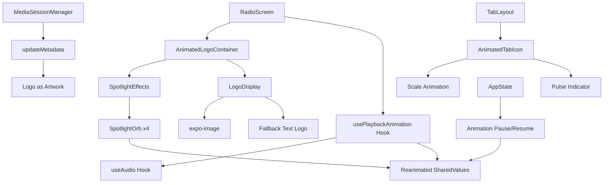

# Design Document

## Overview

This design document outlines the implementation of an animated logo display system for the TrendAnkara Radio player screen. The system consists of a centrally positioned brand logo with dynamic background lighting effects that respond to playback state, enhanced navigation indicators, and media session integration. The implementation leverages React Native Reanimated for performant animations, expo-image for optimized image loading, and the existing MediaSessionManager for system media control integration. The design emphasizes performance, battery efficiency, and seamless integration with the existing audio infrastructure.

## Steering Document Alignment

### Technical Standards (tech.md)
- **React Native Reanimated**: Listed in core dependencies for animations, perfect for 60 FPS animated effects
- **expo-image**: Already in tech stack for optimized image loading with caching
- **Minimal Dependencies**: Reuses existing animation library, no new dependencies needed
- **Battery Conscious**: Implements AppState listeners to pause animations in background
- **Cross-platform Parity**: Unified animation approach works identically on iOS/Android

### Project Structure (structure.md)
Following the established project organization:
- New components in `/components/player/` directory (AnimatedLogo.tsx, SpotlightEffects.tsx)
- Animation hooks in `/hooks/` directory (usePlaybackAnimation.ts)
- Constants in `/constants/` for animation configurations
- Follows PascalCase for components, camelCase for hooks
- Maintains single component per file principle

## Code Reuse Analysis

### Existing Components to Leverage
- **useAudio hook**: Already provides isPlaying, state, and playback status - will drive animation states
- **MediaSessionManager**: Existing infrastructure for media controls - only needs artwork update
- **ThemedView/ThemedText**: Existing themed components for consistent styling
- **useColorScheme hook**: Provides theme context for adjusting effect opacity
- **IconSymbol component**: Can be enhanced for navigation tab animations

### Integration Points
- **AudioService**: Subscribe to playback state changes to trigger animation transitions
- **app/(tabs)/index.tsx**: RadioScreen will host the new animated logo components
- **app/(tabs)/_layout.tsx**: Tab layout will be enhanced with animated radio tab
- **constants/theme.ts**: BrandColors already defined, will add animation constants
- **AppState from React Native**: Already used in AudioService for background detection

## Architecture

The animated logo system uses a layered component architecture with centralized animation state management. The design separates visual effects into modular components while maintaining performance through shared animation values and optimized rendering.



## Components and Interfaces

### AnimatedLogoContainer
- **Purpose:** Container component that orchestrates logo display and background effects
- **Interfaces:**
  - Props: `{ isPlaying: boolean, state: AudioState, theme: 'light' | 'dark' }`
  - Methods: `pauseAnimations()`, `resumeAnimations()`
- **Dependencies:** react-native-reanimated, react-native, AppState
- **Reuses:** ThemedView for base styling, existing layout patterns

### SpotlightEffects
- **Purpose:** Renders and animates 2-3 blurred circular light spots behind the logo (dynamically adjusted based on device performance)
- **Interfaces:**
  - Props: `{ isPlaying: boolean, theme: 'light' | 'dark', performanceMode?: 'high' | 'low' }`
  - Internal: 2-3 animated SharedValue objects for position and scale
- **Dependencies:** react-native-reanimated, react-native Views with shadow/elevation
- **Reuses:** BrandColors from constants/theme.ts for red gradient colors
- **Performance:** Monitors frame rate and reduces to 2 orbs if FPS drops below 50

### LogoDisplay
- **Purpose:** Displays the TrendAnkara logo with responsive sizing and fallback handling
- **Interfaces:**
  - Props: `{ size: number, source: string }`
  - Methods: `onLoadError()` for fallback to text
- **Dependencies:** expo-image for optimized loading
- **Reuses:** Existing image assets, ThemedText for fallback

### AnimatedTabIcon
- **Purpose:** Enhanced tab icon with scale animation and playback indicator
- **Interfaces:**
  - Props: `{ focused: boolean, isPlaying: boolean, color: string }`
  - Animation: Scale to 1.2x when active, pulse when playing
- **Dependencies:** react-native-reanimated, existing IconSymbol
- **Reuses:** IconSymbol component, HapticTab functionality

### usePlaybackAnimation
- **Purpose:** Custom hook that manages animation states based on playback status
- **Interfaces:**
  - Input: Takes playback state from useAudio
  - Output: Returns animation control values and methods
- **Dependencies:** react-native-reanimated hooks, useAudio hook
- **Reuses:** Existing useAudio hook for state subscription

### MediaSessionArtworkUpdater
- **Purpose:** Enhances the existing MediaSessionManager to display logo as album artwork
- **Interfaces:**
  - Method: `setCustomArtwork(imageUri: string, fallbackColor: string)`
  - Integration: Modifies updateMetadata() to accept artwork parameter
  - Platform-specific: Uses expo-av's Audio.setNowPlayingInfoAsync for iOS, notification icon for Android
- **Dependencies:** Existing MediaSessionManager, expo-av, Image asset resolver
- **Reuses:** Complete existing MediaSessionManager infrastructure
- **Implementation:** Replaces hardcoded icon path with configurable artwork URI

## Data Models

### AnimationConfig
```typescript
interface AnimationConfig {
  // Timing configurations
  ambientCycleDuration: number;    // 10000-20000ms per light
  pulseScaleUp: number;            // 1.3
  pulseUpDuration: number;         // 200ms
  pulseDownDuration: number;       // 800ms
  pulseOffset: number[];           // [0, 150, 300, 450]ms for each light

  // Visual parameters
  lightColors: {
    primary: string;              // '#DC2626' (brand red)
    secondary: string;            // '#EF4444' (lighter red)
    accent: string;               // 'rgba(220, 38, 38, 0.5)' (semi-transparent red)
  };
  blurRadius: number;              // 20-40 based on theme
  lightOpacity: {
    dark: number;                 // 0.6
    light: number;                // 0.3
  };
}
```

### SpotlightState
```typescript
interface SpotlightState {
  position: {
    x: SharedValue<number>;
    y: SharedValue<number>;
  };
  scale: SharedValue<number>;
  opacity: SharedValue<number>;
  cycleSpeed: number;              // Random 10-20 seconds
}
```

### ResponsiveSize
```typescript
interface ResponsiveSize {
  logo: {
    small: number;                // 60% of screen width
    medium: number;               // 50% of screen width
    large: number;                // 40% of screen width, max 200px
  };
  effects: {
    orbSize: number;              // 80-120px based on screen
    blurRadius: number;           // 20-40 based on screen
  };
}
```

### MediaArtwork
```typescript
interface MediaArtwork {
  uri: string;                    // Local asset URI for logo
  backgroundColor: string;        // '#DC2626' brand red
  fallbackText: string;          // 'TrendAnkara'
  size: {
    width: number;               // 300
    height: number;              // 300
  };
}
```

## Performance Monitoring

### Frame Rate Monitoring
```typescript
interface PerformanceMonitor {
  currentFPS: SharedValue<number>;
  averageFPS: number;
  performanceMode: 'high' | 'low';

  // Methods
  measureFrameRate(): void;
  adjustQuality(): void;
  reduceAnimationComplexity(): void;
}
```

### Progressive Enhancement Strategy
- **High Performance Mode (60 FPS):** 3 orbs with full blur effects
- **Medium Performance (45-59 FPS):** 2 orbs with reduced blur radius
- **Low Performance (<45 FPS):** 2 orbs with simple opacity, no blur
- **Fallback Mode:** Static logo with subtle fade animation only

## Error Handling

### Error Boundary Component
```typescript
class AnimationErrorBoundary extends React.Component {
  // Catches animation crashes and falls back to static logo
  // Logs errors for debugging
  // Auto-recovers after 5 seconds
}
```

### Error Scenarios

1. **Logo Image Load Failure**
   - **Handling:** Display text-based logo "TrendAnkara" with brand colors
   - **User Impact:** See text logo instead of image, animations continue normally

2. **Animation Performance Degradation**
   - **Handling:** Detect frame drops via runOnJS, reduce animation complexity
   - **User Impact:** Smoother but simpler animations on low-end devices

3. **Memory Pressure**
   - **Handling:** Pause non-critical animations, keep only playback indicator
   - **User Impact:** Reduced visual effects but core functionality maintained

4. **Media Session Update Failure**
   - **Handling:** Log error, continue without album artwork
   - **User Impact:** No logo in system controls but playback continues

5. **Background State Transition Error**
   - **Handling:** Force animation pause state, reset on next foreground
   - **User Impact:** Animations properly resume when returning to app

6. **Theme Detection Failure**
   - **Handling:** Default to light theme opacity values
   - **User Impact:** Effects visible but may not be optimally adjusted

## Testing Strategy

### Unit Testing
- Test animation value calculations with mock Reanimated
- Verify responsive size calculations for different screen dimensions
- Test error handling for image load failures
- Validate animation state transitions based on playback state
- Test AppState listener registration and cleanup

### Integration Testing
- Verify animations trigger correctly with audio state changes
- Test theme-based opacity adjustments
- Confirm media session artwork updates
- Test navigation tab animations with router events
- Verify memory cleanup on component unmount

### End-to-End Testing
- Full playback flow: Start → Play → Pause → Stop with visual verification
- Background/foreground transitions with animation state preservation
- Device rotation with layout adjustments
- Long-duration testing for memory leaks (1+ hours)
- Cross-platform testing on iOS 14+ and Android 10+ devices
- Performance profiling on low-end devices (60 FPS target)