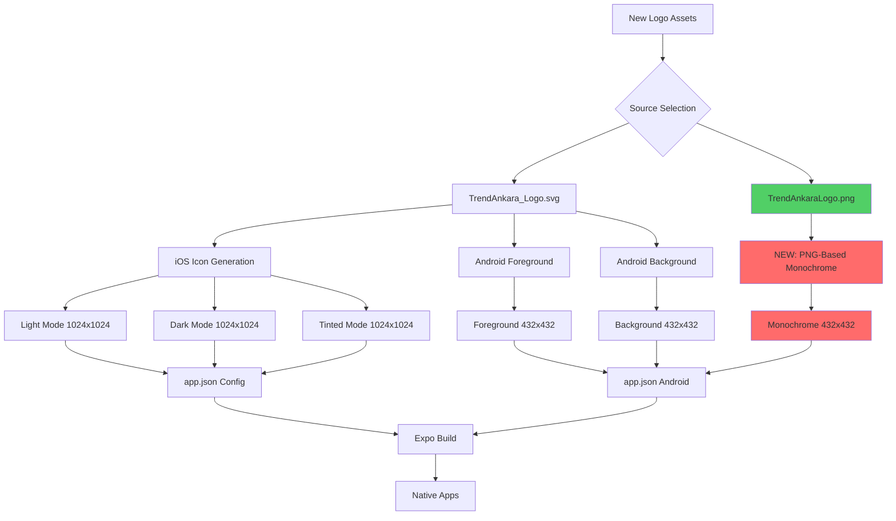

# Design Document - App Logo Update v2

## Overview

This design outlines the technical solution for updating the TrendAnkara mobile app logo using new high-quality 1024x1024 assets while fixing a critical Android Material You themed icon bug. The current implementation generates a blank monochrome layer that appears invisible in Google Pixel Launcher's themed icons feature. Root cause analysis reveals the issue: the current `.threshold(128).negate()` approach incorrectly processes the logo's black background and mixed-color elements, resulting in an inverted or empty silhouette. The solution involves switching from SVG-based processing to PNG-based processing for the monochrome layer, using proper alpha channel extraction and white colorization to create a solid silhouette that Android launchers can tint correctly.

## Steering Document Alignment

### Technical Standards
- **Expo SDK 54 Framework**: Continues using Expo's native icon configuration through `app.json`
- **TypeScript 5.9.2**: Updates to icon generation script maintain strict typing
- **Sharp Image Processing**: Leverages existing Sharp library with improved monochrome generation algorithm
- **Minimal Dependencies**: No new dependencies required - only algorithm improvements
- **Cross-Platform Excellence**: Fixes Android while maintaining successful iOS 18 appearance mode support

### Project Structure
- **Icon Assets**: Replaces source in `assets/logo/` directory with new PNG/SVG files
- **Generation Script**: Modifies existing `scripts/generate-icons.ts` (lines 1272-1380)
- **Configuration**: Preserves existing `app.json` structure (lines 7, 35-51)
- **Output Directories**: Maintains existing `assets/icons/` organization

## Code Reuse Analysis

### Existing Components to Leverage

1. **scripts/generate-icons.ts (Full Script)**
   - **Reuse**: Core infrastructure, iOS generation functions, file writing utilities
   - **Modify**: Only `generateAndroidMonochrome()` function (lines 1272-1380)
   - **Preserve**: All interfaces, validation logic, progress reporting, config updates

2. **assets/logo/TrendAnkaraLogo.png (NEW 30KB)**
   - **Usage**: Primary source for monochrome layer generation
   - **Advantage**: PNG format has explicit alpha channel for proper transparency detection
   - **Strategy**: Use as input to identify opaque logo elements vs transparent background

3. **assets/logo/TrendAnkara_Logo.svg (NEW 11KB)**
   - **Usage**: Continue using for iOS icon variants and Android foreground/background layers
   - **Advantage**: Vector format scales cleanly to all resolutions
   - **Strategy**: Replace old `trendankaralogo.svg` in script configuration

4. **Existing Icon Generation Functions**
   - **generateIOSLightIcon()**: No changes needed - works correctly
   - **generateIOSDarkIcon()**: No changes needed - works correctly
   - **generateIOSTintedIcon()**: No changes needed - works correctly
   - **generateAndroidForeground()**: No changes needed - works correctly
   - **generateAndroidBackground()**: No changes needed - works correctly

### Integration Points

1. **Expo Build System**: No changes to build integration - script runs via `npm run generate-icons`
2. **app.json Configuration**: Icon paths remain unchanged (only regenerate files at existing paths)
3. **iOS Appearance Modes**: Maintain existing light/dark/tinted configuration structure
4. **Android Adaptive Icons**: Maintain existing foreground/background/monochrome three-layer approach

## Architecture

The updated icon generation system replaces only the monochrome layer generation algorithm while preserving all other components.



**Key Change**: Monochrome generation (red boxes) now uses PNG input instead of SVG, applying a new alpha-based extraction algorithm.

## Components and Interfaces

### Component 1: Logo Asset Replacement (New)
- **Purpose:** Replace old SVG logo with new high-quality PNG and SVG assets
- **Files Modified:** `scripts/generate-icons.ts` (configuration section, source path references)
- **Interfaces:**
  ```typescript
  const SOURCE_SVG = 'assets/logo/TrendAnkara_Logo.svg';  // Updated from trendankaralogo.svg
  const SOURCE_PNG = 'assets/logo/TrendAnkaraLogo.png';    // New: For monochrome generation
  ```
- **Dependencies:** File system operations, path resolution
- **Reuses:** Existing script configuration pattern

### Component 2: Monochrome Layer Generator (Modified)
- **Purpose:** Generate proper white silhouette on transparent background for Material You theming
- **Function Signature:** `async function generateAndroidMonochrome(svg: Buffer): Promise<Buffer>` (signature unchanged for backward compatibility)
- **Implementation Strategy:** Keep function signature, but change internal implementation to use PNG instead of SVG
- **Interfaces:**
  ```typescript
  // KEEP existing signature for backward compatibility
  async function generateAndroidMonochrome(svg: Buffer): Promise<Buffer> {
    // NEW IMPLEMENTATION:
    // 1. Load PNG file internally (don't use passed SVG buffer)
    const pngBuffer = await fs.promises.readFile('assets/logo/TrendAnkaraLogo.png');

    // 2. Extract alpha mask to identify logo shape
    const alphaMask = await sharp(pngBuffer).extractChannel('alpha').toBuffer();

    // 3. Create white silhouette by recoloring opaque areas
    const whiteImage = await sharp(pngBuffer)
      .removeAlpha()
      .linear([0, 0, 0], [255, 255, 255])  // Set all RGB to white
      .toBuffer();

    // 4. Recombine white RGB with original alpha mask
    const whiteSilhouette = await sharp(whiteImage)
      .joinChannel(alphaMask)
      .toBuffer();

    // 5. Resize and center within 66x66dp safe zone
    // 6. Composite onto 108x108dp transparent canvas
    // 7. Validate opacity and dimensions
    return monochromeBuffer;
  }
  ```
- **Algorithm Change:**
  ```
  OLD (Broken):
  SVG → threshold(128) → negate() → resize → composite
  Problem: Inverts background, loses logo elements

  NEW (Fixed):
  PNG → extract alpha → removeAlpha → set white → joinChannel(alpha) → resize → composite
  Result: Clean white silhouette on transparent background

  Key: removeAlpha() then joinChannel() avoids .flatten() issues
  ```
- **Caller Impact:** No changes needed at line 2861 (`generateAndroidMonochrome(svgBuffer)`) - function signature stays the same, only internal implementation changes
- **Dependencies:** Sharp image processing library, fs.promises for PNG file reading
- **Reuses:** Existing canvas creation, composite logic, validation utilities

### Component 3: Monochrome Validation (Enhanced)
- **Purpose:** Validate generated monochrome layer is not blank and meets Material You requirements
- **Interfaces:**
  ```typescript
  interface MonochromeValidation {
    hasContent: boolean;           // Check if layer has visible pixels
    opacity: number;               // Average opacity of non-transparent pixels (should be >95%)
    correctSize: boolean;          // Verify 432x432px dimensions
    hasAlpha: boolean;            // Ensure RGBA channels exist
    safeZoneCompliance: boolean;  // Content fits within 264x264px centered region
  }

  function validateMonochromeLayer(buffer: Buffer): Promise<MonochromeValidation>
  ```
- **Dependencies:** Sharp metadata extraction, pixel analysis
- **Reuses:** Extends existing validation in `generateAndroidMonochrome()`

### Component 4: Script Configuration Updater (Minor Modification)
- **Purpose:** Update source file paths in generation script to use new logo files
- **Files Modified:** `scripts/generate-icons.ts`
- **Specific Line Changes:**
  ```typescript
  // Line 3002: validateSource() call
  // OLD: const isValid = await validateSource('assets/logo/trendankaralogo.svg');
  // NEW: const isValid = await validateSource('assets/logo/TrendAnkara_Logo.svg');

  // Line 3014: parseSVG() call
  // OLD: const svgData = await parseSVG('assets/logo/trendankaralogo.svg');
  // NEW: const svgData = await parseSVG('assets/logo/TrendAnkara_Logo.svg');

  // Line 3027: fs.readFile() call
  // OLD: const svgBuffer = await fs.promises.readFile('assets/logo/trendankaralogo.svg');
  // NEW: const svgBuffer = await fs.promises.readFile('assets/logo/TrendAnkara_Logo.svg');

  // Line 3083: Commander option default
  // OLD: .option('-s, --source <path>', 'Path to source SVG file', 'assets/logo/trendankaralogo.svg')
  // NEW: .option('-s, --source <path>', 'Path to source SVG file', 'assets/logo/TrendAnkara_Logo.svg')

  // Line 3094: Help text
  // OLD: Generate icons using default source (assets/logo/trendankaralogo.svg)
  // NEW: Generate icons using default source (assets/logo/TrendAnkara_Logo.svg)
  ```
- **PNG Source**: Hardcoded inside `generateAndroidMonochrome()` function (Line 1273+):
  ```typescript
  const pngBuffer = await fs.promises.readFile('assets/logo/TrendAnkaraLogo.png');
  ```
- **Dependencies:** File system access
- **Reuses:** Existing script configuration pattern
- **Total Changes:** 5 lines updated with new SVG path, 1 new line added for PNG loading

### Component 5: iOS Icon Generators (No Changes)
- **Purpose:** Generate light, dark, and tinted iOS appearance mode icons
- **Status:** Working correctly - no modifications needed
- **Reuses:** Continue using existing functions without changes

## Data Models

### MonochromeGenerationConfig (New)
```typescript
interface MonochromeGenerationConfig {
  source: string;                    // Path to source PNG file
  totalSize: number;                 // 432px (108dp * 4 for xxxhdpi)
  safeZoneSize: number;              // 264px (66dp * 4 for xxxhdpi)
  safeZoneOffset: number;            // 84px ((432-264)/2 for centering)
  targetColor: { r: 255, g: 255, b: 255 };  // White silhouette color
  backgroundColor: { r: 0, g: 0, b: 0, alpha: 0 };  // Transparent background
  validation: {
    minOpacity: number;              // 0.95 (95% opacity requirement)
    maxFileSize: number;             // 5120 bytes (5KB max)
    requireAlpha: boolean;           // true (must have alpha channel)
  };
}
```

### MonochromeGenerationResult (New)
```typescript
interface MonochromeGenerationResult {
  buffer: Buffer;                    // Generated PNG buffer
  metadata: {
    width: number;                   // Should be 432
    height: number;                  // Should be 432
    channels: number;                // Should be 4 (RGBA)
    fileSizeKB: number;             // File size in kilobytes
    averageOpacity: number;         // Average opacity of non-transparent pixels (0-1)
    hasContent: boolean;            // True if visible pixels exist
  };
  validation: {
    passed: boolean;                // Overall validation status
    errors: string[];               // List of validation errors
    warnings: string[];             // List of validation warnings
  };
}
```

### IconAssetReferences (Modified)
```typescript
interface IconAssetReferences {
  source: {
    svg: string;                    // NEW: 'assets/logo/TrendAnkara_Logo.svg'
    png: string;                    // NEW: 'assets/logo/TrendAnkaraLogo.png'
    legacySvg: string;              // OLD: 'assets/logo/trendankaralogo.svg' (deprecated)
  };
  generated: {
    ios: {
      light: string;                // 'assets/icons/ios/icon-light.png'
      dark: string;                 // 'assets/icons/ios/icon-dark.png'
      tinted: string;               // 'assets/icons/ios/icon-tinted.png'
    };
    android: {
      foreground: string;           // 'assets/icons/android/adaptive/foreground.png'
      background: string;           // 'assets/icons/android/adaptive/background.png'
      monochrome: string;           // 'assets/icons/android/adaptive/monochrome.png' (FIXED)
    };
  };
}
```

## Algorithm: PNG-Based Monochrome Generation

The new algorithm fixes the themed icon bug by using PNG's explicit alpha channel to properly extract the logo silhouette:

```typescript
async function generateAndroidMonochrome(svg: Buffer): Promise<Buffer> {
  // Step 0: Load PNG internally (ignore passed SVG buffer for now)
  const pngBuffer = await fs.promises.readFile('assets/logo/TrendAnkaraLogo.png');

  // Step 1: Extract alpha mask to identify logo shape
  // This isolates "what is logo" (opaque pixels) vs "what is background" (transparent pixels)
  const alphaMask = await sharp(pngBuffer)
    .extractChannel('alpha')  // Extract alpha channel as grayscale
    .toBuffer();

  // Step 2: Create white RGB image (no alpha yet)
  // removeAlpha() flattens to RGB, then we set all pixels to white
  const whiteImage = await sharp(pngBuffer)
    .removeAlpha()  // Strip alpha, flatten to RGB
    .linear([0, 0, 0], [255, 255, 255])  // Set all RGB channels to 255 (white)
    .toBuffer();

  // Step 3: Recombine white RGB with original alpha mask
  // This creates white silhouette where logo was, transparent where background was
  const whiteSilhouette = await sharp(whiteImage)
    .joinChannel(alphaMask)  // Add alpha back as 4th channel
    .toBuffer();

  // Step 4: Resize silhouette to fit within safe zone (264x264px)
  const resizedSilhouette = await sharp(whiteSilhouette)
    .resize(264, 264, {
      fit: 'contain',  // Maintain aspect ratio, fit within 264x264
      background: { r: 0, g: 0, b: 0, alpha: 0 }  // Transparent padding
    })
    .toBuffer();

  // Step 5: Composite onto full-size transparent canvas (432x432px)
  const monochromeBuffer = await sharp({
      create: {
        width: 432,
        height: 432,
        channels: 4,
        background: { r: 0, g: 0, b: 0, alpha: 0 }
      }
    })
    .composite([{
      input: resizedSilhouette,
      top: 84,   // Center vertically (432-264)/2
      left: 84,  // Center horizontally (432-264)/2
      blend: 'over'
    }])
    .png({ quality: 100, compressionLevel: 6 })
    .toBuffer();

  // Step 6: Validate result
  const metadata = await sharp(monochromeBuffer).metadata();
  const stats = await sharp(monochromeBuffer).stats();

  // Check if any non-transparent pixels exist
  const hasContent = stats.channels[3].mean > 0;  // Alpha channel mean > 0

  if (!hasContent) {
    throw new Error('Monochrome layer is blank - no visible content detected');
  }

  // Verify white color and opacity for non-transparent pixels
  const isWhite = stats.channels[0].mean > 250 &&
                  stats.channels[1].mean > 250 &&
                  stats.channels[2].mean > 250;

  if (!isWhite) {
    printMsg(YELLOW, `⚠ Warning: Monochrome layer may not be pure white (R:${stats.channels[0].mean}, G:${stats.channels[1].mean}, B:${stats.channels[2].mean})`);
  }

  return monochromeBuffer;
}
```

**Key Differences from Old Algorithm:**
- **OLD**: `SVG → threshold(128) → negate()` (inverts everything, loses logo structure)
- **NEW**: `PNG → extractChannel(alpha) → removeAlpha() → linear(white) → joinChannel(alpha)` (preserves logo shape, creates clean silhouette)
- **Critical Fix**: Using `removeAlpha()` + `joinChannel()` instead of `flatten()` properly handles alpha channel preservation

## Main Generation Flow Orchestration

The icon generation script will handle dual source files (SVG for most icons, PNG for monochrome):

```typescript
// At the top of generateIcons() function:
async function generateIcons(options: GenerationOptions): Promise<void> {
  // Load SVG source (used for most icons)
  const svgPath = 'assets/logo/TrendAnkara_Logo.svg';
  const svgBuffer = await fs.promises.readFile(svgPath);

  // PNG source path (used internally by generateAndroidMonochrome)
  // Note: PNG is loaded inside the function, not passed as buffer
  const pngPath = 'assets/logo/TrendAnkaraLogo.png';

  // Verify both sources exist
  if (!fs.existsSync(svgPath)) {
    throw new Error(`SVG source not found: ${svgPath}`);
  }
  if (!fs.existsSync(pngPath)) {
    throw new Error(`PNG source not found: ${pngPath}`);
  }

  // iOS icons (use SVG)
  if (options.platforms.ios) {
    const lightIcon = await generateIOSLightIcon(svgBuffer);      // SVG → PNG
    const darkIcon = await generateIOSDarkIcon(svgBuffer);        // SVG → PNG
    const tintedIcon = await generateIOSTintedIcon(svgBuffer);    // SVG → PNG
  }

  // Android icons
  if (options.platforms.android) {
    const foreground = await generateAndroidForeground(svgBuffer);   // SVG → PNG
    const background = await generateAndroidBackground();            // Solid color
    const monochrome = await generateAndroidMonochrome(svgBuffer);   // Internally uses PNG!
    // Note: generateAndroidMonochrome ignores svgBuffer and loads PNG internally
  }

  // Rest of generation flow unchanged...
}
```

**Key Points:**
- **SVG Buffer**: Passed to iOS and Android foreground/background functions
- **PNG File**: Loaded internally by `generateAndroidMonochrome()` function
- **Backward Compatibility**: No changes needed at call sites (line 2861)
- **Future Refactoring**: Could pass PNG path as parameter in future, but not required for this fix

## Root Cause Analysis: Why Previous Implementation Failed

### Issue Symptoms
- Monochrome.png file exists (432x432, 1.7KB) but appears blank in themed icon view
- Normal adaptive icon works fine (foreground + background layers)
- iOS appearance modes work perfectly
- Issue only affects Google Pixel Launcher's Material You themed icons feature

### Root Cause Identified

The previous implementation used this approach:
```typescript
.threshold(128)   // Convert to black/white based on 50% brightness threshold
.negate()        // Invert colors
```

**Problem with trendankaralogo.svg structure:**
```xml
<svg>
  <rect fill="#000000"/>  <!-- Black background (brightness: 0) -->
  <path fill="#e53e3e"/>  <!-- Red microphone (brightness: ~50) -->
  <text fill="#ffffff"/>  <!-- White text (brightness: 255) -->
  <circle fill="#e53e3e"/> <!-- Red play button (brightness: ~50) -->
</svg>
```

**What threshold(128).negate() did:**
1. **Black background (0)** → threshold → stays black (0) → negate → becomes white (255)
2. **Red elements (~119)** → threshold → becomes black (below 128) → negate → becomes white (255)
3. **White text (255)** → threshold → stays white (255) → negate → becomes black (0)

**Result:** The entire background became white, the logo elements became white, and the text became black, creating a confusing mess where the launcher couldn't distinguish the logo from the background.

### Why Material You Themed Icons Need Specific Format

Android 13+ Material You themed icons work by:
1. Reading the monochrome layer (expecting white silhouette on transparent background)
2. Replacing white pixels with the user's wallpaper-derived theme color
3. Leaving transparent pixels transparent

**Requirements for Material You:**
- **Opaque white (#FFFFFF, opacity 100%)** for logo areas that should be tinted
- **Fully transparent (alpha 0)** for background areas
- **No gradients or gray values** - must be binary (fully opaque or fully transparent)
- **Content within safe zone** - 66x66dp centered area (264x264px at xxxhdpi)

### Why PNG-Based Approach Works

The new PNG file (`TrendAnkaraLogo.png`) has explicit alpha channel information:
- **Opaque pixels (alpha 255)**: Logo elements (microphone, text, play button)
- **Transparent pixels (alpha 0)**: Background

By extracting the alpha channel as a mask and applying it to a white color, we get:
- **White silhouette** where the logo is (opaque pixels become white)
- **Transparent background** where nothing is (transparent pixels stay transparent)

This creates the exact format Material You expects: a clean white-on-transparent silhouette that launchers can tint.

## Error Handling

### Error Scenarios

1. **PNG Source File Missing**
   - **Detection:** Check `fs.existsSync(PNG_SOURCE)` before generation
   - **Handling:** Provide clear error message: "TrendAnkaraLogo.png not found in assets/logo/"
   - **User Impact:** Generation fails immediately with actionable error message

2. **PNG Has No Alpha Channel**
   - **Detection:** Check `metadata.channels === 4` after loading PNG
   - **Handling:** Attempt to add alpha channel with `ensureAlpha()`, fallback to error if fails
   - **User Impact:** Warning logged, attempt automatic fix, error only if unfixable

3. **Generated Monochrome Layer is Blank**
   - **Detection:** Analyze pixel data, count non-transparent pixels, verify >0
   - **Handling:** Throw error with diagnostic info: pixel count, alpha channel status, source file dimensions
   - **User Impact:** Generation fails with detailed diagnostics for troubleshooting

4. **Monochrome Layer Opacity Too Low**
   - **Detection:** Calculate average opacity of non-transparent pixels, verify >95%
   - **Handling:** Error if <50%, warning if 50-95%, pass if >95%
   - **User Impact:** Clear feedback about quality issue with actual measured opacity

5. **Safe Zone Violation**
   - **Detection:** Analyze pixel distribution, verify content within 264x264px centered region
   - **Handling:** Warning logged, auto-resize to fit within safe zone with padding
   - **User Impact:** Content automatically adjusted, warning shown for manual review

6. **File Size Too Large**
   - **Detection:** Check `buffer.length` after generation, verify <5KB (5120 bytes)
   - **Handling:** Increase PNG compression level, strip all metadata, optimize palette
   - **User Impact:** Automatic optimization, warning if still >5KB after optimization

## Testing Strategy

### Unit Testing

1. **Monochrome Generation Function**
   - Test with valid PNG input (TrendAnkaraLogo.png)
   - Test with PNG lacking alpha channel
   - Test with grayscale PNG
   - Test with corrupted PNG
   - Verify output dimensions (432x432px)
   - Verify RGBA channel count (4 channels)
   - Verify file size (<5KB)

2. **Alpha Channel Extraction**
   - Test with fully opaque PNG (alpha 255 everywhere)
   - Test with fully transparent PNG (alpha 0 everywhere)
   - Test with mixed alpha values (gradient transparency)
   - Verify mask correctly isolates logo shape

3. **Validation Functions**
   - Test `validateMonochromeLayer()` with blank image (should fail)
   - Test with low opacity image (should fail)
   - Test with correct white-on-transparent silhouette (should pass)
   - Test with incorrect dimensions (should fail)

4. **Asset Path Updates**
   - Test script loads new PNG source correctly
   - Test script loads new SVG source correctly
   - Test fallback behavior if files missing

### Integration Testing

1. **End-to-End Icon Generation**
   - Run `npm run generate-icons` with new logo files
   - Verify all icon variants generated (iOS light/dark/tinted, Android foreground/background/monochrome, legacy)
   - Verify app.json updated correctly
   - Verify no existing configuration lost

2. **Expo Build Integration**
   - Run `expo prebuild` after icon generation
   - Verify iOS Xcode project includes all icon variants
   - Verify Android Gradle project includes all adaptive icon layers
   - Check for build warnings or errors related to icons

3. **Platform-Specific Validation**
   - **iOS**: Verify `Assets.xcassets` contains light/dark/tinted variants
   - **Android**: Verify `res/mipmap-anydpi-v26/ic_launcher.xml` references monochrome layer
   - **Android**: Verify AndroidManifest.xml icon references are correct

### Device Testing

1. **Android Material You Themed Icons**
   - **Test Device:** Google Pixel 7+ (Android 13+) with themed icons enabled
   - **Steps:**
     1. Install app on Pixel device
     2. Enable "Themed icons" in launcher settings
     3. Change wallpaper to test different theme colors
     4. Verify icon tints correctly (microphone, text, play button visible)
   - **Expected:** Icon displays as colored silhouette matching wallpaper theme
   - **Previous Bug:** Icon appeared blank/white with no visible content

2. **Android Legacy Adaptive Icons**
   - **Test Device:** Samsung Galaxy S21 (Android 12)
   - **Steps:** Install app, verify normal adaptive icon displays (foreground + background)
   - **Expected:** Red microphone/play button on black background, no themed tinting

3. **iOS Appearance Modes**
   - **Test Device:** iPhone 15 Pro (iOS 18)
   - **Steps:**
     1. Switch device to Light Mode → verify light icon variant
     2. Switch device to Dark Mode → verify dark icon variant
     3. Enable Tinted icons in iOS settings → verify tinted (grayscale) variant
   - **Expected:** Icon adapts to appearance mode automatically

4. **Legacy Device Compatibility**
   - **Test Device:** Android 7.0 device (API 24)
   - **Steps:** Install app, verify legacy square icon displays
   - **Expected:** Fallback to legacy icon format (no adaptive icon support)

### Validation Checklist for Future Icon Updates

To prevent recurrence of themed icon issues:

- [ ] Source file has explicit alpha channel (RGBA PNG preferred)
- [ ] Monochrome layer uses alpha-based extraction, not threshold inversion
- [ ] Generated monochrome layer passes opacity check (>95% for non-transparent pixels)
- [ ] Monochrome layer content fits within 66x66dp safe zone (264x264px at xxxhdpi)
- [ ] File size <5KB for monochrome layer
- [ ] Test on physical Google Pixel device with themed icons enabled
- [ ] Verify icon is visible when wallpaper changes (different theme colors)
- [ ] Document any logo structure peculiarities that affect processing

---
