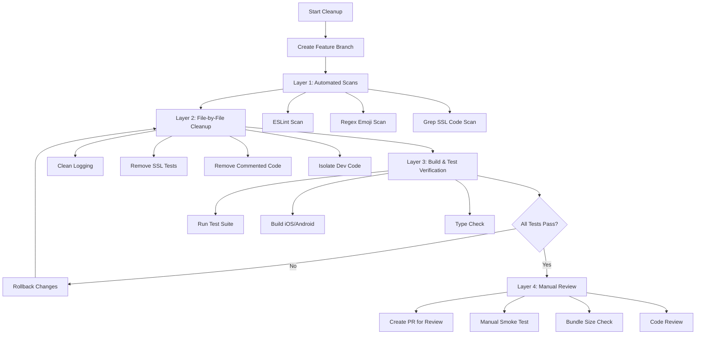

# Design Document

## Overview

This design document outlines the systematic approach to cleaning up the TrendAnkara mobile codebase by removing debugging logs with emoji, eliminating SSL testing infrastructure, cleaning commented-out code, and properly isolating development-only code. This is a **refactoring and cleanup task** rather than a feature addition, focusing on improving code quality, maintainability, and production readiness.

The cleanup will be performed through a combination of:
- **Automated tooling**: ESLint rules, regex scans, grep searches
- **Manual refactoring**: File-by-file cleanup with verification at each step
- **Continuous testing**: Running the full test suite after each major change
- **Incremental approach**: Small, atomic changes with git commits for easy rollback

**Scope**: This design affects 20+ files across services, components, utilities, and Redux slices, but involves **zero new functionality** — only removal and refactoring of existing code.

## Steering Document Alignment

### Technical Standards (tech.md)

This cleanup directly implements the following standards from tech.md:

1. **"No console.log in production"** - All debugging console.log statements will be removed or wrapped in `__DEV__` conditionals
2. **"No commented-out code"** - All commented-out implementations will be removed
3. **"All code and comments in English"** - Professional logging without emoji decorations supports code professionalism
4. **"No overengineering"** - Removes temporary SSL testing infrastructure that's no longer needed

**Technology Stack Alignment**:
- **React Native `__DEV__`**: Uses React Native's built-in development flag for conditional compilation
- **ESLint**: Leverages existing ESLint flat config format (Expo ESLint configuration)
- **TypeScript**: Maintains type safety throughout cleanup (no `any` types introduced)

**Important Interpretation of Standards**:
While tech.md states "No console.log in production", we interpret this to allow `console.error` and `console.warn` for critical error tracking and warnings. This interpretation aligns with:
- Security requirement for error logging (monitoring production issues)
- NFR-REL-001: "All necessary error handling logs SHALL be preserved"
- Industry best practice for production error tracking

### Project Structure (structure.md)

The cleanup will respect and maintain the existing project structure:

```
mobile/
├── services/           # API clients, audio services, cache management
│   ├── api/           # API integration (client.ts, endpoints.ts, initialization.ts)
│   │   └── testConnection.ts  ← TO BE DELETED
│   ├── crashReporting.ts      ← LOGS TO BE CLEANED
│   └── analytics.ts            ← COMMENTED CODE TO BE REMOVED
├── utils/             # Utility functions
│   ├── appInitializer.ts      ← LOGS TO BE CLEANED
│   ├── performance.ts         ← LOGS TO BE CLEANED
│   └── appReview.ts           ← LOGS TO BE CLEANED
├── store/slices/      # Redux state management
│   ├── newsSlice.ts           ← COMMENTED CODE TO BE REMOVED
│   ├── pollsSlice.ts          ← COMMENTED CODE TO BE REMOVED
│   └── playerSlice.ts         ← LOGS TO BE CLEANED
├── app/               # Expo Router pages
│   ├── _layout.tsx            ← DEV CODE TO BE ISOLATED
│   └── (tabs)/                ← ERROR LOGS TO BE REVIEWED
├── hooks/             # Custom React hooks
│   └── useNetworkStatus.ts    ← ERROR LOGS TO BE REVIEWED
└── trendankara-proxy/ # Google Cloud Function proxy
    ├── index.js               ← PRODUCTION CODE (KEEP)
    ├── local-server.js        ← TO BE DELETED
    └── test-proxy.js          ← TO BE DELETED
```

**File Organization**: No files will be moved; only deletions and in-place modifications.

## Code Reuse Analysis

### Existing Tools to Leverage

This cleanup will leverage existing development tools and infrastructure:

1. **ESLint Configuration** (`eslintrc.js`)
   - **Current usage**: Already configured for the project
   - **How leveraged**: Add custom rules for no-console in production
   - **File**: `.eslintrc.js` or `eslint.config.js`

2. **TypeScript Compiler** (`tsconfig.json`)
   - **Current usage**: Type checking throughout the project
   - **How leveraged**: Verify no type errors introduced during cleanup
   - **Verification**: `npx tsc --noEmit`

3. **React Native `__DEV__` Flag**
   - **Current usage**: Already used in `services/api/initialization.ts`
   - **How leveraged**: Wrap development-only code consistently
   - **Pattern**: `if (__DEV__) { /* dev-only code */ }`

4. **Git Version Control**
   - **Current usage**: Project is in git repository
   - **How leveraged**: Create feature branch, atomic commits, easy rollback
   - **Workflow**: `git checkout -b feature/log-cleanup-code-removal`

5. **Existing Test Suite**
   - **Current usage**: Unit and integration tests (exact framework TBD from codebase)
   - **How leveraged**: Run after each major change for regression detection
   - **Command**: `npm test` or equivalent

### Existing Patterns to Follow

**Error Logging Pattern** (found in multiple files):
```typescript
// Current pattern to preserve and clean:
try {
  await someOperation();
} catch (error) {
  console.error('Operation failed:', error); // ✓ Keep (professional)
}

// Pattern to remove:
console.log('🚀 Starting operation...'); // ✗ Remove (debug with emoji)
```

**Development Conditional Pattern** (found in `services/api/initialization.ts`):
```typescript
// Existing pattern to replicate:
if (__DEV__) {
  await testApiConnection(); // Development-only code
}
```

### Integration Points

This cleanup integrates with:

1. **Build System** (Expo/Metro)
   - Integration: Verify production builds exclude `__DEV__` blocks
   - Testing: Build for both iOS and Android platforms

2. **Logging Infrastructure**
   - Integration: Preserve all console.error and console.warn calls
   - Modification: Remove emoji, improve message clarity

3. **API Client** (`services/api/client.ts`)
   - Integration: Maintain existing proxy configuration
   - Modification: Clean request/response interceptor logs

4. **Redux Store** (`store/slices/*`)
   - Integration: Maintain state management functionality
   - Modification: Remove commented API examples

5. **Initialization Service** (`services/api/initialization.ts`)
   - Integration: Maintain initialization flow
   - Modification: Remove testConnection import and call

## Architecture

### Cleanup Strategy Architecture

The cleanup will follow a **layered, incremental approach** with verification at each step:



### Cleanup Phases

**Phase 1: Discovery & Baseline** (Automated)
- Run ESLint to establish baseline violations
- Execute regex scans to find all emoji usage
- Grep searches to locate SSL testing code
- Count existing console.error/warn calls (baseline for NFR-REL-001)

**Phase 2: Systematic Cleanup** (Manual with verification)
- Clean each file category (services → utils → store → app → hooks)
- Commit after each logical grouping
- Run tests after each commit

**Phase 3: Verification** (Automated)
- Full test suite execution
- iOS and Android build verification
- TypeScript type checking
- Bundle size analysis

**Phase 4: Review & Merge** (Manual)
- Manual smoke testing of core features
- Code review
- PR approval and merge

## Components and Interfaces

### Component 1: Log Cleanup Utility Pattern

**Purpose**: Standardized approach to cleaning console logs in each file

**Interface** (conceptual - not a real utility, just a pattern):
```typescript
// Pattern for cleaning logs:

// BEFORE:
console.log('🚀 Initializing API Client with config:', config);
console.log('📤 API Request:', method, url);
console.error('❌ Request failed:', error);

// AFTER (Option 1 - Development only):
if (__DEV__) {
  console.log('Initializing API Client with config:', config);
  console.log('API Request:', method, url);
}
console.error('Request failed:', error); // ✓ Keep (error handling)

// AFTER (Option 2 - Complete removal):
// Removed entirely if purely debugging
console.error('Request failed:', error); // ✓ Keep (error handling)
```

**Decision Criteria**:
- **Remove entirely**: Informational logs with no debugging value
- **Wrap in `__DEV__`**: Useful debugging info for development
- **Keep and clean**: All error/warning logs (remove emoji only)

**Reuses**: React Native's built-in `__DEV__` global

### Component 2: SSL Testing Code Removal

**Purpose**: Remove all SSL testing and certificate bypass utilities

**Files to Delete**:
1. `services/api/testConnection.ts` - Entire file (143 lines)
2. `trendankara-proxy/local-server.js` - Entire file (development server)
3. `trendankara-proxy/test-proxy.js` - Entire file (test script)

**Files to Modify**:
1. `services/api/initialization.ts` - Remove lines 1 (import), 53-56 (function call)

**Production Files to Preserve**:
- `trendankara-proxy/index.js` - Production Google Cloud Function (KEEP)
- `services/api/client.ts` - Proxy configuration (KEEP)
- `services/api/endpoints.ts` - Proxy endpoints (KEEP)
- `utils/imageProxy.ts` - Image proxy utility (KEEP)

**Verification**:
```bash
# After cleanup, these should return zero results:
grep -r "testConnection" services/
grep -r "rejectUnauthorized" --exclude="trendankara-proxy/index.js" .
```

### Component 3: Commented Code Removal Pattern

**Purpose**: Clean up commented-out implementations in Redux slices

**Interface** (pattern):
```typescript
// BEFORE (Redux slice with commented API calls):
export const fetchNews = createAsyncThunk(
  'news/fetchNews',
  async (params: FetchNewsParams) => {
    // In production, call actual API
    // const response = await api.get('/news', { params });
    // return response.data;

    // Mock data for development
    return mockNews;
  }
);

// AFTER (Option 1 - If API is implemented):
/**
 * Fetches news articles from the API
 * @param params - Pagination and filter parameters
 * @returns News articles array
 */
export const fetchNews = createAsyncThunk(
  'news/fetchNews',
  async (params: FetchNewsParams) => {
    const response = await api.get('/news', { params });
    return response.data;
  }
);

// AFTER (Option 2 - If using mocks in development):
/**
 * Fetches news articles (mock data in development, real API in production)
 */
export const fetchNews = createAsyncThunk(
  'news/fetchNews',
  async (params: FetchNewsParams) => {
    if (__DEV__) {
      // Development only: Return mock data
      return mockNews;
    }
    const response = await api.get('/news', { params });
    return response.data;
  }
);
```

**Files Affected**:
- `store/slices/newsSlice.ts` (2 instances)
- `store/slices/pollsSlice.ts` (2 instances)
- `services/analytics.ts` (1 instance)
- `utils/share.ts` (1 commented import)
- `store/index.ts` (1 commented export)

**Decision for Each**:
- **If code is obsolete**: Delete entirely, replace with JSDoc if context valuable
- **If code is future work**: Keep as TODO with issue reference
- **If code is conditional**: Implement `__DEV__` conditional logic

### Component 4: Development Code Isolation

**Purpose**: Properly wrap development-only code in `__DEV__` conditionals

**Interface** (pattern):
```typescript
// BEFORE (app/_layout.tsx):
// Temporarily clear cache for cards to test image loading
if (__DEV__) {
  await apiInitService.clearCache();
  console.log('🗑️ Cache cleared for testing'); // ← Has emoji
}

// AFTER:
if (__DEV__) {
  // Development only: Clear cache for testing
  await apiInitService.clearCache();
}
```

**Files Affected**:
- `app/_layout.tsx` - Cache clearing code (lines 31-33)

**Mock Data Documentation**:
```typescript
// BEFORE:
// Mock data for development
const mockPolls: Poll[] = [...];

// AFTER:
/**
 * Mock poll data - DEVELOPMENT ONLY
 * Used when __DEV__ is true to enable local testing without API
 * In production builds, real API calls are used instead
 */
const mockPolls: Poll[] = [...];
```

## Data Models

**No new data models** - This is a cleanup task that preserves existing data structures.

**Affected Data Flows**:
1. **Logging Flow**: Console output stream (cleaned of emoji, reduced volume)
2. **API Initialization Flow**: Simplified (no SSL testing)
3. **Error Tracking Flow**: Preserved (all error logs maintained)

**Data Preservation**:
- All Redux state structures unchanged
- All TypeScript interfaces unchanged
- All API request/response formats unchanged

## Error Handling

### Error Scenarios and Handling Strategy

#### Scenario 1: Test Failures After Cleanup

**Description**: Unit or integration tests fail after removing code

**Handling Strategy**:
1. Immediately halt further cleanup
2. Review the specific test failure
3. Identify if removed code was necessary (not just debug code)
4. Options:
   - Restore the removed code if it was functional
   - Fix the test if it was testing debug behavior
   - Revert the entire commit if unclear

**User Impact**: Development team notified, cleanup paused

**Rollback**: `git revert <commit-hash>` or `git reset --hard <previous-commit>`

#### Scenario 2: Build Failures (iOS/Android)

**Description**: Production builds fail after cleanup

**Handling Strategy**:
1. Check build error messages for missing imports or broken references
2. Verify TypeScript compilation: `npx tsc --noEmit`
3. Check if removed code was imported elsewhere
4. Options:
   - Fix import statements
   - Restore removed code if it was a dependency
   - Revert commit if issue is complex

**User Impact**: Build process blocked until resolved

**Rollback**: `git revert <commit-hash>`

#### Scenario 3: Accidental Removal of Functional Code

**Description**: Code that appeared to be debug/commented was actually functional

**Handling Strategy**:
1. Git history provides full audit trail of changes
2. `git diff` can show exactly what was removed
3. Cherry-pick restoration: `git checkout <commit-hash> -- <file-path>`
4. Re-run tests to verify restoration

**User Impact**: Potential runtime errors if not caught before merge

**Prevention**:
- Review each file carefully before cleanup
- Run tests after every logical grouping of changes
- Code review before merge

#### Scenario 4: Emoji Detection False Positives

**Description**: Regex scan detects emoji in string literals (user-facing text)

**Handling Strategy**:
1. Manual review of each match
2. Preserve emoji in:
   - User-facing UI strings (Turkish text for users)
   - Test fixtures with emoji data
   - Third-party library code (don't modify)
3. Remove emoji only in:
   - Console log statements
   - Developer comments
   - Debug output

**User Impact**: None if handled correctly

**Verification**: Manual review of regex scan results before cleanup

#### Scenario 5: Production Proxy Configuration Breakage

**Description**: Accidental modification of production proxy settings during SSL code cleanup

**Handling Strategy**:
1. **Prevention**: Do NOT modify these files during cleanup:
   - `trendankara-proxy/index.js` (production Cloud Function)
   - `services/api/client.ts` BASE_URL configuration
   - `services/api/endpoints.ts` PROXY_BASE_URL configuration
   - `utils/imageProxy.ts` PROXY_BASE_URL configuration
2. **If accidentally modified**: Immediately revert changes
3. **Verification**: After cleanup, verify proxy URLs unchanged:
   ```bash
   grep -n "europe-west3-kapitel-h.cloudfunctions.net" services/api/*.ts utils/*.ts
   ```

**User Impact**: Critical - app would fail to load data in production

**Rollback**: Immediate revert required

### Safety Measures

1. **Atomic Commits**: Each logical grouping of changes in a separate commit
2. **Test After Each Commit**: Run test suite to catch issues early
3. **Feature Branch**: All work on `feature/log-cleanup-code-removal` branch
4. **Code Review**: PR review before merge to main
5. **Baseline Establishment**: Document current state before changes:
   - Bundle size baseline
   - Test pass count baseline
   - Console.error/warn count baseline

## Testing Strategy

### Unit Testing

**Approach**: Verify existing unit tests continue to pass

**Key Test Suites to Monitor**:
- Redux slice tests (if they exist)
- API client tests
- Utility function tests
- Component tests (if using React Testing Library or similar)

**Test Execution**:
```bash
# Run full test suite
npm test

# Run with coverage to ensure no decrease
npm test -- --coverage
```

**Success Criteria**: 100% of existing tests pass (LOG-CLEANUP-005.1)

### Integration Testing

**Approach**: Verify API integration tests pass after SSL testing code removal

**Key Integration Points to Test**:
- API client initialization
- Proxy server communication
- Error handling in API calls
- Cache management

**Success Criteria**: All API integration tests pass (LOG-CLEANUP-002.5)

### Build Testing

**iOS Build Verification**:
```bash
# TypeScript compilation
npx tsc --noEmit

# iOS build (if on macOS)
npx expo run:ios --configuration Release

# Or EAS build
eas build --platform ios
```

**Android Build Verification**:
```bash
# Android build
npx expo run:android --variant release

# Or EAS build
eas build --platform android
```

**Success Criteria**: Both platforms build without errors (LOG-CLEANUP-005.2)

### Manual Testing (Smoke Test)

**Test Checklist** (LOG-CLEANUP-005.4):

1. **Radio Player**:
   - [ ] Play button starts audio stream
   - [ ] Pause button stops audio
   - [ ] Volume/mute controls work
   - [ ] Background playback functions

2. **News Page**:
   - [ ] News articles load successfully
   - [ ] Article details display correctly
   - [ ] Categories filter works
   - [ ] Badge indicators appear for new content

3. **Polls Page**:
   - [ ] Polls load and display
   - [ ] Voting mechanism works
   - [ ] Results display after voting

4. **Settings Page**:
   - [ ] Settings load correctly
   - [ ] Preference changes persist
   - [ ] Dark/light mode toggle works

5. **Error Handling**:
   - [ ] Network errors display appropriate messages
   - [ ] Offline mode shows cached content
   - [ ] Error logs appear in console (professional format)

**Execution Environment**: Real device or simulator/emulator

**Success Criteria**: All smoke tests pass, no regressions detected

### Automated Code Quality Checks

#### ESLint Scan

**Configuration**: Update `eslint.config.js` (uses ESLint flat config format):
```javascript
// eslint.config.js
const { defineConfig } = require('eslint/config');
const expoConfig = require('eslint-config-expo/flat');

module.exports = defineConfig([
  expoConfig,
  {
    ignores: ['dist/*'],
  },
  {
    rules: {
      // Enforce no console in production (allow error/warn)
      'no-console': ['error', { allow: ['warn', 'error'] }],
    },
  },
]);
```

**Rationale**: While tech.md states "No console.log in production", we interpret this to allow `console.error` and `console.warn` for critical error tracking and warnings, as specified in NFR-REL-001 (preserve error handling logs).

**Execution**:
```bash
npm run lint
# or
npx eslint . --ext .ts,.tsx
```

**Success Criteria**: Zero violations of no-console rule

#### Emoji Detection Scan

**Regex Pattern**:
```javascript
/[\u{1F300}-\u{1F9FF}\u{2600}-\u{26FF}\u{2700}-\u{27BF}]/u
```

**Execution** (macOS/Linux compatible):
```bash
# Option 1: Use ripgrep (recommended - install via: brew install ripgrep)
rg '[\p{Emoji}]' --type typescript services/ utils/ app/ store/ hooks/

# Option 2: Use grep with explicit Unicode escapes (macOS compatible)
# Note: grep -P (Perl regex) is not available on macOS by default
grep -r --include="*.ts" --include="*.tsx" \
  -e "🚀\|📤\|📋\|🔗\|🎯\|⏱️\|📦\|❌\|🔴\|📱\|🌐\|🔒\|📊\|🔄\|🐛\|🚨\|🍞\|🧪\|📶\|🔍\|📡\|✅\|🎵\|📻\|🗑️\|⏹️\|⚠️" \
  services/ utils/ app/ store/ hooks/

# Option 3: Use Node.js script (most reliable cross-platform)
# Create scripts/detect-emoji.js and run: node scripts/detect-emoji.js

# Option 4: Simple check for common emoji in console statements
grep -r --include="*.ts" --include="*.tsx" \
  -E "console\.(log|warn|error|debug).*[🚀📤📋🔗🎯⏱️📦❌🔴📱🌐🔒📊🔄🐛🚨🍞🧪📶🔍📡✅🎵📻🗑️⏹️⚠️]" \
  services/ utils/ app/ store/ hooks/
```

**Platform Note**: The project runs on macOS (darwin), so `grep -P` (Perl regex) is not available. Use ripgrep or the alternative grep commands above.

**Success Criteria**: Zero matches (or only matches in `__DEV__` blocks)

#### Commented Code Detection

**Patterns to Search**:
```bash
# Find commented-out const declarations
grep -rn "^[[:space:]]*//[[:space:]]*const " --include="*.ts" --include="*.tsx" .

# Find commented-out imports
grep -rn "^[[:space:]]*//[[:space:]]*import " --include="*.ts" --include="*.tsx" .

# Find commented-out async functions
grep -rn "^[[:space:]]*//[[:space:]]*async " --include="*.ts" --include="*.tsx" .
```

**Success Criteria**: Manual review shows zero inappropriate commented code

#### SSL Code Detection

**Patterns to Search**:
```bash
# Find testConnection references
grep -r "testConnection" services/

# Find SSL bypass code (excluding production proxy)
grep -r "rejectUnauthorized" --exclude="trendankara-proxy/index.js" .
```

**Success Criteria**: Zero matches

### Bundle Size Analysis

**Tool**: Expo export with bundle size measurement

**Step 1: Establish Baseline** (BEFORE cleanup):
```bash
# Generate production bundle for iOS
npx expo export --platform ios --output-dir baseline-bundle

# Measure and record baseline size
du -sh baseline-bundle/ > bundle-size-baseline.txt
cat bundle-size-baseline.txt
# Example output: "12.5M  baseline-bundle/"

# Also measure individual bundle file
ls -lh baseline-bundle/_expo/static/js/ios/*.js | awk '{print $5, $9}' >> bundle-size-baseline.txt
```

**Step 2: Post-Cleanup Measurement** (AFTER all cleanup):
```bash
# Generate production bundle after cleanup
npx expo export --platform ios --output-dir cleanup-bundle

# Measure cleaned bundle size
du -sh cleanup-bundle/ > bundle-size-after.txt
cat bundle-size-after.txt
# Example output: "12.3M  cleanup-bundle/"

# Measure individual bundle file
ls -lh cleanup-bundle/_expo/static/js/ios/*.js | awk '{print $5, $9}' >> bundle-size-after.txt
```

**Step 3: Compare and Verify**:
```bash
# Show difference
echo "=== Baseline ===" && cat bundle-size-baseline.txt
echo "=== After Cleanup ===" && cat bundle-size-after.txt

# Calculate percentage reduction
# Should see reduction ≥1KB OR no increase (NFR-PERF-002)
```

**Step 4: Bundle Analysis** (optional detailed analysis):
```bash
# Install bundle visualizer
npm install --save-dev react-native-bundle-visualizer

# Generate visualization
npx react-native-bundle-visualizer

# Verify __DEV__ blocks are stripped from production bundle
# Look for absence of development-only code in the visualization
```

**Success Criteria**:
- Bundle size reduced by ≥1KB OR remained the same
- Bundle size SHALL NOT increase
- Verification that `__DEV__` blocks are properly stripped

**Analysis**: Identify if development-only code (cache clearing, debug logs) is excluded from production bundle

### Regression Testing Strategy

**After Each Major File Cleanup**:
1. Run TypeScript compiler: `npx tsc --noEmit`
2. Run test suite: `npm test`
3. If either fails: Review and fix OR revert commit

**Before Creating PR**:
1. Full test suite execution
2. iOS build verification
3. Android build verification
4. Manual smoke test on device/emulator
5. Bundle size comparison
6. Code quality scans (ESLint, grep, regex)

**Documentation**: Record all test results in PR description

---

## Implementation Workflow

### Git Branch Strategy

```bash
# Create feature branch
git checkout -b feature/log-cleanup-code-removal

# Work in small commits
git commit -m "Clean emoji logs from services/api/client.ts"
git commit -m "Remove SSL testing utility testConnection.ts"
# ... etc

# Push for PR
git push origin feature/log-cleanup-code-removal
```

### Recommended Commit Sequence

1. **Commit 1**: "Add ESLint no-console rule and run initial scan"
2. **Commit 2**: "Clean emoji logs from services/api/client.ts"
3. **Commit 3**: "Clean emoji logs from services/crashReporting.ts"
4. **Commit 4**: "Clean emoji logs from utils/ directory"
5. **Commit 5**: "Remove testConnection.ts and references"
6. **Commit 6**: "Remove proxy testing utilities"
7. **Commit 7**: "Clean commented code from Redux slices"
8. **Commit 8**: "Clean commented code from services/analytics.ts"
9. **Commit 9**: "Isolate dev-only code in app/_layout.tsx"
10. **Commit 10**: "Document mock data usage in Redux slices"
11. **Commit 11**: "Final verification and documentation update"

**Safety**: Each commit is independently revertable

### Verification Checklist

- [ ] All tests pass (100% success rate)
- [ ] TypeScript compiles without errors
- [ ] iOS build succeeds
- [ ] Android build succeeds
- [ ] ESLint shows zero no-console violations
- [ ] Emoji regex scan returns zero results
- [ ] SSL code grep searches return zero results
- [ ] Commented code scan shows zero inappropriate comments
- [ ] Bundle size reduced or unchanged (not increased)
- [ ] Manual smoke test passes all scenarios
- [ ] Code review completed
- [ ] PR approved

---

## Summary

This design provides a **systematic, safe, and verifiable approach** to cleaning up the TrendAnkara mobile codebase. By leveraging existing tools (ESLint, TypeScript, git), following established patterns (`__DEV__` conditionals), and implementing continuous verification (tests after each change), we minimize risk while achieving the code quality goals outlined in the requirements.

**Key Design Principles**:
1. **Incremental**: Small, atomic changes with frequent testing
2. **Reversible**: Git commits allow easy rollback
3. **Verified**: Automated and manual testing at each step
4. **Documented**: Clear patterns and decision criteria
5. **Safe**: Production proxy configuration preserved, error logs maintained
