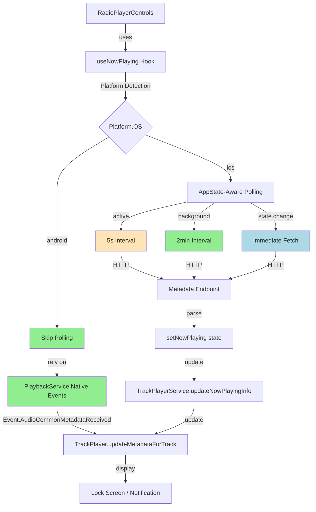
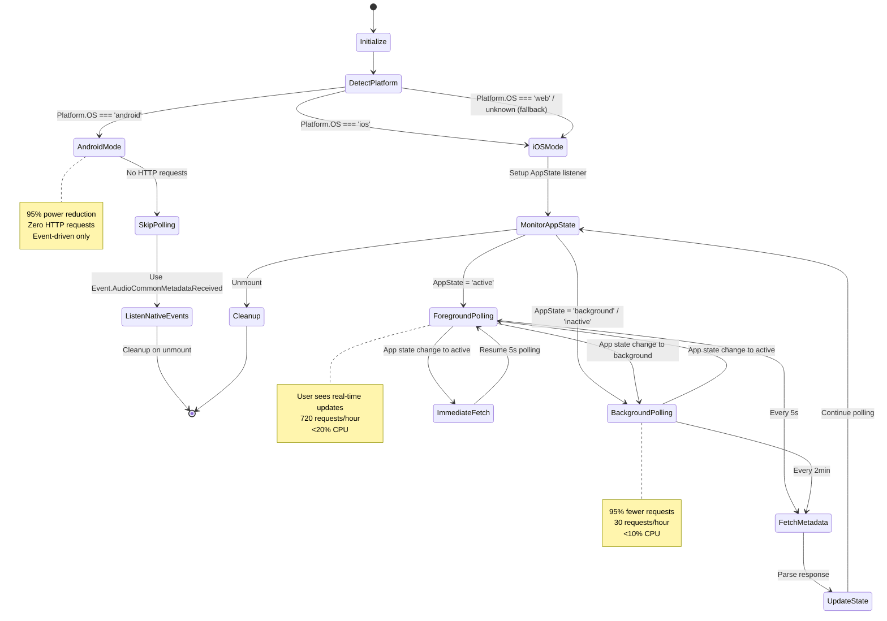
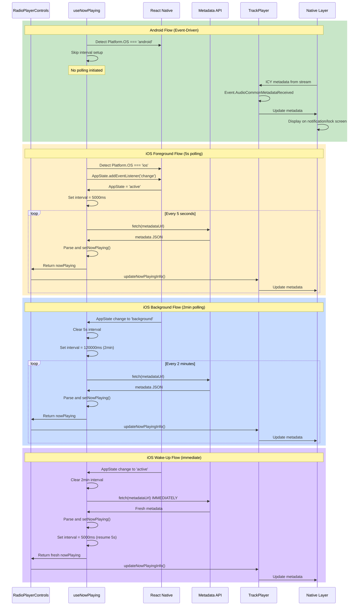

# Design Document - Metadata Polling Power Optimization

## Overview

This design implements platform-specific, context-aware metadata polling optimization to reduce power consumption during background audio playback by 85-95%. The solution leverages native platform capabilities (Android's ExoPlayer events) and adaptive polling strategies (iOS AppState-aware intervals) to minimize CPU usage, network requests, and battery drain while maintaining a seamless user experience.

**Core Strategy:**
- **Android**: Disable HTTP polling entirely, rely on native ExoPlayer metadata events
- **iOS**: Implement AppState-aware polling (5s foreground, 2min background)
- **Both**: Add event-driven metadata fetches on user interaction

**Current Impact:**
- 240 HTTP requests in 20 minutes (5-second intervals)
- 65.5% CPU usage (6-7x higher than expected)
- ~35%/hour battery drain (3.5x higher than normal)

**Expected Improvement:**
- Android: 95% power reduction (zero polling)
- iOS: 85-95% power reduction in background
- Overall: 71% battery drain reduction

## Steering Document Alignment

### Technical Standards (tech.md)

**Adheres to:**
- ✅ **No overengineering**: Uses existing React Native AppState and Platform APIs
- ✅ **Battery conscious**: Core objective of this optimization
- ✅ **Cross-platform parity**: Both platforms get optimal implementation
- ✅ **Minimal dependencies**: Zero new packages required
- ✅ **React Native 0.81.4**: Uses built-in AppState module
- ✅ **react-native-track-player ^4.1.1**: Leverages existing Event.AudioCommonMetadataReceived

**Best Practices:**
- Platform-specific optimizations using `Platform.OS`
- Proper cleanup of listeners and intervals
- AbortController for fetch cancellation
- TypeScript type safety maintained

### Project Structure (structure.md)

**File Organization:**
- `hooks/useNowPlaying.ts` - Modified (add platform detection and AppState logic)
- `services/audio/PlaybackService.ts` - Already optimal (no changes needed)
- `services/audio/TrackPlayerService.ts` - Already supports metadata updates (no changes)
- `components/radio/RadioPlayerControls.tsx` - No changes required (backward compatible)

**Naming Consideration:**
- React Native's `AppState` will be imported with alias to avoid collision with `types/models.ts:AppState`
- Pattern: `import { AppState as RNAppState } from 'react-native';`

## Code Reuse Analysis

### Existing Components to Leverage

#### 1. **Platform Detection Pattern** (`services/audio/PlaybackService.ts:6, 97`)
```typescript
import { Platform } from 'react-native';

if (Platform.OS === 'android') {
  // Android-specific logic
}
```
**How it will be used**: Add same pattern to `useNowPlaying.ts` to skip polling on Android

#### 2. **Native Metadata Handler** (`services/audio/PlaybackService.ts:97-124`)
```typescript
if (Platform.OS === 'android') {
  TrackPlayer.addEventListener(Event.AudioCommonMetadataReceived, async (event) => {
    const title = event.title || 'Live Stream';
    const artist = event.artist || 'Trend Ankara';
    await TrackPlayer.updateMetadataForTrack(currentTrackIndex, { title, artist });
  });
}
```
**Status**: Already implemented and working perfectly ✅
**Action**: No changes needed, just ensure useNowPlaying doesn't interfere

#### 3. **Existing Fetch Logic** (`hooks/useNowPlaying.ts:24-133`)
```typescript
const fetchMetadata = async () => {
  // Abort controller pattern
  if (abortControllerRef.current) {
    abortControllerRef.current.abort();
  }
  abortControllerRef.current = new AbortController();

  // Fetch with timeout
  const response = await fetch(metadataUrl, {
    signal: abortControllerRef.current.signal,
    headers: { 'Cache-Control': 'no-cache' },
  });

  // Parse JSON or plain text
  // Set state
}
```
**How it will be reused**: Keep exact same logic, just control WHEN it runs

#### 4. **Interval Cleanup Pattern** (`hooks/useNowPlaying.ts:142-156`)
```typescript
return () => {
  isMounted = false;

  if (intervalRef.current) {
    clearInterval(intervalRef.current);
    intervalRef.current = null;
  }

  if (abortControllerRef.current) {
    abortControllerRef.current.abort();
    abortControllerRef.current = null;
  }
};
```
**How it will be extended**: Add AppState subscription cleanup

#### 5. **TrackPlayer Metadata Update** (`services/audio/TrackPlayerService.ts:298-356`)
```typescript
async updateNowPlayingInfo(nowPlaying: {...} | null): Promise<void> {
  // Throttling and change detection already implemented
  await TrackPlayer.updateMetadataForTrack(currentTrackIndex, {
    title: titleString,
    artist: artistString,
    artwork: this.currentArtwork,
  });
}
```
**Status**: Already has throttling (1 second minimum) and change detection ✅
**Action**: No changes needed

### Integration Points

#### 1. **RadioPlayerControls → useNowPlaying** (`components/radio/RadioPlayerControls.tsx:48`)
```typescript
const { nowPlaying } = useNowPlaying(metadataUrl);
```
**Integration**: Hook interface remains unchanged, no component modifications needed

#### 2. **useNowPlaying → TrackPlayerService** (`components/radio/RadioPlayerControls.tsx:59`)
```typescript
trackPlayerService.updateNowPlayingInfo(nowPlaying);
```
**Integration**: Existing flow preserved, just frequency changes

#### 3. **PlaybackService → TrackPlayerService** (Native events already wired)
```typescript
Event.AudioCommonMetadataReceived → TrackPlayer.updateMetadataForTrack()
```
**Integration**: Already working, useNowPlaying will not interfere on Android

## Architecture

### High-Level Component Diagram



### State Machine Diagram



### Data Flow Diagram



## Components and Interfaces

### Component 1: useNowPlaying Hook (Modified)

**File**: `hooks/useNowPlaying.ts`

**Purpose**: Fetch and manage metadata with platform-specific and context-aware polling strategies

**Current Interface** (preserved for backward compatibility):
```typescript
export const useNowPlaying = (metadataUrl?: string) => {
  // Returns
  return { nowPlaying, isLoading };
};
```

**Internal Changes**:
```typescript
import { useState, useEffect, useRef } from 'react';
import { Platform, AppState as RNAppState, AppStateStatus } from 'react-native';

interface NowPlayingInfo {
  title?: string;
  artist?: string;
  song?: string;
}

export const useNowPlaying = (metadataUrl?: string) => {
  const [nowPlaying, setNowPlaying] = useState<NowPlayingInfo | null>(null);
  const [isLoading, setIsLoading] = useState(false);
  const [appState, setAppState] = useState<AppStateStatus>(RNAppState.currentState);
  const abortControllerRef = useRef<AbortController | null>(null);
  const intervalRef = useRef<NodeJS.Timeout | null>(null);

  // New: Determine polling interval based on app state (iOS only)
  const getPollingInterval = (): number => {
    // Default to 2 minutes for power safety
    if (appState === 'active') {
      return 5000; // 5 seconds foreground
    }
    return 120000; // 2 minutes background
  };

  useEffect(() => {
    // Platform-specific early return for Android
    if (Platform.OS === 'android') {
      console.log('[useNowPlaying] Android detected - using native metadata events');
      console.log('[useNowPlaying] PlaybackService handles metadata via Event.AudioCommonMetadataReceived');
      console.log('[useNowPlaying] Polling disabled for power optimization');
      return; // EXIT: No polling on Android
    }

    if (!metadataUrl) {
      console.log('[useNowPlaying] No metadataUrl provided');
      return;
    }

    console.log('[useNowPlaying] iOS detected - implementing context-aware polling');
    let isMounted = true;

    const fetchMetadata = async () => {
      // ... existing fetch logic unchanged ...
    };

    // New: Start polling with current interval
    const startPolling = () => {
      if (intervalRef.current) {
        clearInterval(intervalRef.current);
      }
      const interval = getPollingInterval();
      console.log(`[useNowPlaying] Starting polling: ${interval}ms (${appState} state)`);
      intervalRef.current = setInterval(fetchMetadata, interval);
    };

    // Initial fetch
    fetchMetadata();
    startPolling();

    // New: Listen for app state changes (iOS only)
    const subscription = RNAppState.addEventListener('change', (nextAppState) => {
      console.log(`[useNowPlaying] App state: ${appState} → ${nextAppState}`);
      setAppState(nextAppState);

      if (nextAppState === 'active') {
        // App came to foreground - fetch immediately
        console.log('[useNowPlaying] App activated - fetching fresh metadata');
        fetchMetadata();
      }

      // Restart polling with new interval
      startPolling();
    });

    // Cleanup
    return () => {
      isMounted = false;
      if (intervalRef.current) {
        clearInterval(intervalRef.current);
        intervalRef.current = null;
      }
      if (abortControllerRef.current) {
        abortControllerRef.current.abort();
        abortControllerRef.current = null;
      }
      subscription.remove(); // New: Clean up AppState listener
    };
  }, [metadataUrl, appState]); // New: Re-run when appState changes

  return { nowPlaying, isLoading };
};
```

**Key Design Decisions**:
1. **Platform Detection First**: Early return on Android saves all iOS-specific overhead
2. **AppState Alias**: Use `AppState as RNAppState` to avoid collision with `types/models.ts:AppState`
3. **Backward Compatible**: Interface unchanged, no consumer modifications needed
4. **Power-Safe Fallback**: Default to 2-minute interval if AppState detection fails
5. **Immediate Fetch on Wake**: Provides fresh metadata when user returns to app

**Dependencies**:
- `react` (existing)
- `react-native` (existing - Platform, AppState)

**Reuses**:
- Existing fetchMetadata logic (lines 24-133)
- Existing AbortController pattern
- Existing timeout and error handling
- Existing JSON/plain text parsing

### Component 2: PlaybackService (No Changes)

**File**: `services/audio/PlaybackService.ts`

**Purpose**: Handle background playback and native metadata events

**Status**: ✅ Already optimal

**Relevant Code** (lines 97-124):
```typescript
if (Platform.OS === 'android') {
  TrackPlayer.addEventListener(Event.AudioCommonMetadataReceived, async (event) => {
    const title = event.title || 'Live Stream';
    const artist = event.artist || 'Trend Ankara';

    const currentTrackIndex = await TrackPlayer.getActiveTrackIndex();
    if (currentTrackIndex !== undefined) {
      await TrackPlayer.updateMetadataForTrack(currentTrackIndex, {
        title,
        artist,
      });
    }
  });
}
```

**Why No Changes**:
- Event-driven architecture already perfect
- ExoPlayer extracts ICY metadata natively
- Updates TrackPlayer without HTTP requests
- Zero CPU impact between song changes

**Integration**: When useNowPlaying skips polling on Android, this becomes the sole metadata source

### Component 3: TrackPlayerService (No Changes)

**File**: `services/audio/TrackPlayerService.ts`

**Purpose**: Manage audio playback and metadata updates

**Status**: ✅ Already optimal

**Relevant Code** (lines 298-356):
```typescript
async updateNowPlayingInfo(nowPlaying: {...} | null): Promise<void> {
  // Already has:
  // - Metadata change detection (line 315)
  // - 1-second throttling (line 322)
  // - Artwork preservation (line 344)

  await TrackPlayer.updateMetadataForTrack(currentTrackIndex, {
    title: titleString,
    artist: artistString,
    artwork: this.currentArtwork,
  });
}
```

**Why No Changes**:
- Throttling prevents duplicate updates
- Change detection skips identical metadata
- Artwork handling prevents notification flicker
- Already optimized for minimal CPU impact

**Integration**: Receives metadata from useNowPlaying (iOS) or PlaybackService (Android), processes identically

### Component 4: RadioPlayerControls (No Changes)

**File**: `components/radio/RadioPlayerControls.tsx`

**Purpose**: UI component for player controls

**Status**: ✅ Backward compatible

**Relevant Code** (lines 48, 59):
```typescript
const { nowPlaying } = useNowPlaying(metadataUrl);

useEffect(() => {
  if (playerState === 'playing' || playerState === 'paused' || playerState === 'buffering') {
    trackPlayerService.updateNowPlayingInfo(nowPlaying);
  }
}, [nowPlaying, playerState]);
```

**Why No Changes**:
- Hook interface unchanged
- Metadata flow identical
- Component doesn't care about polling frequency
- On Android, `nowPlaying` will be null initially (graceful handling already exists)

**Integration**: Consumes useNowPlaying without knowing about platform differences

## Data Models

### Existing Models (Reused)

#### NowPlayingInfo (hooks/useNowPlaying.ts:3-7)
```typescript
interface NowPlayingInfo {
  title?: string;   // Display title
  artist?: string;  // Artist name
  song?: string;    // Song name
}
```
**Status**: ✅ No changes needed

#### PlayerStateType (types/models.ts:132)
```typescript
type PlayerStateType = 'stopped' | 'playing' | 'paused' | 'buffering' | 'error';
```
**Status**: ✅ No changes needed

### New Models

#### AppStateStatus (React Native built-in)
```typescript
type AppStateStatus = 'active' | 'background' | 'inactive';
```
**Usage**: Track iOS app state for polling interval adjustment

**Mapping**:
- `'active'` → Foreground (5s polling)
- `'background'` → Backgrounded (2min polling)
- `'inactive'` → Transitioning / locked (2min polling)

## Error Handling

### Error Scenario 1: Platform Detection Fails
**Description**: `Platform.OS` returns unexpected value

**Handling**:
```typescript
if (Platform.OS === 'android') {
  // Android path
} else {
  // Default to iOS path (safe fallback)
}
```

**User Impact**: iOS polling behavior used, still power-efficient with 2min background default

**Fallback**: iOS context-aware polling (safer than no optimization)

### Error Scenario 2: AppState Listener Fails
**Description**: `RNAppState.addEventListener` throws error or never fires

**Handling**:
```typescript
try {
  const subscription = RNAppState.addEventListener('change', handler);
  return () => subscription.remove();
} catch (error) {
  console.error('[useNowPlaying] AppState listener failed:', error);
  // Continue with initial appState (defaults to 2min for safety)
}
```

**User Impact**: Falls back to initial interval (2min default = power-safe)

**Fallback**: Continue with conservative 2-minute polling

### Error Scenario 3: Native Metadata Events Fail (Android)
**Description**: `Event.AudioCommonMetadataReceived` never fires

**Handling**: Already handled in PlaybackService.ts:119-122
```typescript
try {
  await TrackPlayer.updateMetadataForTrack(...);
} catch (error) {
  console.error('[PlaybackService] Failed to update metadata:', error);
  // Playback continues uninterrupted
}
```

**User Impact**: Metadata may be stale ("Trend Ankara - Canlı Yayın"), but playback unaffected

**Fallback**: Default metadata displayed, no HTTP polling activated (preserves power savings)

### Error Scenario 4: Metadata Fetch Fails (iOS)
**Description**: Network request to metadataUrl fails

**Handling**: Existing logic in useNowPlaying.ts:121-127
```typescript
catch (error: any) {
  if (error.name !== 'AbortError') {
    console.error('Error fetching metadata:', error);
    if (isMounted) {
      setNowPlaying(null);
    }
  }
}
```

**User Impact**: Previous metadata retained or null displayed, retry on next interval

**Fallback**: Automatic retry via next polling cycle (5s or 2min depending on state)

### Error Scenario 5: Memory Leak from Interval
**Description**: Interval not cleared on unmount

**Handling**: Existing cleanup pattern in useNowPlaying.ts:142-156 (extended)
```typescript
return () => {
  isMounted = false;

  if (intervalRef.current) {
    clearInterval(intervalRef.current);
    intervalRef.current = null;
  }

  if (abortControllerRef.current) {
    abortControllerRef.current.abort();
    abortControllerRef.current = null;
  }

  subscription.remove(); // NEW: Clean up AppState listener
};
```

**User Impact**: None (prevented by proper cleanup)

**Prevention**: Multiple cleanup steps in dependency array and unmount

## Testing Strategy

### Unit Testing

#### Test Suite 1: Platform Detection
**File**: `__tests__/hooks/useNowPlaying.test.ts` (new)

```typescript
describe('useNowPlaying - Platform Detection', () => {
  it('should skip polling on Android', () => {
    Platform.OS = 'android';
    const { result } = renderHook(() => useNowPlaying('https://test.com'));

    expect(global.fetch).not.toHaveBeenCalled();
    expect(result.current.nowPlaying).toBeNull();
  });

  it('should enable polling on iOS', () => {
    Platform.OS = 'ios';
    const { result } = renderHook(() => useNowPlaying('https://test.com'));

    expect(global.fetch).toHaveBeenCalled();
  });

  it('should default to iOS behavior on unknown platform', () => {
    Platform.OS = 'web' as any;
    const { result } = renderHook(() => useNowPlaying('https://test.com'));

    expect(global.fetch).toHaveBeenCalled();
  });
});
```

#### Test Suite 2: iOS Interval Calculation
**File**: `__tests__/hooks/useNowPlaying.test.ts` (new)

```typescript
describe('useNowPlaying - iOS Intervals', () => {
  beforeEach(() => {
    Platform.OS = 'ios';
    jest.useFakeTimers();
  });

  it('should use 5s interval when app is active', () => {
    RNAppState.currentState = 'active';
    renderHook(() => useNowPlaying('https://test.com'));

    jest.advanceTimersByTime(5000);
    expect(global.fetch).toHaveBeenCalledTimes(2); // Initial + 5s

    jest.advanceTimersByTime(5000);
    expect(global.fetch).toHaveBeenCalledTimes(3);
  });

  it('should use 2min interval when app is background', () => {
    RNAppState.currentState = 'background';
    renderHook(() => useNowPlaying('https://test.com'));

    jest.advanceTimersByTime(5000);
    expect(global.fetch).toHaveBeenCalledTimes(1); // Only initial

    jest.advanceTimersByTime(115000); // Total 120s
    expect(global.fetch).toHaveBeenCalledTimes(2); // Initial + 2min
  });

  it('should use 2min interval when app is inactive', () => {
    RNAppState.currentState = 'inactive';
    renderHook(() => useNowPlaying('https://test.com'));

    jest.advanceTimersByTime(120000);
    expect(global.fetch).toHaveBeenCalledTimes(2);
  });
});
```

#### Test Suite 3: AppState Transitions
**File**: `__tests__/hooks/useNowPlaying.test.ts` (new)

```typescript
describe('useNowPlaying - AppState Transitions', () => {
  it('should fetch immediately on app wake', () => {
    Platform.OS = 'ios';
    RNAppState.currentState = 'background';
    renderHook(() => useNowPlaying('https://test.com'));

    const initialCallCount = global.fetch.mock.calls.length;

    // Simulate app wake
    act(() => {
      RNAppState.currentState = 'active';
      // Trigger AppState listener
    });

    expect(global.fetch).toHaveBeenCalledTimes(initialCallCount + 1);
  });

  it('should switch from 5s to 2min interval when backgrounded', () => {
    Platform.OS = 'ios';
    RNAppState.currentState = 'active';
    jest.useFakeTimers();

    renderHook(() => useNowPlaying('https://test.com'));

    // Foreground: 5s interval
    jest.advanceTimersByTime(5000);
    expect(global.fetch).toHaveBeenCalledTimes(2);

    // Background app
    act(() => {
      RNAppState.currentState = 'background';
    });

    // Should not fire at 5s anymore
    jest.advanceTimersByTime(5000);
    expect(global.fetch).toHaveBeenCalledTimes(2); // No new call

    // Should fire at 2min
    jest.advanceTimersByTime(115000); // Total 120s from background
    expect(global.fetch).toHaveBeenCalledTimes(3);
  });
});
```

### Integration Testing

#### Integration Test 1: Android Physical Device
**Device**: Android (28051FDH3005RT or similar)
**Duration**: 20 minutes

**Test Steps**:
1. Build and install app on Android device
2. Start audio playback
3. Lock screen and background app
4. Monitor logcat for metadata events
5. Monitor logcat for HTTP requests (should be ZERO)
6. Verify metadata updates when song changes
7. Collect battery stats via ADB

**Expected Results**:
- ✅ Zero HTTP requests to metadataUrl
- ✅ Metadata updates via Event.AudioCommonMetadataReceived only
- ✅ CPU usage <10% during playback
- ✅ Log message: "Android detected - using native metadata events"

**Success Criteria**:
- No "Fetching metadata from" log entries
- Metadata updates visible on lock screen/notification
- Battery drain <12%/hour

#### Integration Test 2: iOS Foreground
**Device**: iPhone 8+ with iOS 14+
**Duration**: 10 minutes

**Test Steps**:
1. Build and install app on iOS device
2. Start audio playback with app in foreground
3. Keep app visible (do not lock or background)
4. Monitor console logs
5. Count fetch requests over 10 minutes

**Expected Results**:
- ✅ Fetch every 5 seconds (120 requests in 10 min)
- ✅ Log message: "iOS detected - implementing context-aware polling"
- ✅ Log message: "Starting polling: 5000ms (active state)"
- ✅ Metadata updates visible immediately

**Success Criteria**:
- 120 ± 5 fetch requests in 10 minutes
- Metadata display latency <1 second
- No noticeable performance degradation

#### Integration Test 3: iOS Background
**Device**: iPhone 8+ with iOS 14+
**Duration**: 20 minutes

**Test Steps**:
1. Build and install app on iOS device
2. Start audio playback
3. Immediately lock screen or background app
4. Monitor console logs
5. Count fetch requests over 20 minutes

**Expected Results**:
- ✅ Fetch every 2 minutes (10 requests in 20 min)
- ✅ Log message: "Starting polling: 120000ms (background state)"
- ✅ Metadata may be up to 2 minutes stale
- ✅ CPU usage <10%

**Success Criteria**:
- 10 ± 2 fetch requests in 20 minutes (95% reduction from 240)
- Battery drain <12%/hour (60%+ improvement)
- Audio playback uninterrupted

#### Integration Test 4: iOS App State Transitions
**Device**: iPhone 8+ with iOS 14+
**Duration**: 5 minutes

**Test Steps**:
1. Start playback in foreground (active)
2. Wait 15 seconds (3 fetches at 5s interval)
3. Background app for 60 seconds (should be 1 fetch or less)
4. Return to foreground
5. Verify immediate fetch on wake
6. Verify return to 5s polling

**Expected Results**:
- ✅ Log: "App state: active → background"
- ✅ Log: "Starting polling: 120000ms (background state)"
- ✅ Log: "App state: background → active"
- ✅ Log: "App activated - fetching fresh metadata"
- ✅ Log: "Starting polling: 5000ms (active state)"
- ✅ Fresh metadata displayed within 1 second of wake

**Success Criteria**:
- Immediate fetch visible in logs on wake
- Interval changes logged correctly
- No interval memory leaks (verified via memory profiler)

### End-to-End Testing

#### E2E Test 1: Complete User Journey
**Scenario**: User starts radio, uses app, backgrounds, then returns

**Steps**:
1. Open app
2. Tap play button
3. Verify metadata appears within 5 seconds
4. Use app for 2 minutes
5. Press home button (background)
6. Wait 5 minutes
7. Return to app
8. Verify fresh metadata appears immediately

**Expected**:
- Android: Native metadata updates throughout
- iOS: Foreground polling → background polling → immediate fetch on wake
- No playback interruption
- Fresh data on return

#### E2E Test 2: Extended Background Playback
**Scenario**: User listens for 1 hour with app backgrounded

**Steps**:
1. Start playback
2. Immediately background/lock
3. Listen for 60 minutes
4. Collect battery stats
5. Verify metadata is updating

**Expected**:
- Android: 0 HTTP requests, native events only
- iOS: 30 HTTP requests (1 per 2 minutes)
- Battery drain <12%/hour
- CPU usage <10% average

**Metrics to Collect**:
- Total battery drain (target: <12%)
- Average CPU usage (target: <10%)
- HTTP request count (Android: 0, iOS: 30)
- Metadata accuracy (spot check vs actual stream)

## Implementation Notes

### Critical Requirements

1. **Import Alias**: Must use `import { AppState as RNAppState }` to avoid collision with `types/models.ts:AppState`

2. **Platform Detection First**: Android check must be first thing in useEffect to avoid any iOS-specific setup

3. **Subscription Cleanup**: AppState listener MUST be removed on unmount to prevent memory leak

4. **Console Logging**: Maintain detailed logs for debugging production issues

5. **Backward Compatibility**: useNowPlaying interface unchanged - no consumer modifications

### Performance Considerations

1. **Android**: Zero overhead - immediate return from useEffect

2. **iOS Foreground**: Similar to current (5s polling maintained for UX)

3. **iOS Background**: 95% reduction in wake events (120s vs 5s interval)

4. **State Transitions**: Single immediate fetch on wake (acceptable overhead)

5. **Memory**: AppState subscription is lightweight, cleaned up properly

### Monitoring & Metrics

**Log Messages to Monitor**:
```
[useNowPlaying] Android detected - using native metadata events
[useNowPlaying] iOS detected - implementing context-aware polling
[useNowPlaying] Starting polling: 5000ms (active state)
[useNowPlaying] Starting polling: 120000ms (background state)
[useNowPlaying] App state: active → background
[useNowPlaying] App state: background → active
[useNowPlaying] App activated - fetching fresh metadata
```

**Metrics to Track**:
- Platform distribution (android vs ios)
- Polling frequency (5s vs 2min)
- App state transitions per session
- Metadata fetch success rate
- Average battery drain per hour

### Rollback Plan

**If Issues Arise**:

1. **Feature Flag Approach** (if implemented before):
```typescript
const USE_OPTIMIZED_POLLING = __DEV__ ? true : false;

if (!USE_OPTIMIZED_POLLING) {
  // Old behavior: always poll at 5s
  intervalRef.current = setInterval(fetchMetadata, 5000);
  return;
}
```

2. **Quick Fix**: Reduce iOS background interval to 30s instead of 2min

3. **Full Rollback**: Revert to original useNowPlaying.ts (single commit revert)

### Migration Path

**Phase 1**: Android optimization (highest impact, lowest risk)
- Deploy Android path first
- Monitor for 1 week
- Verify zero regressions

**Phase 2**: iOS background optimization
- Deploy iOS AppState logic
- Monitor battery improvement
- Adjust interval if needed (30s, 60s, 120s)

**Phase 3**: Production monitoring
- Track metrics across user base
- Collect feedback on metadata staleness
- Iterate on intervals if needed

---

**Design Version:** 1.0
**Date:** October 17, 2025
**Status:** Ready for Tasks Phase
**Requirements Reference:** `.claude/specs/metadata-polling-power-optimization/requirements.md`
**Investigation Reference:** `.claude/bugs/power-consumption-investigation/`
