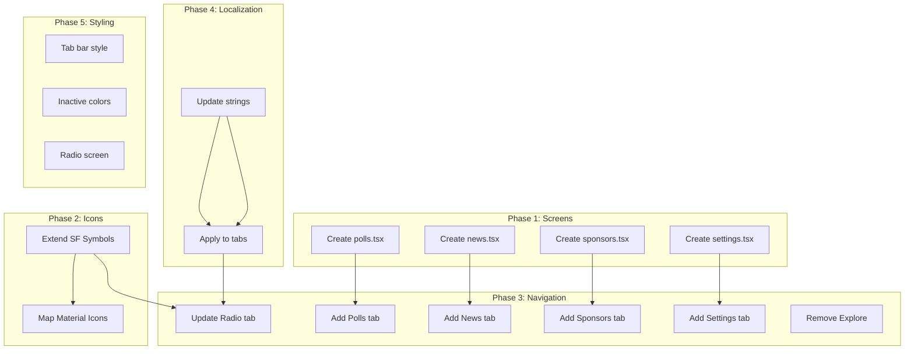

# Tasks: Navigation Structure

## Task Checklist

### Phase 1: Screen File Creation

- [x] **Task 1.1: Create polls.tsx screen file**
  - **Files:** `app/(tabs)/polls.tsx` (new)
  - **Requirements:** [Screen Routing Configuration]
  - **Details:** Create basic polls screen component with ThemedView, ThemedText, and placeholder content
  - **Leverage:** Copy structure from existing index.tsx

- [x] **Task 1.2: Create news.tsx screen file**
  - **Files:** `app/(tabs)/news.tsx` (new)
  - **Requirements:** [Screen Routing Configuration]
  - **Details:** Create basic news screen component with ThemedView, ThemedText, and placeholder content
  - **Leverage:** Copy structure from existing index.tsx

- [x] **Task 1.3: Create sponsors.tsx screen file**
  - **Files:** `app/(tabs)/sponsors.tsx` (new)
  - **Requirements:** [Screen Routing Configuration]
  - **Details:** Create basic sponsors screen component with ThemedView, ThemedText, and placeholder content
  - **Leverage:** Copy structure from existing index.tsx

- [x] **Task 1.4: Create settings.tsx screen file**
  - **Files:** `app/(tabs)/settings.tsx` (new)
  - **Requirements:** [Screen Routing Configuration]
  - **Details:** Create basic settings screen component with ThemedView, ThemedText, and placeholder content
  - **Leverage:** Copy structure from existing index.tsx

### Phase 2: Icon System Setup

- [x] **Task 2.1: Extend IconSymbol mappings for new tabs**
  - **Files:** `components/ui/icon-symbol.tsx`
  - **Requirements:** [Visual Icon Indicators]
  - **Details:** Add mappings for play.circle.fill, chart.bar.fill, newspaper.fill, megaphone.fill, gearshape.fill
  - **Leverage:** Existing MAPPING object structure

- [x] **Task 2.2: Update Android icon mappings**
  - **Files:** `components/ui/icon-symbol.tsx`
  - **Requirements:** [Visual Icon Indicators]
  - **Details:** Map to Material Icons: play-circle-filled, bar-chart, article, campaign, settings
  - **Leverage:** Existing MaterialIcons import

### Phase 3: Navigation Configuration

- [x] **Task 3.1: Update tab layout with Radio tab**
  - **Files:** `app/(tabs)/_layout.tsx`
  - **Requirements:** [Bottom Tab Navigation, Radio Player Access]
  - **Details:** Update index tab with title "Radyo" and play.circle.fill icon
  - **Leverage:** Existing Tabs.Screen structure, import Strings from constants

- [x] **Task 3.2: Add Polls tab to navigation**
  - **Files:** `app/(tabs)/_layout.tsx`
  - **Requirements:** [Bottom Tab Navigation]
  - **Details:** Add Tabs.Screen for polls with title "Anketler" and chart.bar.fill icon
  - **Leverage:** Copy existing Tabs.Screen pattern

- [x] **Task 3.3: Add News tab to navigation**
  - **Files:** `app/(tabs)/_layout.tsx`
  - **Requirements:** [Bottom Tab Navigation]
  - **Details:** Add Tabs.Screen for news with title "Haberler" and newspaper.fill icon
  - **Leverage:** Copy existing Tabs.Screen pattern

- [x] **Task 3.4: Add Sponsors tab to navigation**
  - **Files:** `app/(tabs)/_layout.tsx`
  - **Requirements:** [Bottom Tab Navigation]
  - **Details:** Add Tabs.Screen for sponsors with title "Sponsorlar" and megaphone.fill icon
  - **Leverage:** Copy existing Tabs.Screen pattern

- [x] **Task 3.5: Add Settings tab to navigation**
  - **Files:** `app/(tabs)/_layout.tsx`
  - **Requirements:** [Bottom Tab Navigation]
  - **Details:** Add Tabs.Screen for settings with title "Ayarlar" and gearshape.fill icon
  - **Leverage:** Copy existing Tabs.Screen pattern

- [x] **Task 3.6: Remove unused Explore tab**
  - **Files:** `app/(tabs)/_layout.tsx`, `app/(tabs)/explore.tsx`
  - **Requirements:** [Bottom Tab Navigation]
  - **Details:** Remove explore Tabs.Screen entry and delete explore.tsx file
  - **Leverage:** N/A - cleanup task

### Phase 4: Turkish Localization

- [x] **Task 4.1: Update strings constants with tab labels**
  - **Files:** `constants/strings.ts`
  - **Requirements:** [Turkish Navigation Labels]
  - **Details:** Ensure tabs object has: home: "Radyo", polls: "Anketler", news: "Haberler", sponsors: "Sponsorlar", settings: "Ayarlar"
  - **Leverage:** Existing Strings constant structure (if exists, otherwise follow pattern from core-theme spec)

- [x] **Task 4.2: Apply Turkish strings to tab configuration**
  - **Files:** `app/(tabs)/_layout.tsx`
  - **Requirements:** [Turkish Navigation Labels]
  - **Details:** Replace hardcoded titles with Strings.tabs.* references
  - **Leverage:** Import Strings from constants

### Phase 5: Styling and Polish

- [x] **Task 5.1: Add tab bar styling for theme support**
  - **Files:** `app/(tabs)/_layout.tsx`
  - **Requirements:** [Bottom Tab Navigation, Visual Icon Indicators]
  - **Details:** Add tabBarStyle with background and border colors from theme
  - **Leverage:** Existing Colors import and colorScheme hook

- [x] **Task 5.2: Configure inactive tab colors**
  - **Files:** `app/(tabs)/_layout.tsx`
  - **Requirements:** [Visual Icon Indicators]
  - **Details:** Add tabBarInactiveTintColor to screenOptions using theme colors
  - **Leverage:** Colors[colorScheme].tabIconDefault

- [x] **Task 5.3: Update Radio screen with proper title**
  - **Files:** `app/(tabs)/index.tsx`
  - **Requirements:** [Radio Player Access]
  - **Details:** Replace placeholder content with "Trend Ankara" title and radio player message
  - **Leverage:** ThemedText component

### Phase 6: Type Safety

- [x] **Task 6.1: Create navigation type definitions**
  - **Files:** `types/navigation.ts` (new)
  - **Requirements:** [Screen Routing Configuration]
  - **Details:** Define TabParamList and TabScreenProps types for type-safe navigation
  - **Leverage:** React Navigation type patterns

- [x] **Task 6.2: Apply types to screen components**
  - **Files:** All screen files in `app/(tabs)/`
  - **Requirements:** [Screen Routing Configuration]
  - **Details:** Add proper typing to screen component props (optional, for future use)
  - **Leverage:** Navigation types from task 6.1

## Task Dependencies

## Validation Criteria

Each task should be validated against:
1. **Functionality:** Navigation works as expected
2. **Visual:** Icons and labels display correctly
3. **Theme:** Colors adapt to light/dark mode
4. **Platform:** Works on both iOS and Android
5. **TypeScript:** No type errors

## Implementation Order

**Recommended execution sequence:**
1. Phase 1: Create all screen files (parallel execution possible)
2. Phase 2: Update icon mappings
3. Phase 4: Set up Turkish strings
4. Phase 3: Configure all tabs
5. Phase 5: Apply styling
6. Phase 6: Add type safety (optional, can be deferred)

## Estimated Time

- **Phase 1:** ~20 minutes (4 tasks × 5 min)
- **Phase 2:** ~10 minutes (2 tasks × 5 min)
- **Phase 3:** ~30 minutes (6 tasks × 5 min)
- **Phase 4:** ~10 minutes (2 tasks × 5 min)
- **Phase 5:** ~15 minutes (3 tasks × 5 min)
- **Phase 6:** ~10 minutes (2 tasks × 5 min)
- **Total:** ~1.5 hours

## Notes

- All screen files follow the same basic pattern, making Phase 1 quick
- Icon mappings are straightforward additions to existing object
- Tab configuration is mostly copy-paste with label/icon changes
- Strings constant may already exist from theme spec
- Type safety phase is optional but recommended for maintainability
- Test on both iOS and Android after completion