# Design Document: Player Social Contact Sections

## Overview

This feature redesigns the social contact functionality on the radio player home screen by splitting a single "Bizi Takip Edin" section into two distinct, purpose-driven sections:

1. **İstek Hattı (Request Line)** - Direct communication channels (Phone + WhatsApp)
2. **Sosyal Medya (Social Media)** - Social following channels (Instagram + Facebook)

The implementation will create new specialized components while leveraging existing infrastructure (useSettings hook, MobileSettings types, theme system, and Ionicons). The design prioritizes clarity, minimal vertical space usage, and platform-appropriate deep linking.

## Steering Document Alignment

### Technical Standards (tech.md)

**Component Architecture:**
- Follow functional component pattern with TypeScript
- Use React.FC with typed props interfaces
- Leverage existing themed components (ThemedView, ThemedText)
- Utilize useThemeColor hook for light/dark mode support

**State Management:**
- Use existing useSettings/useSocialLinks hooks (no new state management)
- Leverage React hooks (useState, useCallback) for local component state
- Follow existing service layer pattern (SettingsService)

**Icon Library:**
- Use @expo/vector-icons (Ionicons) exclusively
- No react-icons (web-only, incompatible with React Native)

**Styling:**
- Use StyleSheet.create pattern (not inline styles)
- Reference BrandColors and Colors from constants/theme.ts
- Follow existing shadow/elevation patterns for depth

### Project Structure (structure.md)

**Component Organization:**
```
components/
  social/
    SocialMediaButtons.tsx        (existing - may be refactored or deprecated)
    PlayerContactSection.tsx      (NEW - main section wrapper)
    ContactButton.tsx             (NEW - reusable icon+text button)
    RequestLineSection.tsx        (NEW - İstek Hattı)
    SocialMediaSection.tsx        (NEW - Sosyal Medya)
```

**File Naming Conventions:**
- PascalCase for component files
- Descriptive names that match component purpose
- Co-locate related components in `components/social/`

**Import Patterns:**
- Use `@/` path alias for absolute imports
- Import types separately when needed
- Group imports: React → React Native → Expo → Local

## Code Reuse Analysis

### Existing Components to Leverage

1. **ThemedView** (`components/themed-view.tsx`)
   - **Usage**: Container for all sections and buttons
   - **Provides**: Automatic light/dark mode background colors
   - **Pattern**: `<ThemedView style={styles.container}>`

2. **ThemedText** (`components/themed-text.tsx`)
   - **Usage**: Section titles and button labels
   - **Provides**: Themed text colors, typography variants
   - **Pattern**: `<ThemedText type="subtitle">`

3. **SocialMediaButtons** (`components/social/SocialMediaButtons.tsx`)
   - **Decision**: Create new specialized components instead of refactoring
   - **Reasons**:
     - Existing component uses circular icon-only design with background colors
     - Existing component mixes all social platforms in one undifferentiated list
     - New design requires two distinct sections with different purposes (request vs follow)
     - New design uses icon+text layout (not circular icons)
     - Existing component may be used elsewhere in the app (backward compatibility)
     - Refactoring would require significant changes breaking backward compatibility
   - **Strategy**: Keep existing component untouched, create new purpose-specific components for home screen
   - **Trade-off**: Slight bundle size increase vs. cleaner separation of concerns and zero risk to existing functionality

### Existing Hooks to Leverage

1. **useSocialLinks** (`hooks/useSettings.ts:180`)
   - **Usage**: Fetch social contact configuration
   - **Returns**: `{ facebook, instagram, whatsapp, liveCall }`
   - **Integration**: Primary data source for all sections

2. **useThemeColor** (`hooks/use-theme-color.tsx`)
   - **Usage**: Get theme-aware colors for components
   - **Pattern**: Used internally by ThemedView/ThemedText

### Existing Services to Leverage

1. **SettingsService** (`services/settings/SettingsService.ts`)
   - **Usage**: Provides cached configuration
   - **Integration**: Already integrated via useSettings hook
   - **No changes needed**: Service layer remains unchanged
   - **Note**: Cache TTL managed by SettingsService (requirements specify 7-day TTL)

### Existing Utilities to Leverage

1. **Linking** (React Native built-in)
   - **Usage**: Open deep links and phone calls
   - **Pattern**: Already used in SocialMediaButtons.tsx
   - **Reuse**: Deep link logic can be extracted into utility functions

2. **expo-haptics**
   - **Usage**: Tactile feedback on button presses
   - **Pattern**: `Haptics.impactAsync(Haptics.ImpactFeedbackStyle.Light)`
   - **Example**: VoteButton.tsx uses Medium impact (line 111)
   - **Justification for Light**: Contact buttons are lighter actions than voting, so we use Light instead of Medium for more subtle feedback

3. **Alert** (React Native built-in)
   - **Usage**: Confirmation dialogs and error messages
   - **Pattern**: Already used in SocialMediaButtons for errors

### Integration Points

1. **Home Screen** (`app/(tabs)/index.tsx`)
   - **Current**: Single `<SocialMediaButtons>` component
   - **New**: Replace with `<PlayerContactSection>` wrapper containing both sections
   - **Integration**: Simply swap components, no state management changes

2. **MobileSettings Type** (`types/api.ts`)
   - **Current**: Already includes all required fields
   - **Integration**: No type changes needed
   - **Fields Used**:
     - `playerWhatsappNumber: string | null`
     - `liveCallPhoneNumber: string | null`
     - `playerInstagramUrl: string | null`
     - `playerFacebookUrl: string | null`

3. **API Endpoint** (`/api/mobile/v1/config`)
   - **Current**: Backend already provides all social fields
   - **Integration**: No API changes needed
   - **Cache**: 7-day TTL handled by SettingsService

## Architecture

### Component Hierarchy

```mermaid
graph TD
    A[index.tsx<br/>Home Screen] --> B[PlayerContactSection]
    B --> C[RequestLineSection<br/>İstek Hattı]
    B --> D[SocialMediaSection<br/>Sosyal Medya]
    C --> E1[ContactButton<br/>WhatsApp]
    C --> E2[ContactButton<br/>Phone]
    D --> F1[ContactButton<br/>Instagram]
    D --> F2[ContactButton<br/>Facebook]

    G[useSocialLinks Hook] -.->|provides data| B
    H[BrandColors] -.->|styling| E1
    H -.->|styling| E2
    H -.->|styling| F1
    H -.->|styling| F2

    I[Linking API] -.->|deep links| E1
    I -.->|deep links| E2
    I -.->|deep links| F1
    I -.->|deep links| F2

    J[expo-haptics] -.->|feedback| E1
    J -.->|feedback| E2
    J -.->|feedback| F1
    J -.->|feedback| F2
```



### Data Flow


### Interaction Flow


## Components and Interfaces

### Component 1: PlayerContactSection

**Purpose:** Main wrapper component that conditionally renders both contact sections

**Interface:**
```typescript
interface PlayerContactSectionProps {
  style?: StyleProp<ViewStyle>;
}

export const PlayerContactSection: React.FC<PlayerContactSectionProps>
```

**Responsibilities:**
- Fetch social links using useSocialLinks hook
- Determine which sections to display based on available data
- Render RequestLineSection if whatsapp OR liveCall exists
- Render SocialMediaSection if instagram OR facebook exists
- Hide entire component if no data available

**Dependencies:**
- useSocialLinks hook
- ThemedView component
- RequestLineSection component
- SocialMediaSection component

**Reuses:**
- ThemedView for container
- Existing useSocialLinks hook

**Key Logic:**
```typescript
const socialLinks = useSocialLinks();

const hasRequestLine = !!(socialLinks.whatsapp || socialLinks.liveCall);
const hasSocialMedia = !!(socialLinks.instagram || socialLinks.facebook);

if (!hasRequestLine && !hasSocialMedia) return null;
```

---

### Component 2: RequestLineSection

**Purpose:** Displays İstek Hattı section with WhatsApp and Phone buttons

**Interface:**
```typescript
interface RequestLineSectionProps {
  whatsappNumber: string | null;
  phoneNumber: string | null;
  style?: StyleProp<ViewStyle>;
}

export const RequestLineSection: React.FC<RequestLineSectionProps>
```

**Responsibilities:**
- Render section title "İstek Hattı"
- Display WhatsApp button if whatsappNumber exists
- Display Phone button if phoneNumber exists
- Handle WhatsApp deep linking
- Handle phone call confirmation dialog

**Dependencies:**
- ContactButton component
- ThemedView, ThemedText
- React Native Linking
- React Native Alert
- expo-haptics

**Reuses:**
- ContactButton for button rendering
- ThemedView/ThemedText for layout and titles
- Existing deep link pattern from SocialMediaButtons.tsx

**Key Functions:**
```typescript
const handleWhatsApp = async () => {
  // Clean phone number, format with country code
  // Open whatsapp://send?phone={number}
  // Fallback to web if app not installed
};

const handlePhone = async () => {
  // Show confirmation dialog with phone number
  // On confirm: initiate tel:{number}
};
```

---

### Component 3: SocialMediaSection

**Purpose:** Displays Sosyal Medya section with Instagram and Facebook buttons

**Interface:**
```typescript
interface SocialMediaSectionProps {
  instagramUrl: string | null;
  facebookUrl: string | null;
  style?: StyleProp<ViewStyle>;
}

export const SocialMediaSection: React.FC<SocialMediaSectionProps>
```

**Responsibilities:**
- Render section title "Sosyal Medya"
- Display Instagram button if instagramUrl exists
- Display Facebook button if facebookUrl exists
- Handle Instagram deep linking with app/web fallback
- Handle Facebook deep linking with app/web fallback

**Dependencies:**
- ContactButton component
- ThemedView, ThemedText
- React Native Linking
- expo-haptics

**Reuses:**
- ContactButton for button rendering
- ThemedView/ThemedText for layout and titles
- Existing deep link pattern from SocialMediaButtons.tsx

**Key Functions:**
```typescript
const handleInstagram = async () => {
  // Extract username from URL
  // Try instagram://user?username={username}
  // Fallback to https://instagram.com/{username}
};

const handleFacebook = async () => {
  // Try fb://profile/{pageId} (if page ID available)
  // Fallback to web URL
};
```

---

### Component 4: ContactButton

**Purpose:** Reusable icon+text button for social contact actions

**Interface:**
```typescript
interface ContactButtonProps {
  icon: keyof typeof Ionicons.glyphMap;
  label: string;
  onPress: () => void;
  color: string;
  accessibilityLabel: string;
  style?: StyleProp<ViewStyle>;
}

export const ContactButton: React.FC<ContactButtonProps>
```

**Responsibilities:**
- Render icon from Ionicons
- Render text label below icon
- Apply platform color to icon/background
- Provide haptic feedback on press
- Ensure 48x48dp minimum touch target
- Support accessibility labels

**Dependencies:**
- Ionicons from @expo/vector-icons
- ThemedText for label
- expo-haptics for feedback
- TouchableOpacity for press handling

**Reuses:**
- ThemedText component
- Haptic feedback pattern from VoteButton.tsx
- Touch target sizing from existing button components

**Visual Structure:**
```
┌─────────────────┐
│                 │
│      [Icon]     │  <- Ionicons, colored
│                 │
│      Label      │  <- ThemedText
│                 │
└─────────────────┘
```

---

### Component 5: Utility Functions (helpers)

**Purpose:** Extract reusable deep linking and validation logic

**Location:** `components/social/helpers.ts` (new file)

**Functions:**

```typescript
/**
 * Open URL with app deep link fallback to web
 */
export const openWithDeepLink = async (
  appUrl: string,
  webUrl: string,
  appName: string
): Promise<void> => {
  try {
    const canOpenApp = await Linking.canOpenURL(appUrl);
    if (canOpenApp) {
      await Linking.openURL(appUrl);
    } else {
      await Linking.openURL(webUrl);
    }
  } catch (error) {
    console.error(`Error opening ${appName}:`, error);
    Alert.alert('Hata', `${appName} açılırken bir hata oluştu`);
  }
};

/**
 * Clean and format phone number for Turkish mobile
 */
export const formatPhoneNumber = (phone: string): string => {
  // Remove all non-digit characters
  const cleaned = phone.replace(/\D/g, '');

  // Add country code if not present
  if (!cleaned.startsWith('90')) {
    return `90${cleaned}`;
  }

  return cleaned;
};

/**
 * Extract Instagram username from various URL formats
 */
export const extractInstagramUsername = (url: string): string => {
  return url
    .replace('https://instagram.com/', '')
    .replace('https://www.instagram.com/', '')
    .replace('@', '')
    .split('/')[0]; // Handle trailing slashes
};

/**
 * Show phone call confirmation dialog
 */
export const showCallConfirmation = (
  phoneNumber: string,
  onConfirm: () => void
): void => {
  Alert.alert(
    'Canlı Yayın Hattı',
    `${phoneNumber} numarasını aramak istiyor musunuz?`,
    [
      { text: 'İptal', style: 'cancel' },
      { text: 'Ara', onPress: onConfirm },
    ]
  );
};
```

**Reuses:**
- Alert pattern from existing components
- Phone formatting logic from SocialMediaButtons.tsx
- URL parsing pattern from existing code

---

## Data Models

### MobileSettings (Existing - No Changes)

This type already exists in `types/api.ts` and contains all required fields:

```typescript
export interface MobileSettings {
  // ... other fields ...

  // Player Social Settings (fields we use)
  playerWhatsappNumber: string | null;
  liveCallPhoneNumber: string | null;
  playerInstagramUrl: string | null;
  playerFacebookUrl: string | null;

  // ... other fields ...
}
```

**Usage:** Consumed via useSocialLinks hook which extracts these four fields

---

### SocialLinks (Existing - No Changes)

Returned by `useSocialLinks()` hook in `hooks/useSettings.ts:180`:

```typescript
{
  facebook: string | null;
  instagram: string | null;
  whatsapp: string | null;
  liveCall: string | null;
}
```

**Usage:** Primary data structure passed to PlayerContactSection

---

### ContactButtonConfig (Internal Type)

Used internally for button configuration:

```typescript
interface ContactButtonConfig {
  id: 'whatsapp' | 'phone' | 'instagram' | 'facebook';
  icon: keyof typeof Ionicons.glyphMap;
  label: string;
  color: string;
  onPress: () => void;
  accessibilityLabel: string;
  visible: boolean;
}
```

**Usage:** Map data to button props within section components

---

## Visual Design Specifications

### Layout Structure

**Compact Vertical Design:**
- Each section has minimal vertical spacing
- Buttons arranged horizontally within each section
- Sections stacked vertically with moderate spacing

```
┌────────────────────────────────────┐
│                                    │
│   [Player Controls Above]          │
│                                    │
├────────────────────────────────────┤
│                                    │
│   İstek Hattı                      │ <- Section title
│   ┌──────┐    ┌──────┐            │
│   │  📱  │    │  📞  │            │ <- Icon buttons
│   │      │    │      │            │
│   │WhatsApp   │ Ara  │            │ <- Labels
│   └──────┘    └──────┘            │
│                                    │
├────────────────────────────────────┤
│                                    │
│   Sosyal Medya                     │ <- Section title
│   ┌──────┐    ┌──────┐            │
│   │  📷  │    │  👥  │            │ <- Icon buttons
│   │      │    │      │            │
│   │Instagram  │Facebook│           │ <- Labels
│   └──────┘    └──────┘            │
│                                    │
└────────────────────────────────────┘
```

### Spacing and Sizing

**Section Spacing:**
- Title to buttons: 16dp
- Between sections: 32dp
- Section to player controls: 40dp (existing)

**Button Sizing:**
- Touch target: 48x48dp minimum (Android), 44x44pt (iOS)
- Icon size: 28px
- Icon to label spacing: 8dp
- Button to button spacing: 20dp (horizontal)

**Typography:**
- Section titles: 20px, bold, ThemedText type="subtitle" (matches existing subtitle style)
- Button labels: 16px, normal weight, ThemedText type="default" (matches existing default style)

### Color Palette

**Platform Colors (from BrandColors):**
```typescript
{
  whatsapp: '#25D366',   // WhatsApp green
  phone: '#DC2626',      // Trend Ankara red (BrandColors.primary)
  instagram: '#E4405F',  // Instagram pink/magenta
  facebook: '#1877F2',   // Facebook blue
}
```

**Note:** Phone button color changed from `#FF0000` (pure red, used in existing SocialMediaButtons.tsx:154) to `#DC2626` (brand red) for consistency with established brand palette.

**Background and Text:**
- Section titles: `colors.text` (theme-aware)
- Button labels: `colors.text` (theme-aware)
- Button backgrounds: Transparent (no background tint needed)
- Icon colors: Platform color at 100%

**Button styling approach:**
```typescript
{
  // Simple, clean look - icon provides color
  backgroundColor: 'transparent',
  // Icon uses full platform color
  iconColor: platformColor,
}
```

**Note:** Removed color opacity manipulation to avoid dependency on external color libraries. Icons at full platform colors provide sufficient visual distinction.

---

## Error Handling

### Error Scenarios

#### 1. WhatsApp Not Installed

**Handling:**
```typescript
try {
  const canOpen = await Linking.canOpenURL(whatsappUrl);
  if (!canOpen) {
    Alert.alert('WhatsApp Bulunamadı', 'WhatsApp uygulaması yüklü değil.');
    return;
  }
  await Linking.openURL(whatsappUrl);
} catch (error) {
  Alert.alert('Hata', 'WhatsApp açılamadı');
}
```

**User Impact:** Clear message that app is not installed

---

#### 2. Phone Call Fails

**Handling:**
```typescript
Linking.openURL(`tel:${cleanNumber}`).catch(() => {
  Alert.alert('Hata', 'Arama yapılamadı');
});
```

**User Impact:** Error shown if device cannot make calls (e.g., iPad WiFi)

---

#### 3. Instagram/Facebook Deep Link Fails

**Handling:**
```typescript
try {
  const canOpenApp = await Linking.canOpenURL(appUrl);
  if (canOpenApp) {
    await Linking.openURL(appUrl);
  } else {
    // Graceful fallback to web
    await Linking.openURL(webUrl);
  }
} catch (error) {
  Alert.alert('Hata', 'Bağlantı açılırken bir hata oluştu');
}
```

**User Impact:** Seamless fallback to browser, only shows error if both fail

---

#### 4. Configuration Fetch Fails

**Handling:** Already handled by SettingsService and useSettings hook

**Behavior:**
- SettingsService returns cached config if fetch fails
- If no cache, returns default settings (all fields null)
- PlayerContactSection checks for null values and hides sections

**User Impact:** Graceful degradation - sections simply don't appear

---

#### 5. Malformed Phone Number

**Handling:**
```typescript
const formatPhoneNumber = (phone: string): string => {
  const cleaned = phone.replace(/\D/g, '');
  if (cleaned.length < 10) {
    console.warn('Phone number too short:', phone);
    // Still attempt to dial, OS will handle invalid number
  }
  return cleaned.startsWith('90') ? cleaned : `90${cleaned}`;
};
```

**User Impact:** Best-effort formatting, OS handles truly invalid numbers

---

#### 6. Rapid Button Presses

**Handling:** Debounce using disabled state during action

```typescript
const [isOpening, setIsOpening] = useState(false);

const handlePress = async () => {
  if (isOpening) return;
  setIsOpening(true);

  try {
    await Haptics.impactAsync(Haptics.ImpactFeedbackStyle.Light);
    await openWithDeepLink(appUrl, webUrl, appName);
  } finally {
    setIsOpening(false);
  }
};
```

**User Impact:** Prevents duplicate opens, avoids app switching confusion

---

## Testing Strategy

### Unit Testing

**Components to Test:**
1. **PlayerContactSection**
   - ✅ Renders RequestLineSection when whatsapp or liveCall present
   - ✅ Renders SocialMediaSection when instagram or facebook present
   - ✅ Hides completely when no data available
   - ✅ Passes correct props to child sections

2. **RequestLineSection**
   - ✅ Shows WhatsApp button when whatsappNumber provided
   - ✅ Shows Phone button when phoneNumber provided
   - ✅ Hides WhatsApp button when whatsappNumber is null
   - ✅ Calls handleWhatsApp with correct phone number
   - ✅ Shows confirmation dialog for phone calls

3. **SocialMediaSection**
   - ✅ Shows Instagram button when instagramUrl provided
   - ✅ Shows Facebook button when facebookUrl provided
   - ✅ Hides buttons when URLs are null
   - ✅ Extracts username correctly from Instagram URL

4. **ContactButton**
   - ✅ Renders icon and label correctly
   - ✅ Applies correct color
   - ✅ Calls onPress when tapped
   - ✅ Provides haptic feedback
   - ✅ Has correct accessibility label

5. **Helper Functions**
   - ✅ `formatPhoneNumber`: Handles various formats, adds country code
   - ✅ `extractInstagramUsername`: Parses different URL formats
   - ✅ `openWithDeepLink`: Tries app, falls back to web
   - ✅ `showCallConfirmation`: Displays correct dialog

**Test Framework:** Jest + React Native Testing Library

**Mock Dependencies:**
- Mock `Linking.canOpenURL` and `Linking.openURL`
- Mock `Alert.alert`
- Mock `Haptics.impactAsync`
- Mock `useSocialLinks` hook

---

### Integration Testing

**Test Flows:**

1. **Full Section Rendering**
   - Given: All social contact fields populated in config
   - When: Home screen renders
   - Then: Both sections visible with all 4 buttons

2. **Partial Configuration**
   - Given: Only whatsappNumber and instagramUrl in config
   - When: Home screen renders
   - Then: Both sections visible but only 2 buttons total

3. **Empty Configuration**
   - Given: All social contact fields are null
   - When: Home screen renders
   - Then: PlayerContactSection not rendered at all

4. **WhatsApp Flow**
   - Given: User has WhatsApp installed
   - When: User taps WhatsApp button
   - Then: WhatsApp app opens with pre-filled number

5. **Phone Call Flow**
   - Given: User taps Phone button
   - When: Confirmation dialog appears
   - Then: User can confirm or cancel
   - When: User confirms
   - Then: Phone dialer opens

6. **Instagram App Not Installed**
   - Given: User doesn't have Instagram app
   - When: User taps Instagram button
   - Then: Instagram web page opens in browser

**Test Framework:** Detox (E2E) or manual testing on physical devices

---

### End-to-End Testing

**User Scenarios:**

1. **Song Request Journey**
   ```
   User opens app
   → Scrolls to İstek Hattı section
   → Taps WhatsApp button
   → WhatsApp opens with radio station number
   → User sends song request message
   ```

2. **Social Follow Journey**
   ```
   User opens app
   → Scrolls to Sosyal Medya section
   → Taps Instagram button
   → Instagram app opens (or web)
   → User views station profile
   → User follows the station
   ```

3. **Live Call Journey**
   ```
   User opens app during live show
   → Scrolls to İstek Hattı section
   → Taps Phone button
   → Confirmation dialog shows phone number
   → User confirms
   → Phone dialer opens
   → User completes call to live show
   ```

4. **Error Recovery**
   ```
   User opens app with no internet
   → Configuration fails to fetch
   → Cached config used
   → Sections render with cached data
   → User can still interact with buttons
   ```

**Success Criteria:**
- All buttons respond within 100ms
- Deep links open within 500ms
- Fallbacks work seamlessly
- No crashes or stuck states
- Accessibility features work (VoiceOver/TalkBack)

---

## Implementation Phases

### Phase 1: Foundation (Components)
1. Create `ContactButton` component with icon+text layout
2. Create helper functions in `helpers.ts`
3. Unit test ContactButton and helpers

### Phase 2: Sections
1. Create `RequestLineSection` with WhatsApp/Phone logic
2. Create `SocialMediaSection` with Instagram/Facebook logic
3. Unit test both section components

### Phase 3: Integration
1. Create `PlayerContactSection` wrapper
2. Integrate into `app/(tabs)/index.tsx`
3. Remove or deprecate old `SocialMediaButtons` usage
4. Integration testing

### Phase 4: Polish
1. Accessibility testing (VoiceOver/TalkBack)
2. Visual QA on iOS and Android
3. Performance testing
4. Error scenario testing

---

## Accessibility Considerations

### Screen Reader Support

**All buttons must include:**
```typescript
<TouchableOpacity
  accessibilityRole="button"
  accessibilityLabel="WhatsApp ile şarkı iste"
  accessibilityHint="WhatsApp uygulamasını açar"
>
```

**Section titles must be announced:**
```typescript
<ThemedText
  type="subtitle"
  accessibilityRole="header"
>
  İstek Hattı
</ThemedText>
```

### Touch Target Sizes

**Minimum sizes:**
- iOS: 44x44 points
- Android: 48x48 dp

**Implementation:**
```typescript
const styles = StyleSheet.create({
  button: {
    minWidth: 48,
    minHeight: 48,
    paddingHorizontal: 16,
    paddingVertical: 12,
  },
});
```

### Color Contrast

**Ensure WCAG AA compliance:**
- Icon colors must have 4.5:1 contrast ratio against background
- Text labels must have 4.5:1 contrast ratio
- Platform colors (#25D366, #DC2626, etc.) already meet these requirements

### Haptic Feedback

**Provide tactile confirmation:**
```typescript
await Haptics.impactAsync(Haptics.ImpactFeedbackStyle.Light);
```

**Guidelines:**
- Light impact for button presses
- Medium impact for confirmation actions
- Heavy impact for errors (optional)

---

## Performance Considerations

### Rendering Optimization

**Conditional Rendering:**
- Only render sections with available data
- Use early returns to avoid unnecessary renders
- Leverage React.memo for ContactButton if needed

**Example:**
```typescript
if (!whatsappNumber && !phoneNumber) return null;
```

### Memoization

**Consider memoizing expensive operations:**
```typescript
const formattedPhone = useMemo(
  () => formatPhoneNumber(phoneNumber),
  [phoneNumber]
);

const instagramUsername = useMemo(
  () => extractInstagramUsername(instagramUrl),
  [instagramUrl]
);
```

### Deep Link Performance

**Minimize delay:**
- Cache `Linking.canOpenURL` results if possible
- Use `Promise.race` for timeout handling (optional)
- Provide immediate haptic feedback before opening

**Example:**
```typescript
const handlePress = async () => {
  // Immediate feedback
  await Haptics.impactAsync(Haptics.ImpactFeedbackStyle.Light);

  // Then async operation
  await openWithDeepLink(appUrl, webUrl, appName);
};
```

---

## Platform Differences

### iOS vs Android

**Deep Link URL Schemes:**

| Platform   | WhatsApp         | Instagram                    | Facebook          |
|------------|------------------|------------------------------|-------------------|
| iOS        | `whatsapp://`    | `instagram://user?username=` | `fb://profile/`   |
| Android    | `whatsapp://`    | `instagram://user?username=` | `fb://page/`      |

**Phone Calling:**
- Both platforms support `tel:` scheme
- iOS: Shows native confirmation on first call
- Android: Opens dialer directly (we add custom confirmation)

**Haptic Feedback:**
- iOS: Uses Taptic Engine (richer feedback)
- Android: Uses vibration motor (simpler feedback)

**Touch Targets:**
- iOS: Minimum 44x44 points
- Android: Minimum 48x48 dp

### Implementation Strategy

**Use Platform.OS sparingly:**
Most deep links work identically on both platforms. Only use platform detection if necessary:

```typescript
const facebookUrl = Platform.OS === 'ios'
  ? `fb://profile/${pageId}`
  : `fb://page/${pageId}`;
```

**Prefer feature detection:**
```typescript
const canOpen = await Linking.canOpenURL(appUrl);
// Works on both platforms
```

---

## Migration Strategy

### Backward Compatibility

**Keep existing SocialMediaButtons:**
- Don't remove immediately
- Mark as deprecated in comments
- May be used in other parts of the app (check references)

**Gradual rollout:**
1. Add new PlayerContactSection components
2. Update only home screen initially
3. Monitor for issues
4. If stable, consider migrating other usages
5. Deprecate old component after all migrations complete

### Rollback Plan

**If issues arise:**
1. Revert `app/(tabs)/index.tsx` to use old `<SocialMediaButtons>`
2. New components remain in codebase (no harm)
3. Fix issues, re-deploy

**Feature Flag (Optional):**
```typescript
const USE_NEW_CONTACT_SECTIONS = true; // or from config

{USE_NEW_CONTACT_SECTIONS ? (
  <PlayerContactSection />
) : (
  <SocialMediaButtons />
)}
```

---

## Open Questions / Decisions Needed

### 1. Icon Selection

**Question:** Which exact Ionicons should we use?

**Recommendations:**
- WhatsApp: `logo-whatsapp`
- Phone: `call` or `call-outline`
- Instagram: `logo-instagram`
- Facebook: `logo-facebook`

**Decision:** Use filled `logo-*` for social platforms, `call` for phone

---

### 2. Pre-filled WhatsApp Message

**Question:** What message should be pre-filled?

**Current:** `"Merhaba, Trend Ankara radyosu hakkında bilgi almak istiyorum."`

**Recommendation:** Change to song request context:
`"Merhaba! Şarkı isteğim var."`

**Decision:** User will confirm in implementation phase

---

### 3. Button Animation

**Question:** Should buttons have press animations like VoteButton?

**Options:**
- A) Simple opacity change (activeOpacity={0.7})
- B) Scale animation (like VoteButton.tsx)
- C) No animation (immediate action)

**Recommendation:** Option A (simple) for faster perceived performance

---

### 4. Section Collapse/Expand

**Question:** Should sections be collapsible to save space?

**Analysis:**
- Pro: Even more compact
- Con: Extra complexity, users might not discover features
- Con: Adds state management

**Recommendation:** No. Keep sections always visible if data exists.

---

## Summary

This design leverages existing infrastructure extensively while introducing focused, purpose-specific components. The architecture follows established patterns in the codebase (functional components, TypeScript, themed styling, Ionicons) and integrates seamlessly with the existing useSettings/SettingsService layer.

Key implementation strategy:
1. **Reuse over rebuild**: ThemedView, ThemedText, useSocialLinks hook
2. **Component composition**: Small, focused components (ContactButton) composed into larger sections
3. **Backward compatibility**: Keep existing components, gradual migration
4. **Platform awareness**: Handle iOS/Android differences gracefully
5. **Accessibility-first**: Screen readers, touch targets, haptic feedback

The design is ready for atomic task breakdown in the tasks phase.
