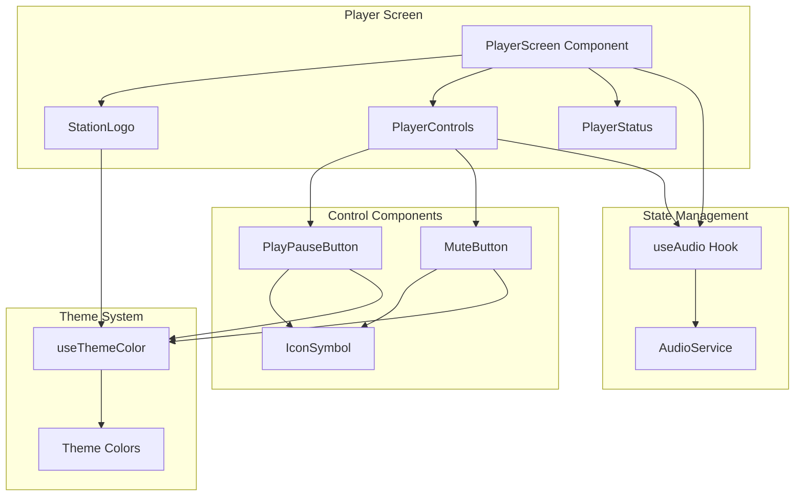
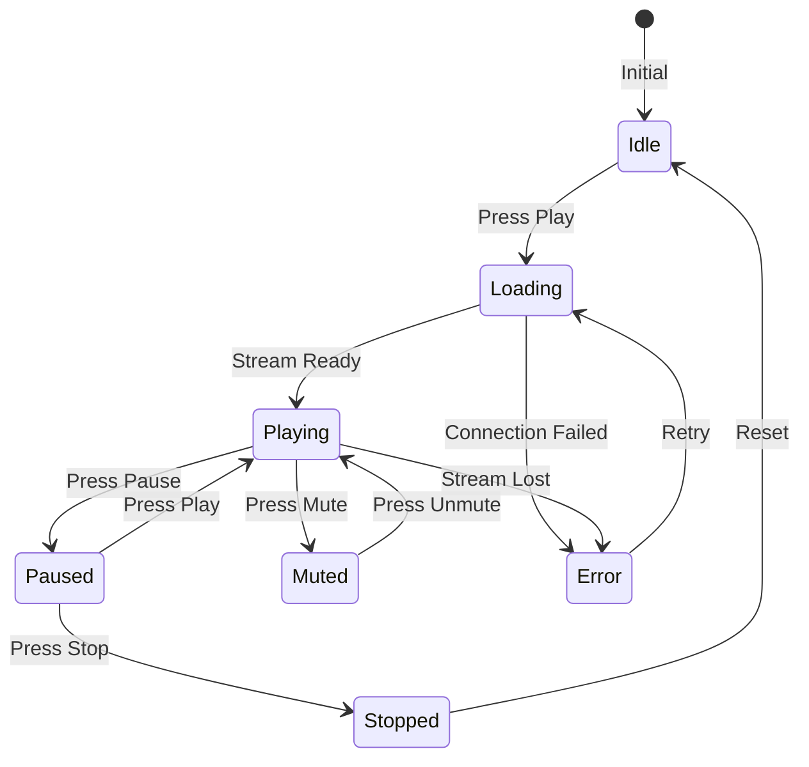

# Design: Radio Player UI

## Overview
This design document details the technical implementation of the Radio Player UI for Trend Ankara app, featuring a prominent play/pause button, station logo display, and mute control, all integrated with the audio streaming service and following the app's design principles.

## Architecture

### Component Architecture



### State Flow Diagram



## Detailed Design

### 1. Main Player Screen Component

**File:** `app/(tabs)/index.tsx` (update existing)

```typescript
import React from 'react';
import { StyleSheet, SafeAreaView, View } from 'react-native';
import { ThemedView } from '@/components/themed-view';
import { PlayerControls } from '@/components/player/PlayerControls';
import { StationLogo } from '@/components/player/StationLogo';
import { useColorScheme } from '@/hooks/use-color-scheme';

export default function RadioScreen() {
  const colorScheme = useColorScheme();

  return (
    <ThemedView style={styles.container}>
      <SafeAreaView style={styles.safeArea}>
        <View style={styles.content}>
          <StationLogo />
          <PlayerControls />
        </View>
      </SafeAreaView>
    </ThemedView>
  );
}

const styles = StyleSheet.create({
  container: {
    flex: 1,
  },
  safeArea: {
    flex: 1,
  },
  content: {
    flex: 1,
    justifyContent: 'center',
    alignItems: 'center',
    paddingHorizontal: 20,
  },
});
```

### 2. Play/Pause Button Component

**File:** `components/player/PlayPauseButton.tsx` (new)

```typescript
import React from 'react';
import {
  TouchableOpacity,
  StyleSheet,
  ActivityIndicator,
  Platform
} from 'react-native';
import * as Haptics from 'expo-haptics';
import { IconSymbol } from '@/components/ui/icon-symbol';
import { useThemeColor } from '@/hooks/use-theme-color';
import { useAudio } from '@/hooks/useAudio';
import Animated, {
  useAnimatedStyle,
  withSpring
} from 'react-native-reanimated';

const AnimatedTouchable = Animated.createAnimatedComponent(TouchableOpacity);

export function PlayPauseButton() {
  const { play, pause, isPlaying, state } = useAudio();
  const tintColor = useThemeColor({}, 'tint');

  const handlePress = async () => {
    if (Platform.OS === 'ios') {
      await Haptics.impactAsync(Haptics.ImpactFeedbackStyle.Light);
    }

    if (isPlaying) {
      await pause();
    } else {
      await play();
    }
  };

  const animatedStyle = useAnimatedStyle(() => ({
    transform: [{ scale: withSpring(1) }],
  }));

  const getIconName = () => {
    if (isPlaying) return 'pause.circle.fill';
    return 'play.circle.fill';
  };

  return (
    <AnimatedTouchable
      style={[styles.button, animatedStyle]}
      onPress={handlePress}
      activeOpacity={0.8}
      disabled={state === 'loading'}
    >
      {state === 'loading' ? (
        <ActivityIndicator size="large" color={tintColor} />
      ) : (
        <IconSymbol
          name={getIconName()}
          size={80}
          color={tintColor}
        />
      )}
    </AnimatedTouchable>
  );
}

const styles = StyleSheet.create({
  button: {
    width: 100,
    height: 100,
    justifyContent: 'center',
    alignItems: 'center',
  },
});
```

### 3. Station Logo Component

**File:** `components/player/StationLogo.tsx` (new)

```typescript
import React from 'react';
import { StyleSheet, View } from 'react-native';
import { Image } from 'expo-image';
import { ThemedText } from '@/components/themed-text';
import { useThemeColor } from '@/hooks/use-theme-color';

export function StationLogo() {
  const textColor = useThemeColor({}, 'text');

  // Placeholder for now - will be replaced with actual logo
  const logoSource = require('@/assets/images/icon.png');

  return (
    <View style={styles.container}>
      <Image
        source={logoSource}
        style={styles.logo}
        contentFit="contain"
        transition={200}
      />
      <ThemedText type="title" style={styles.title}>
        {"Trend Ankara"}
      </ThemedText>
    </View>
  );
}

const styles = StyleSheet.create({
  container: {
    alignItems: 'center',
    marginBottom: 40,
  },
  logo: {
    width: 120,
    height: 120,
    marginBottom: 16,
  },
  title: {
    fontSize: 24,
    fontWeight: 'bold',
  },
});
```

### 4. Mute Button Component

**File:** `components/player/MuteButton.tsx` (new)

```typescript
import React, { useState } from 'react';
import { TouchableOpacity, StyleSheet, Platform } from 'react-native';
import * as Haptics from 'expo-haptics';
import { IconSymbol } from '@/components/ui/icon-symbol';
import { useThemeColor } from '@/hooks/use-theme-color';

export function MuteButton() {
  const [isMuted, setIsMuted] = useState(false);
  const iconColor = useThemeColor({}, 'icon');

  const handlePress = async () => {
    if (Platform.OS === 'ios') {
      await Haptics.impactAsync(Haptics.ImpactFeedbackStyle.Light);
    }

    setIsMuted(!isMuted);
    // TODO: Integrate with audio service mute functionality
  };

  const getIconName = () => {
    if (isMuted) return 'speaker.slash.fill';
    return 'speaker.wave.2.fill';
  };

  return (
    <TouchableOpacity
      style={styles.button}
      onPress={handlePress}
      activeOpacity={0.7}
      accessibilityLabel={isMuted ? "Sesi Aç" : "Sesi Kapat"}
      accessibilityRole="button"
    >
      <IconSymbol
        name={getIconName()}
        size={32}
        color={iconColor}
      />
    </TouchableOpacity>
  );
}

const styles = StyleSheet.create({
  button: {
    padding: 12,
    justifyContent: 'center',
    alignItems: 'center',
  },
});
```

### 5. Player Controls Container

**File:** `components/player/PlayerControls.tsx` (new)

```typescript
import React from 'react';
import { View, StyleSheet } from 'react-native';
import { PlayPauseButton } from './PlayPauseButton';
import { MuteButton } from './MuteButton';
import { ThemedText } from '@/components/themed-text';
import { useAudio } from '@/hooks/useAudio';

export function PlayerControls() {
  const { status } = useAudio();

  return (
    <View style={styles.container}>
      <PlayPauseButton />

      <View style={styles.secondaryControls}>
        <MuteButton />
      </View>

      {status.state === 'error' && (
        <ThemedText style={styles.errorText}>
          {status.error || "Bağlantı hatası"}
        </ThemedText>
      )}
    </View>
  );
}

const styles = StyleSheet.create({
  container: {
    alignItems: 'center',
    width: '100%',
  },
  secondaryControls: {
    marginTop: 32,
  },
  errorText: {
    color: '#DC2626',
    marginTop: 16,
    textAlign: 'center',
  },
});
```

### 6. Icon Mapping Updates

**File:** `components/ui/icon-symbol.tsx` (update existing)

```typescript
// Add to MAPPING object
const MAPPING = {
  // Existing mappings...
  'play.circle.fill': 'play-circle',
  'pause.circle.fill': 'pause-circle',
  'speaker.wave.2.fill': 'volume-up',
  'speaker.slash.fill': 'volume-off',
  // ...
} as IconMapping;
```

### 7. Updated Theme Colors

**Note:** This assumes the theme has been updated with brand colors from the theme spec

```typescript
// constants/theme.ts (should already be updated)
const brandRed = '#DC2626';
const brandBlack = '#000000';
const brandWhite = '#FFFFFF';

export const Colors = {
  light: {
    tint: brandRed,
    // ... other colors
  },
  dark: {
    tint: brandRed,
    // ... other colors
  },
};
```

## Implementation Patterns

### Pattern 1: Responsive Button Sizing
```typescript
// Use dimensions for responsive sizing
import { Dimensions } from 'react-native';

const { width } = Dimensions.get('window');
const buttonSize = Math.min(width * 0.25, 100); // Max 100px
```

### Pattern 2: Error State Display
```typescript
// Consistent error messaging
{status.state === 'error' && (
  <ThemedText style={styles.error}>
    {status.error || "Bir hata oluştu"}
  </ThemedText>
)}
```

### Pattern 3: Accessibility Labels
```typescript
// Turkish accessibility labels
accessibilityLabel="Oynat/Duraklat"
accessibilityHint="Radyo yayınını başlatır veya duraklatır"
accessibilityRole="button"
```

## State Management

### Audio State Integration
- Components subscribe to audio state via useAudio hook
- Real-time updates for play/pause/loading/error states
- Centralized state management through AudioService singleton

### Local UI State
- Mute button maintains local state (for now)
- Animation states handled by Reanimated
- Touch feedback managed per component

## API Design

### Component Props

```typescript
// PlayPauseButton
interface PlayPauseButtonProps {
  size?: number; // Button size (default: 80)
  disabled?: boolean;
}

// StationLogo
interface StationLogoProps {
  source?: ImageSource;
  title?: string;
}

// MuteButton
interface MuteButtonProps {
  size?: number; // Icon size (default: 32)
}
```

## Testing Strategy

### Visual Testing
- Test on various screen sizes
- Verify dark/light mode appearance
- Check touch target sizes (min 44x44)
- Validate color contrast ratios

### Interaction Testing
- Play/pause state transitions
- Loading indicator display
- Error message visibility
- Haptic feedback on iOS

### Integration Testing
- Audio service connection
- State synchronization
- Network error handling
- Background state updates

## Migration Plan

### Phase 1: Component Creation
1. Create player component directory
2. Build individual components
3. Update icon mappings

### Phase 2: Integration
1. Connect to useAudio hook
2. Update main screen
3. Test state management

### Phase 3: Polish
1. Add animations
2. Implement haptic feedback
3. Fine-tune responsive sizing

## Security Considerations
- No sensitive data in UI components
- Logo assets bundled locally
- No external image loading initially

## Performance Implications
- Minimal re-renders with proper memoization
- Native driver for animations
- Efficient image loading with expo-image
- < 100ms button response time

## Accessibility
- All controls have Turkish labels
- Proper accessibility roles
- Screen reader compatible
- Focus indicators for keyboard nav
- Sufficient touch targets

## Edge Cases

### Screen Sizes
- Small phones: Scale down but maintain min touch targets
- Tablets: Maximum size constraints
- Landscape: Adjust layout appropriately

### State Handling
- Rapid play/pause taps: Debounce or queue
- Network loss during playback: Show error
- App background/foreground: Sync state

### Error Scenarios
- Stream unavailable: Clear error message
- Network timeout: Show retry option
- Permission denied: Guide user to settings

## Dependencies on Existing Code
- `hooks/useAudio.ts` - Audio state management
- `components/themed-view.tsx` - Themed container
- `components/themed-text.tsx` - Themed text
- `components/ui/icon-symbol.tsx` - Platform icons
- `hooks/use-theme-color.ts` - Theme colors
- `constants/theme.ts` - Color definitions

## Future Considerations
1. **Volume Slider**: Add volume control
2. **Progress Indicator**: Show buffering progress
3. **Metadata Display**: Current program info
4. **Share Button**: Social media sharing
5. **Favorite Button**: Save to favorites
6. **Sleep Timer**: Auto-stop after duration