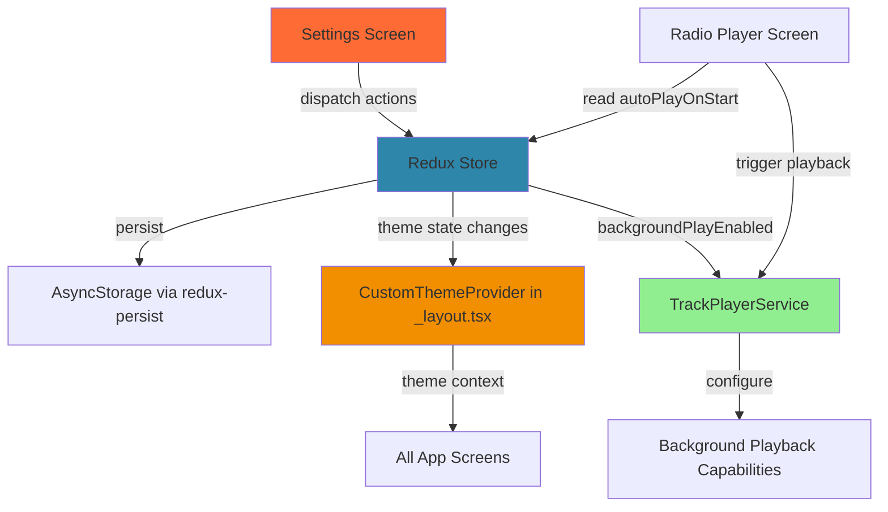
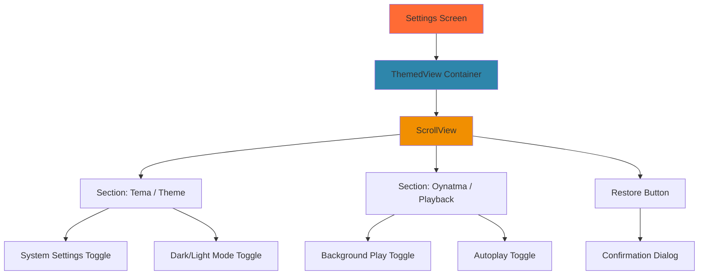
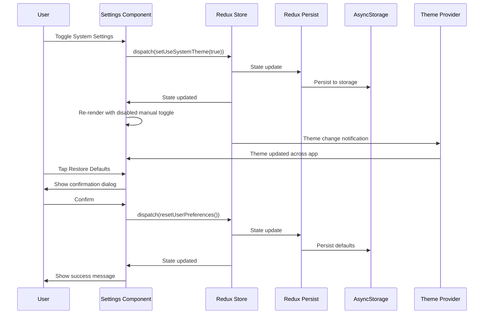
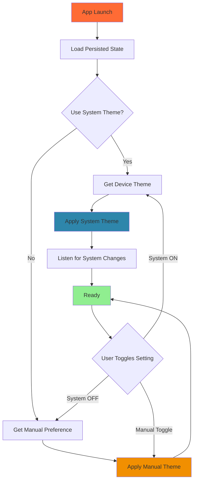

# Design Document - Settings Page

## Overview

The Settings Page is a simplified, focused interface that provides users with four essential app configuration options: system theme preference, manual dark/light mode selection, background playback control, and autoplay behavior. The implementation replaces the existing comprehensive settings page with a streamlined version that adheres to the "Simple is better" principle. The design leverages existing Redux state management patterns, AsyncStorage persistence, and themed UI components to deliver a consistent, maintainable solution fully localized in Turkish.

This design builds entirely on the existing codebase architecture, reusing the Redux Toolkit settingsSlice, AsyncStorage integration via redux-persist, ThemedView/ThemedText components, and established navigation patterns.

## Steering Document Alignment

### Technical Standards (tech.md)

**State Management:**
- Uses existing Redux Toolkit with `@reduxjs/toolkit` for global state management
- Leverages the current `settingsSlice.ts` pattern with reducers and actions
- Employs redux-persist with AsyncStorage for cross-restart persistence

**UI Components:**
- Uses existing `ThemedView` and `ThemedText` components from the codebase
- Leverages React Native's native `Switch` component for toggle controls
- Follows the established pattern of `useThemeColor` hook for dynamic theming

**Code Standards:**
- All code and comments in English
- Turkish UI strings using JSX expressions from `constants/strings.ts`
- Full TypeScript typing with no `any` types
- Functional components with hooks (no class components)

**Dependencies:**
- `@react-native-async-storage/async-storage` - Already in use for storage
- `@reduxjs/toolkit` and `redux-persist` - Already configured
- `react-native` - Core framework (Switch, ScrollView, Alert)
- `@expo/vector-icons` - Icon library (Ionicons)

**Performance Requirements:**
- Theme changes apply instantly (< 100ms) via React context updates
- Toggle interactions have immediate visual feedback
- AsyncStorage operations don't block UI (redux-persist handles async writes)

### Project Structure (structure.md)

**File Locations:**
```
mobile/
├── app/
│   └── settings.tsx                    # Settings screen (REPLACE existing)
├── store/
│   └── slices/
│       └── settingsSlice.ts            # Redux slice (SIMPLIFY existing)
├── constants/
│   ├── strings.ts                      # Turkish UI strings (ADD new strings)
│   └── themes.ts                       # Theme configuration (EXISTING)
├── components/
│   ├── themed-view.tsx                 # Themed container (REUSE)
│   └── themed-text.tsx                 # Themed text (REUSE)
└── hooks/
    └── use-color-scheme.ts             # Color scheme hook (REUSE)
```

**Component Organization:**
- Settings screen in `app/settings.tsx` following existing screen pattern
- No new components needed - reuse ThemedView, ThemedText, native Switch
- Redux state in `store/slices/settingsSlice.ts` following established slice pattern

**Navigation:**
- Settings screen accessible via bottom tab navigation (already configured)
- No new navigation setup required - existing tab already points to settings.tsx

## Code Reuse Analysis

### Existing Components to Leverage

**1. ThemedView Component** (`components/themed-view.tsx`)
- **Usage**: Container for the entire settings screen
- **Integration**: Wrap settings content to automatically handle light/dark backgrounds
- **Pattern**: `<ThemedView style={styles.container}>{content}</ThemedView>`

**2. ThemedText Component** (`components/themed-text.tsx`)
- **Usage**: All text labels, headers, and descriptions
- **Types Available**: `default`, `title`, `subtitle`, `defaultSemiBold`
- **Pattern**: `<ThemedText type="subtitle">{strings.settings.title}</ThemedText>`

**3. Native Switch Component** (React Native)
- **Usage**: All four toggle controls
- **Pattern**: Already used in existing settings.tsx
- **Configuration**: Platform-specific colors, disabled state support

**4. Alert Component** (React Native)
- **Usage**: Confirmation dialog for "Restore Defaults"
- **Pattern**: `Alert.alert(title, message, buttons)` - platform-native dialogs

### Existing Services to Leverage

**1. Redux Store** (`store/index.ts`)
- **Current Setup**: Redux Toolkit store with redux-persist configured
- **Persistence**: AsyncStorage backend, settings slice already whitelisted
- **Integration**: Use existing `useAppDispatch` and `useAppSelector` typed hooks

**2. Settings Slice** (`store/slices/settingsSlice.ts`)
- **Current State**: Contains `userPreferences` object with various settings
- **Actions Available**: `setTheme`, `setAutoPlayOnStart`, `setBackgroundPlayEnabled`, `resetUserPreferences`
- **Modification**: Simplify `userPreferences` interface, remove unused fields

**3. Theme System** (`constants/themes.ts`)
- **Available**: `LightTheme`, `DarkTheme` with complete color palettes
- **Hook**: `useColorScheme()` for system theme detection
- **Integration**: Already integrated with React Navigation theming

### Existing Utilities to Leverage

**1. useThemeColor Hook** (`hooks/use-theme-color.ts`)
- **Purpose**: Get themed colors dynamically
- **Usage**: `const backgroundColor = useThemeColor({}, 'background')`
- **Integration**: Used by ThemedView and ThemedText internally

**2. Redux Typed Hooks** (`store/hooks.ts`)
- **Available**: `useAppDispatch`, `useAppSelector`, `useAppStore`
- **Purpose**: Fully typed Redux hooks for TypeScript safety
- **Usage**: Replace `useDispatch` and `useSelector` with typed versions

**3. String Constants** (`constants/strings.ts`)
- **Pattern**: Centralized Turkish strings organized by feature
- **Integration**: Import and reference: `strings.settings.darkMode`
- **Extension**: Add new strings for the 4 settings in Turkish

### Integration Points

**1. Redux State Persistence**
- **Location**: `store/index.ts` with redux-persist configuration
- **Current**: Settings slice is already whitelisted for persistence
- **Integration**: No changes needed - simplified settings will auto-persist

**2. Theme Provider**
- **Location**: `app/_layout.tsx` with CustomThemeProvider
- **Current**: Theme changes propagate through React context
- **Integration**: CustomThemeProvider subscribes to Redux theme state and applies theme

**Theme Provider Integration Pattern:**
```typescript
// In app/_layout.tsx
export default function RootLayout() {
  // Subscribe to theme settings from Redux
  const useSystemTheme = useAppSelector(
    state => state.settings.userPreferences.useSystemTheme
  );
  const isDarkMode = useAppSelector(
    state => state.settings.userPreferences.isDarkMode
  );
  const systemScheme = useColorScheme();

  // Calculate current theme based on settings
  const currentTheme = useMemo(() => {
    if (useSystemTheme) {
      return systemScheme === 'dark' ? DarkTheme : LightTheme;
    }
    return isDarkMode ? DarkTheme : LightTheme;
  }, [useSystemTheme, isDarkMode, systemScheme]);

  return (
    <CustomThemeProvider theme={currentTheme}>
      <ThemeProvider value={currentTheme === DarkTheme ? DarkNavigationTheme : LightNavigationTheme}>
        <Stack>{/* ... */}</Stack>
      </ThemeProvider>
    </CustomThemeProvider>
  );
}
```

**3. Audio Player Service**
- **Location**: `services/audio/TrackPlayerService.ts`
- **Current**: Needs to monitor Redux state for background play preferences
- **Integration**: Service should subscribe to `backgroundPlayEnabled` state changes

**TrackPlayerService Integration Pattern:**
```typescript
// In TrackPlayerService.ts or Radio Player Screen
import { store } from '@/store';

// Subscribe to background play changes
store.subscribe(() => {
  const backgroundPlayEnabled = store.getState().settings.userPreferences.backgroundPlayEnabled;

  // Update TrackPlayer capabilities based on setting
  TrackPlayer.updateOptions({
    capabilities: backgroundPlayEnabled
      ? [Capability.Play, Capability.Pause, Capability.Stop]
      : [Capability.Play, Capability.Pause],
    compactCapabilities: backgroundPlayEnabled
      ? [Capability.Play, Capability.Pause]
      : [],
    notificationCapabilities: backgroundPlayEnabled
      ? [Capability.Play, Capability.Pause]
      : [],
  });
});
```

**Note**: This subscription ensures notification controls appear/disappear based on the background play setting as per Requirement 3, AC#6-7.

**4. App Launch Logic**
- **Location**: Radio player screen (`app/(tabs)/index.tsx`)
- **Current**: Initialization on component mount
- **Integration**: Add useEffect to check `autoPlayOnStart` and trigger playback

**Autoplay Implementation Pattern:**
```typescript
// In app/(tabs)/index.tsx (Radio Player Screen)
export default function RadioPlayerScreen() {
  const autoPlayOnStart = useAppSelector(
    state => state.settings.userPreferences.autoPlayOnStart
  );
  const backgroundPlayEnabled = useAppSelector(
    state => state.settings.userPreferences.backgroundPlayEnabled
  );
  const [hasAttemptedAutoplay, setHasAttemptedAutoplay] = useState(false);

  useEffect(() => {
    // Only attempt autoplay once on mount
    if (autoPlayOnStart && !hasAttemptedAutoplay) {
      setHasAttemptedAutoplay(true);

      // Delay to ensure redux-persist rehydration is complete
      setTimeout(async () => {
        try {
          // Check if launching in background (deep link, notification)
          const appState = AppState.currentState;
          const shouldPlay = appState === 'active' ||
            (appState === 'background' && backgroundPlayEnabled);

          if (shouldPlay) {
            await TrackPlayerService.play();
          }
        } catch (error) {
          // Handle autoplay failure per Requirement 4, AC#4
          Alert.alert('Hata', 'Bağlantı hatası. Lütfen tekrar deneyin.');
        }
      }, 500);
    }
  }, [autoPlayOnStart, backgroundPlayEnabled, hasAttemptedAutoplay]);

  // ... rest of component
}
```

**Background Launch Handling**: This pattern addresses Requirement 4, AC#6 by checking `AppState.currentState` to determine if the app was launched in foreground or background, and respects the `backgroundPlayEnabled` setting when deciding whether to start playback.

## Architecture

### System Architecture



### Component Hierarchy



### State Management Flow



### Theme Switching Logic



## Components and Interfaces

### Component 1: Settings Screen

**File:** `app/settings.tsx`

**Purpose:** Main settings page UI with four toggle controls and restore defaults button

**Interfaces:**
```typescript
// No props - screen component
interface SettingsScreenProps {}

// Internal state for conditional rendering
interface SettingsState {
  useSystemTheme: boolean;
  isDarkMode: boolean;
  backgroundPlayEnabled: boolean;
  autoPlayOnStart: boolean;
}
```

**Dependencies:**
- Redux hooks: `useAppSelector`, `useAppDispatch`
- Theme hooks: `useColorScheme`
- React Native: `ScrollView`, `Switch`, `Alert`, `StyleSheet`
- Components: `ThemedView`, `ThemedText`
- Constants: `strings` from `constants/strings.ts`

**Reuses:**
- ThemedView for containers
- ThemedText for labels and headers
- Switch component pattern from existing settings.tsx
- Alert.alert for confirmation dialogs

**Key Behaviors:**
- Loads settings from Redux state on mount
- Dispatches actions on toggle changes
- Disables manual theme toggle when system setting is on
- Shows confirmation dialog before restore defaults
- Displays success feedback after restore

### Component 2: Redux Settings Slice

**File:** `store/slices/settingsSlice.ts`

**Purpose:** Manage simplified settings state with persistence

**Interfaces:**
```typescript
interface UserPreferences {
  // Theme settings
  useSystemTheme: boolean;        // Default: true
  isDarkMode: boolean;            // Default: false (light mode)

  // Playback settings
  backgroundPlayEnabled: boolean; // Default: true
  autoPlayOnStart: boolean;       // Default: false
}

interface SettingsState {
  userPreferences: UserPreferences;
  isLoading: boolean;
  error: string | null;
}
```

**Actions:**
```typescript
// Theme actions
setUseSystemTheme(state, action: PayloadAction<boolean>)
setIsDarkMode(state, action: PayloadAction<boolean>)

// Playback actions
setBackgroundPlayEnabled(state, action: PayloadAction<boolean>)
setAutoPlayOnStart(state, action: PayloadAction<boolean>)

// Reset action
resetUserPreferences(state)
```

**Dependencies:**
- `@reduxjs/toolkit` for createSlice
- Initial state constants

**Reuses:**
- Existing settingsSlice.ts structure and patterns
- Existing redux-persist configuration
- Existing typed hooks pattern

**Migration Strategy:**
- Keep existing action names where possible (`setBackgroundPlayEnabled`, `setAutoPlayOnStart`)
- Add new actions: `setUseSystemTheme`, `setIsDarkMode`
- Remove unused actions: `setAudioQuality`, `setNotificationsEnabled`, cache-related actions
- Preserve state structure for smooth migration

### Component 3: Turkish Strings

**File:** `constants/strings.ts`

**Purpose:** Centralized Turkish localization for settings UI

**Interfaces:**
```typescript
interface SettingsStrings {
  title: string;

  // Theme section
  themeSection: string;
  useSystemTheme: string;
  useSystemThemeDescription: string;
  darkMode: string;
  darkModeDescription: string;

  // Playback section
  playbackSection: string;
  backgroundPlay: string;
  backgroundPlayDescription: string;
  autoPlay: string;
  autoPlayDescription: string;

  // Restore defaults
  restoreDefaults: string;
  restoreConfirmTitle: string;
  restoreConfirmMessage: string;
  restoreSuccess: string;
  cancel: string;
  confirm: string;
}
```

**Dependencies:** None

**Reuses:**
- Existing strings.ts structure and organization pattern
- Existing Turkish character encoding

**Values (Turkish):**
- `title`: "Ayarlar"
- `useSystemTheme`: "Sistem Ayarlarını Kullan"
- `darkMode`: "Karanlık Mod"
- `backgroundPlay`: "Arka Planda Çal"
- `autoPlay`: "Otomatik Başlat"
- `restoreDefaults`: "Varsayılana Dön"
- `restoreConfirmMessage`: "Emin misiniz?"
- `restoreSuccess`: "Ayarlar varsayılana döndürüldü"

## Data Models

### UserPreferences Model

```typescript
interface UserPreferences {
  // Theme preferences
  useSystemTheme: boolean;        // Controls whether to follow device theme
  isDarkMode: boolean;            // Manual theme selection (when useSystemTheme is false)

  // Playback preferences
  backgroundPlayEnabled: boolean; // Controls background audio playback
  autoPlayOnStart: boolean;       // Controls autoplay on app launch
}
```

**Default Values:**
```typescript
const defaultUserPreferences: UserPreferences = {
  useSystemTheme: true,
  isDarkMode: false,
  backgroundPlayEnabled: true,
  autoPlayOnStart: false,
};
```

**Storage Location:** AsyncStorage via redux-persist
- **Key:** `persist:root` (Redux persist root)
- **Nested Path:** `settings.userPreferences`
- **Format:** JSON string

**Persistence Strategy:**
- Redux persist automatically saves state to AsyncStorage on every change
- Debounced writes (default 1s delay) to avoid excessive I/O
- Rehydration on app launch before UI renders

### SettingsState Model (Redux)

```typescript
interface SettingsState {
  userPreferences: UserPreferences;
  isLoading: boolean;              // For future async operations
  error: string | null;            // For future error handling
}
```

**Initial State:**
```typescript
const initialState: SettingsState = {
  userPreferences: defaultUserPreferences,
  isLoading: false,
  error: null,
};
```

## UI Design Specifications

### Layout Structure

```
┌─────────────────────────────────────┐
│  ← Ayarlar                          │ ← Navigation header
├─────────────────────────────────────┤
│                                     │
│  TEMA                               │ ← Section header
│  ┌─────────────────────────────────┐│
│  │ Sistem Ayarlarını Kullan   [●]  ││ ← Toggle ON
│  │ Cihazın tema ayarlarını kullan  ││ ← Subtitle
│  └─────────────────────────────────┘│
│  ┌─────────────────────────────────┐│
│  │ Karanlık Mod               [○]  ││ ← Toggle OFF (disabled)
│  │ Karanlık tema kullan            ││ ← Grayed out
│  └─────────────────────────────────┘│
│                                     │
│  OYNATMA                            │ ← Section header
│  ┌─────────────────────────────────┐│
│  │ Arka Planda Çal            [●]  ││ ← Toggle ON
│  │ Uygulama arka plandayken çal    ││
│  └─────────────────────────────────┘│
│  ┌─────────────────────────────────┐│
│  │ Otomatik Başlat            [○]  ││ ← Toggle OFF
│  │ Açılışta otomatik çalmaya başla││
│  └─────────────────────────────────┘│
│                                     │
│  ┌─────────────────────────────────┐│
│  │      Varsayılana Dön            ││ ← Button
│  └─────────────────────────────────┘│
│                                     │
└─────────────────────────────────────┘
```

### Visual Specifications

**Section Headers:**
- Font: System bold, 13pt
- Color: Secondary text color (themed)
- Letter spacing: 1.2
- Uppercase: Yes
- Padding: 24pt top, 16pt bottom

**Setting Item:**
- Height: 60pt minimum
- Padding: 16pt horizontal, 12pt vertical
- Background: Card background (themed)
- Border radius: 12pt
- Margin: 8pt between items

**Setting Label:**
- Font: System medium, 16pt
- Color: Primary text color (themed)
- Position: Left aligned

**Setting Subtitle:**
- Font: System regular, 13pt
- Color: Secondary text color (themed)
- Position: Below label, left aligned
- Opacity: 0.6

**Switch Toggle:**
- Position: Right aligned, vertically centered
- Size: Platform default (iOS: 51×31pt, Android: 48×24dp)
- Track color OFF: #767577
- Track color ON: #81b0ff (or theme primary color)
- Thumb color: Platform default

**Disabled Toggle:**
- Opacity: 0.4
- Interaction: Disabled
- Visual: Grayed out appearance

**Restore Button:**
- Height: 50pt
- Background: Destructive color (#FF3B30) or theme accent
- Text color: White
- Font: System semibold, 16pt
- Border radius: 12pt
- Margin top: 32pt

### Confirmation Dialog

**Title:** "Varsayılana Dön"
**Message:** "Emin misiniz? Tüm ayarlar varsayılan değerlere dönecek."
**Buttons:**
- Cancel: "İptal" (left, default style)
- Confirm: "Evet" (right, destructive style)

**Platform Behavior:**
- iOS: Uses native Alert with two buttons
- Android: Uses native AlertDialog with two buttons

## Error Handling

### Error Scenarios

#### Scenario 1: AsyncStorage Write Failure

**Description:** Redux persist fails to write settings to AsyncStorage due to storage quota or I/O error

**Handling:**
- Redux persist silently catches error and retries on next change
- User continues to use app with in-memory state
- On next successful write, state is persisted

**User Impact:**
- No visible error to user
- Settings may not persist if app force-quit before successful write
- Minimal impact due to automatic retry mechanism

**Implementation:**
```typescript
// Redux persist configuration with error handling
const persistConfig = {
  key: 'root',
  storage: AsyncStorage,
  whitelist: ['settings'],
  writeFailHandler: (err) => {
    console.error('Redux persist write failed:', err);
    // Silent failure - retry on next change
  },
};
```

#### Scenario 2: Theme Application Failure

**Description:** Theme change dispatched but React Navigation theme doesn't update due to context issue

**Handling:**
- Check if CustomThemeProvider is properly wrapping navigation
- Verify theme subscription in root layout
- Fallback to system theme if custom theme fails

**User Impact:**
- Visual inconsistency if theme doesn't apply
- User may need to restart app to fix theme

**Implementation:**
```typescript
// Error boundary in theme provider
try {
  applyTheme(newTheme);
} catch (error) {
  console.error('Theme application failed:', error);
  // Fallback to system theme
  applyTheme(useColorScheme() === 'dark' ? DarkTheme : LightTheme);
}
```

#### Scenario 3: Autoplay Fails on Launch

**Description:** autoPlayOnStart is true but playback fails due to network error or audio permission

**Handling:**
- Catch error in TrackPlayerService
- Show user-friendly error toast
- Don't retry automatically (per requirement)
- Log error for debugging

**User Impact:**
- User sees error message: "Bağlantı hatası. Lütfen tekrar deneyin."
- User can manually tap play button
- No automatic retry to avoid annoying repeated errors

**Implementation:**
```typescript
// In radio player screen useEffect
useEffect(() => {
  const tryAutoplay = async () => {
    if (autoPlayOnStart) {
      try {
        await TrackPlayerService.play();
      } catch (error) {
        // Show error, don't retry
        Alert.alert('Hata', 'Bağlantı hatası. Lütfen tekrar deneyin.');
      }
    }
  };
  tryAutoplay();
}, []);
```

#### Scenario 4: Background Play Permission Denied (iOS)

**Description:** User enables background play but iOS audio session setup fails due to permissions

**Handling:**
- TrackPlayerService catches permission error
- Request audio session permission
- Show error if permission denied
- Guide user to Settings app

**User Impact:**
- User sees permission request dialog
- If denied, user sees error with instructions
- User must manually enable permission in iOS Settings

**Implementation:**
```typescript
// In TrackPlayerService
try {
  await TrackPlayer.setupPlayer({
    capabilities: [Capability.Play, Capability.Pause],
    compactCapabilities: [Capability.Play, Capability.Pause],
  });
} catch (error) {
  if (error.code === 'PERMISSION_DENIED') {
    Alert.alert(
      'İzin Gerekli',
      'Arka planda çalmak için ses izni gerekiyor. Lütfen ayarlardan izin verin.',
      [{ text: 'Ayarlar', onPress: () => Linking.openSettings() }]
    );
  }
}
```

#### Scenario 5: State Rehydration Failure

**Description:** App launches but redux-persist fails to rehydrate state from AsyncStorage

**Handling:**
- Redux persist provides `PersistGate` to show loading until rehydration complete
- If rehydration fails, fall back to initial state
- Log error for debugging

**User Impact:**
- Brief loading screen on app launch (< 500ms)
- If rehydration fails, settings reset to defaults
- User can reconfigure settings

**Implementation:**
```typescript
// In app/_layout.tsx
<PersistGate
  loading={<LoadingScreen />}
  persistor={persistor}
  onBeforeLift={async () => {
    // Called before rehydration - can check health
  }}
>
  {children}
</PersistGate>
```

## Testing Strategy

### Unit Testing

**Settings Slice Tests:**
```typescript
describe('settingsSlice', () => {
  test('setUseSystemTheme updates state correctly', () => {
    const state = reducer(initialState, setUseSystemTheme(false));
    expect(state.userPreferences.useSystemTheme).toBe(false);
  });

  test('setIsDarkMode updates state correctly', () => {
    const state = reducer(initialState, setIsDarkMode(true));
    expect(state.userPreferences.isDarkMode).toBe(true);
  });

  test('resetUserPreferences restores defaults', () => {
    const modifiedState = {
      ...initialState,
      userPreferences: {
        useSystemTheme: false,
        isDarkMode: true,
        backgroundPlayEnabled: false,
        autoPlayOnStart: true,
      },
    };
    const state = reducer(modifiedState, resetUserPreferences());
    expect(state.userPreferences).toEqual(defaultUserPreferences);
  });
});
```

**Component Tests:**
```typescript
describe('Settings Screen', () => {
  test('renders all four toggles', () => {
    render(<SettingsScreen />);
    expect(screen.getByText('Sistem Ayarlarını Kullan')).toBeTruthy();
    expect(screen.getByText('Karanlık Mod')).toBeTruthy();
    expect(screen.getByText('Arka Planda Çal')).toBeTruthy();
    expect(screen.getByText('Otomatik Başlat')).toBeTruthy();
  });

  test('disables dark mode toggle when system theme is on', () => {
    const { getByTestId } = render(<SettingsScreen />);
    const systemToggle = getByTestId('system-theme-toggle');
    const darkModeToggle = getByTestId('dark-mode-toggle');

    fireEvent(systemToggle, 'onValueChange', true);
    expect(darkModeToggle.props.disabled).toBe(true);
  });

  test('shows confirmation dialog on restore defaults', () => {
    const { getByText } = render(<SettingsScreen />);
    const restoreButton = getByText('Varsayılana Dön');

    fireEvent.press(restoreButton);
    expect(Alert.alert).toHaveBeenCalledWith(
      expect.any(String),
      'Emin misiniz?',
      expect.any(Array)
    );
  });
});
```

### Integration Testing

**Theme Switching Flow:**
1. Launch app with system theme ON
2. Verify app theme matches device theme
3. Toggle system theme OFF
4. Verify manual toggle becomes enabled
5. Toggle dark mode ON
6. Verify app switches to dark theme
7. Close and relaunch app
8. Verify theme persisted correctly

**Background Play Flow:**
1. Toggle background play ON
2. Start audio playback
3. Minimize app
4. Verify audio continues playing
5. Toggle background play OFF
6. Minimize app again
7. Verify audio stops playing

**Autoplay Flow:**
1. Toggle autoplay ON
2. Close app completely
3. Relaunch app
4. Verify audio starts automatically within 3 seconds
5. Toggle autoplay OFF
6. Close and relaunch
7. Verify audio doesn't start

**Restore Defaults Flow:**
1. Change all four settings from defaults
2. Tap restore defaults button
3. Tap cancel in confirmation dialog
4. Verify settings unchanged
5. Tap restore defaults again
6. Tap confirm
7. Verify all settings restored to defaults
8. Verify success message shown
9. Close and relaunch app
10. Verify defaults persisted

### End-to-End Testing

**Complete User Journey:**
1. **Fresh Install:**
   - Install app
   - Launch for first time
   - Verify system theme ON, dark mode OFF, background play ON, autoplay OFF

2. **Customize Settings:**
   - Navigate to settings
   - Toggle system theme OFF
   - Enable dark mode
   - Verify app theme changes to dark
   - Toggle autoplay ON
   - Close app

3. **Verify Persistence:**
   - Relaunch app
   - Verify autoplay starts playback
   - Open settings
   - Verify dark mode and autoplay still ON

4. **Background Play Test:**
   - Toggle background play OFF
   - Go to home screen
   - Start radio playback
   - Minimize app
   - Verify playback stops
   - Toggle background play ON
   - Minimize app again
   - Verify playback continues

5. **Restore Defaults:**
   - Tap restore defaults
   - Confirm
   - Verify all settings reset
   - Verify theme switches back to light (system)
   - Close and relaunch
   - Verify autoplay doesn't trigger
   - Verify defaults persisted

**Platform-Specific Tests:**
- Run all flows on both iOS and Android
- Verify toggle appearance matches platform conventions
- Verify confirmation dialog matches platform style
- Test theme switching with device system theme changes
- Test background playback with platform-specific audio sessions

### Manual Testing Checklist

- [ ] All Turkish strings render correctly with special characters
- [ ] Toggle switches respond immediately to touch
- [ ] Disabled toggle is visually distinct but still visible
- [ ] Theme changes apply instantly across entire app
- [ ] Confirmation dialog shows proper Turkish text
- [ ] Success message appears after restore defaults
- [ ] Settings persist across app restarts
- [ ] Settings persist across device reboots
- [ ] Autoplay respects background play setting on launch
- [ ] Background play controls appear/disappear in notification center
- [ ] Screen readers correctly announce toggle states in Turkish
- [ ] Touch targets are adequate size (minimum 44pt)
- [ ] Scrolling is smooth on long settings list
- [ ] No console errors or warnings during normal usage

## Implementation Notes

### Code Organization

**File Modification Order:**
1. `constants/strings.ts` - Add new Turkish strings first
2. `store/slices/settingsSlice.ts` - Simplify state and actions
3. `app/settings.tsx` - Replace UI with new simplified version
4. `app/(tabs)/index.tsx` - Add autoplay logic to radio player
5. Test and verify all functionality

### Migration Considerations

**Backward Compatibility:**
- Existing users may have old settings structure in AsyncStorage
- Redux persist will merge new structure with old
- Missing fields will use default values from initialState
- Migration logic will transform old state to new state cleanly

**State Cleanup with Migration:**
```typescript
// In store/slices/settingsSlice.ts
import { createMigrate, PersistConfig } from 'redux-persist';

// Migration logic to transform old state to new simplified state
const migrations = {
  1: (state: any) => {
    // Transform old comprehensive state to new simplified state
    return {
      userPreferences: {
        // Map old theme setting to new system theme preference
        useSystemTheme: state.userPreferences?.theme === 'system' ?? true,
        isDarkMode: state.userPreferences?.theme === 'dark' ?? false,

        // Preserve existing background play and autoplay settings
        backgroundPlayEnabled: state.userPreferences?.backgroundPlayEnabled ?? true,
        autoPlayOnStart: state.userPreferences?.autoPlayOnStart ?? false,
      },
      isLoading: false,
      error: null,
    };
  },
};

// Apply migration to persist config
export const settingsPersistConfig: PersistConfig<SettingsState> = {
  key: 'settings',
  storage: AsyncStorage,
  version: 1,
  migrate: createMigrate(migrations, { debug: false }),
};
```

**Migration Strategy:**
1. Increment version to 1 in persist config
2. Transform old `theme: 'light' | 'dark' | 'system'` to new `useSystemTheme` and `isDarkMode` booleans
3. Preserve `backgroundPlayEnabled` and `autoPlayOnStart` if they exist
4. Remove old unused fields (audioQuality, notifications, cache settings)
5. Redux-persist automatically runs migration on rehydration

**Result**: Clean state structure with no unused data, smooth upgrade for existing users.

### Performance Optimizations

**Memoization:**
```typescript
// Custom hook to get current theme based on settings
const useCurrentTheme = () => {
  const useSystemTheme = useAppSelector(
    state => state.settings.userPreferences.useSystemTheme
  );
  const isDarkMode = useAppSelector(
    state => state.settings.userPreferences.isDarkMode
  );
  const systemScheme = useColorScheme();

  return useMemo(() => {
    if (useSystemTheme) {
      return systemScheme === 'dark' ? DarkTheme : LightTheme;
    }
    return isDarkMode ? DarkTheme : LightTheme;
  }, [useSystemTheme, isDarkMode, systemScheme]);
};
```

**Debounced Persistence:**
- Redux persist already debounces writes (1s default)
- No additional debouncing needed
- Instant UI feedback, batched storage writes

**Conditional Rendering:**
- Use `disabled` prop on Switch instead of conditional rendering
- Keeps component tree stable, better performance
- Smoother animations and transitions

### Accessibility Implementation

**Screen Reader Support:**
```typescript
<Switch
  value={isDarkMode}
  onValueChange={handleDarkModeToggle}
  disabled={useSystemTheme}
  accessible={true}
  accessibilityLabel={strings.settings.darkMode}
  accessibilityHint={strings.settings.darkModeDescription}
  accessibilityState={{ disabled: useSystemTheme, checked: isDarkMode }}
/>
```

**Touch Target Sizing:**
```typescript
const styles = StyleSheet.create({
  settingItem: {
    minHeight: 60, // Ensures 44pt minimum touch target
    paddingHorizontal: 16,
    paddingVertical: 12,
  },
});
```

### Localization Best Practices

**String Centralization:**
```typescript
// constants/strings.ts
export const strings = {
  settings: {
    title: 'Ayarlar',
    themeSection: 'TEMA',
    useSystemTheme: 'Sistem Ayarlarını Kullan',
    useSystemThemeDescription: 'Cihazın tema ayarlarını kullan',
    // ... all other strings
  },
};
```

**Usage in Components:**
```typescript
import { strings } from '@/constants/strings';

<ThemedText type="subtitle">{strings.settings.title}</ThemedText>
```

**Testing Turkish Characters:**
- Verify ç, ğ, ı, ö, ş, ü render correctly on all platforms
- Test with different system fonts
- Ensure proper text wrapping with Turkish words

### Platform-Specific Considerations

**iOS:**
- Use `UIImpactFeedbackGenerator` for haptic feedback on toggle (optional)
- Respect iOS HIG for switch appearance and behavior
- Test with iOS 15+ dark mode system settings
- Verify proper audio session category for background play

**Android:**
- Use Material Design switch styling
- Test with Android 12+ Material You theming
- Verify proper foreground service for background play
- Handle audio focus correctly

**Cross-Platform:**
- Use `Platform.OS` only when absolutely necessary
- Prefer React Native's cross-platform components
- Test on both platforms for every change
- Use platform-specific styles only for fine-tuning

## Conclusion

This design leverages the existing Trend Ankara mobile app architecture to deliver a simplified, focused settings page. By reusing established patterns (Redux Toolkit state management, redux-persist for storage, ThemedView/ThemedText components, and Turkish string constants), the implementation will be straightforward and maintainable. The design adheres to all steering document principles: simple is better, respect user resources, full Turkish localization, and no overengineering. The atomic task breakdown in the next phase will ensure smooth, step-by-step implementation.
