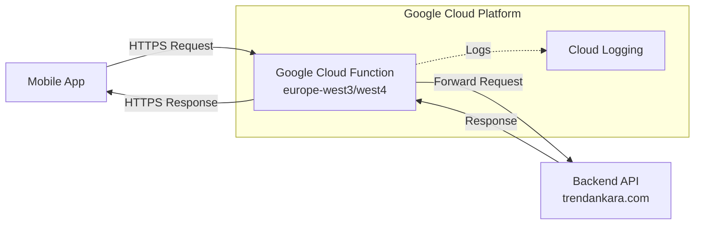

# gcp-proxy-gateway - Task 6

Execute task 6 for the gcp-proxy-gateway specification.

## Task Description
Create Google Cloud deployment script

## Requirements Reference
**Requirements**: 2.1, 2.2, 3.1, 3.2, 3.3

## Usage
```
/Task:6-gcp-proxy-gateway
```

## Instructions

Execute with @spec-task-executor agent the following task: "Create Google Cloud deployment script"

```
Use the @spec-task-executor agent to implement task 6: "Create Google Cloud deployment script" for the gcp-proxy-gateway specification and include all the below context.

# Steering Context
## Steering Documents Context

No steering documents found or all are empty.

# Specification Context
## Specification Context (Pre-loaded): gcp-proxy-gateway

### Requirements
# Requirements Document - GCP Proxy Gateway

## Introduction

This feature implements a Google Cloud Function as a proxy gateway to bypass SSL certificate configuration issues preventing the TrendAnkara mobile application from connecting to its backend API. The proxy will act as an intermediary, handling SSL/TLS connections through Google's infrastructure while forwarding requests transparently to the backend server at trendankara.com.

## Alignment with Product Vision

This solution enables immediate restoration of mobile app functionality without waiting for the one-month timeline needed to fix SSL certificates on the main server. It ensures users can continue accessing all app features while maintaining security through Google's SSL infrastructure.

## Requirements

### Requirement 1: Proxy Gateway Core Functionality

**User Story:** As a mobile app user, I want to access all TrendAnkara API endpoints without SSL errors, so that I can use the app normally.

#### Acceptance Criteria

1. WHEN a mobile app makes a request to any API endpoint THEN the proxy SHALL forward it to the trendankara.com server
2. IF the backend server responds THEN the proxy SHALL return the exact response to the mobile app
3. WHEN any HTTP method (GET, POST, PUT, DELETE, PATCH) is used THEN the proxy SHALL support it
4. IF the request contains headers (Authorization, X-Platform, etc.) THEN the proxy SHALL forward them correctly

### Requirement 2: European Region Deployment

**User Story:** As the system administrator, I want the proxy deployed in European data centers, so that latency is minimized for users in Turkey and Netherlands.

#### Acceptance Criteria

1. WHEN deploying the function THEN it SHALL be deployed to europe-west3 (Frankfurt) or europe-west4 (Netherlands)
2. IF Frankfurt is unavailable THEN the system SHALL allow deployment to Netherlands as an alternative
3. WHEN deployed THEN the function URL SHALL reflect the European region in its domain

### Requirement 3: Cost Optimization

**User Story:** As the business owner, I want minimal cloud costs, so that the proxy solution remains economically viable.

#### Acceptance Criteria

1. WHEN configuring the function THEN memory allocation SHALL be set to 128MB maximum
2. IF no traffic is received THEN the function SHALL scale down to 0 instances
3. WHEN concurrent users increase THEN the function SHALL support up to 100 instances maximum
4. IF the function is idle THEN it SHALL NOT incur charges beyond storage

### Requirement 4: CORS and Mobile App Support

**User Story:** As a mobile app developer, I want proper CORS headers, so that the app can make cross-origin requests without issues.

#### Acceptance Criteria

1. WHEN any request is received THEN the proxy SHALL include proper CORS headers in the response
2. IF an OPTIONS preflight request is received THEN the proxy SHALL respond with 204 status and CORS headers
3. WHEN mobile-specific headers are sent THEN the proxy SHALL preserve them (X-Platform, X-App-Version, X-Device-ID)

### Requirement 5: Error Handling and Resilience

**User Story:** As a mobile app user, I want meaningful error messages when something goes wrong, so that I understand the issue.

#### Acceptance Criteria

1. WHEN the backend server times out THEN the proxy SHALL return a 504 Gateway Timeout error
2. IF the backend server is unreachable THEN the proxy SHALL return a 502 Bad Gateway error
3. WHEN any other error occurs THEN the proxy SHALL return a 500 Internal Server Error with a generic message
4. IF an error occurs THEN the proxy SHALL log the error details for debugging

### Requirement 6: Transparent API Compatibility

**User Story:** As a mobile app developer, I want to change only the base URL in my app configuration, so that integration is simple.

#### Acceptance Criteria

1. WHEN updating the mobile app THEN only the BASE_URL constant SHALL need to be changed
2. IF the proxy URL is configured THEN all existing API paths SHALL work without modification
3. WHEN query parameters are included THEN the proxy SHALL forward them correctly
4. IF request bodies are sent THEN the proxy SHALL forward them without modification

## Non-Functional Requirements

### Performance
- Response time SHALL be within 200ms of direct connection latency
- The proxy SHALL handle at least 100 concurrent connections
- Function cold start time SHALL be under 3 seconds
- Timeout SHALL be set to 30 seconds to accommodate slow backend responses

### Security
- All connections to the proxy SHALL use HTTPS
- The proxy SHALL NOT store or log sensitive data (passwords, tokens)
- Authentication headers SHALL be forwarded without inspection
- The proxy SHALL use Google Cloud's default service account with minimal permissions

### Reliability
- The proxy SHALL have 99.9% uptime (following Google Cloud SLA)
- The proxy SHALL automatically retry failed requests to the backend (up to 3 attempts)
- The proxy SHALL handle backend SSL errors gracefully
- Function logs SHALL be retained for debugging purposes

### Usability
- Deployment SHALL be automated through a single script
- Configuration SHALL support environment variables for flexibility
- Testing tools SHALL be provided to verify proxy functionality
- Documentation SHALL include clear deployment and troubleshooting guides

---

### Design
# Design Document - GCP Proxy Gateway

## Overview

The GCP Proxy Gateway is a lightweight Google Cloud Function that acts as a transparent proxy between the TrendAnkara mobile application and its backend API server. It solves SSL certificate configuration issues by leveraging Google's managed SSL infrastructure, allowing immediate restoration of mobile app functionality without modifying the backend server.

## Architecture

The solution implements a simple reverse proxy pattern using Google Cloud Functions with minimal overhead:



## Components and Interfaces

### Component 1: Proxy Function (index.js)
- **Purpose:** Main HTTP handler that receives requests and forwards them to the backend
- **Interfaces:**
  - HTTP trigger endpoint accepting all methods (GET, POST, PUT, DELETE, PATCH, OPTIONS)
  - Request/Response transformation for header management
- **Dependencies:**
  - @google-cloud/functions-framework (HTTP function framework)
  - axios (HTTP client for backend requests)
- **Configuration:**
  - TARGET_API_BASE: Backend server URL (https://trendankara.com)
  - Memory: 128MB (optimized for cost)
  - Timeout: 30 seconds
  - Region: europe-west3 or europe-west4

### Component 2: CORS Handler
- **Purpose:** Manages Cross-Origin Resource Sharing for mobile app compatibility
- **Interfaces:**
  - Sets required CORS headers on all responses
  - Handles OPTIONS preflight requests
- **Headers Managed:**
  - Access-Control-Allow-Origin: *
  - Access-Control-Allow-Methods: GET, POST, PUT, DELETE, OPTIONS, PATCH
  - Access-Control-Allow-Headers: Content-Type, Authorization, X-Platform, X-App-Version, X-Device-ID, Accept
  - Access-Control-Max-Age: 3600

### Component 3: Request Forwarding Engine
- **Purpose:** Transforms and forwards requests to the backend server
- **Interfaces:**
  - URL construction from request path
  - Header filtering and forwarding
  - Query parameter preservation
  - Request body forwarding for applicable methods
- **Header Processing:**
  - Preserves mobile app headers (X-Platform, X-App-Version, X-Device-ID)
  - Removes Google Cloud specific headers
  - Maintains authentication headers

### Component 4: Error Handler
- **Purpose:** Provides structured error responses for various failure scenarios
- **Error Types:**
  - 504 Gateway Timeout: Backend response exceeds timeout
  - 502 Bad Gateway: Backend server unreachable
  - 500 Internal Server Error: Unexpected proxy errors
- **Error Format:**
  ```json
  {
    "error": "Error Type",
    "message": "User-friendly message"
  }
  ```

## Data Models

### Request Model
```javascript
{
  method: string,           // HTTP method
  path: string,            // Request path
  headers: {               // Request headers
    'content-type': string,
    'authorization': string,
    'x-platform': string,
    'x-app-version': string,
    'x-device-id': string
  },
  query: object,           // Query parameters
  body: any                // Request body (for POST, PUT, PATCH)
}
```

### Response Model
```javascript
{
  status: number,          // HTTP status code
  headers: {              // Response headers
    'content-type': string,
    'cache-control': string,
    // CORS headers
  },
  data: any               // Response body
}
```

### Proxy Configuration
```javascript
{
  runtime: 'nodejs18',
  memory: '128MB',
  timeout: '30s',
  minInstances: 0,        // Scale to zero
  maxInstances: 100,      // Support concurrent users
  region: 'europe-west3', // or 'europe-west4'
  env: {
    TARGET_API_BASE: 'https://trendankara.com',
    NODE_ENV: 'production'
  }
}
```

## API Endpoint Mapping

All endpoints are transparently proxied with the following pattern:

| Original Backend URL | Proxy URL |
|---------------------|-----------|
| `https://trendankara.com/api/mobile/v1/*` | `https://[REGION]-[PROJECT].cloudfunctions.net/trendankara-proxy/api/mobile/v1/*` |
| `https://trendankara.com/api/admin/*` | `https://[REGION]-[PROJECT].cloudfunctions.net/trendankara-proxy/api/admin/*` |

## Error Handling

### Error Scenarios

1. **Backend Timeout**
   - **Handling:** Return 504 status with timeout message
   - **User Impact:** Request fails with clear timeout indication
   - **Logging:** Log timeout duration and endpoint

2. **Backend Unreachable**
   - **Handling:** Return 502 status with bad gateway message
   - **User Impact:** Request fails with server unavailability message
   - **Logging:** Log connection error details

3. **Invalid Request**
   - **Handling:** Forward backend's 4xx response unchanged
   - **User Impact:** Receives original validation error from backend
   - **Logging:** Log request details for debugging

4. **Proxy Internal Error**
   - **Handling:** Return 500 status with generic error message
   - **User Impact:** Request fails with internal error message
   - **Logging:** Full error stack trace for investigation

## Deployment Architecture

### Google Cloud Project Setup
```bash
# Project creation and configuration
gcloud projects create [PROJECT_ID]
gcloud config set project [PROJECT_ID]

# Enable required APIs
gcloud services enable cloudfunctions.googleapis.com
gcloud services enable cloudbuild.googleapis.com
```

### Function Deployment
```bash
gcloud functions deploy trendankara-proxy \
  --runtime nodejs18 \
  --trigger-http \
  --allow-unauthenticated \
  --entry-point proxyRequest \
  --region europe-west3 \
  --memory 128MB \
  --timeout 30s \
  --min-instances 0 \
  --max-instances 100
```

## Mobile App Integration

### Configuration Update
```javascript
// Before (Direct connection with SSL issues)
const API_BASE = 'https://trendankara.com/api/mobile/v1';

// After (Through proxy)
const API_BASE = 'https://europe-west3-[PROJECT].cloudfunctions.net/trendankara-proxy/api/mobile/v1';
```

### Environment Variable Support
```javascript
const PROXY_BASE_URL = process.env.EXPO_PUBLIC_PROXY_URL ||
  'https://europe-west3-trendankara-proxy.cloudfunctions.net/trendankara-proxy';
```

## Testing Strategy

### Unit Testing
- Test CORS header generation
- Test URL construction logic
- Test error response formatting
- Mock axios for backend request testing

### Integration Testing
- Test actual proxy forwarding with test backend
- Verify header forwarding accuracy
- Test all HTTP methods
- Validate query parameter handling

### End-to-End Testing
- Deploy to staging project first
- Test all mobile app API endpoints
- Verify authentication flow works
- Test error scenarios with backend offline

## Performance Considerations

### Optimization Strategies
- Minimal memory allocation (128MB)
- Lightweight dependencies (only essential packages)
- No request/response transformation beyond headers
- Efficient error handling without stack traces in production

### Expected Performance
- Cold start: ~1-3 seconds
- Warm response: ~50-200ms added latency
- Throughput: 100+ requests per second per instance
- Auto-scaling: 0-100 instances based on load

## Security Considerations

### Data Protection
- No logging of request/response bodies
- Authentication tokens passed through without inspection
- No data persistence or caching
- Minimal IAM permissions (default service account)

### Network Security
- All connections use HTTPS/TLS
- Google manages SSL certificates
- No direct exposure of backend server
- Request validation delegated to backend

## Monitoring and Observability

### Cloud Logging
- All requests logged with method, path, and status
- Error details logged for debugging
- Performance metrics (response times)
- No sensitive data in logs

### Metrics
- Request count by endpoint
- Error rate by type
- Response time distribution
- Cold start frequency

## Rollback Strategy

### Immediate Rollback
```javascript
// Revert mobile app configuration
const API_BASE = 'https://trendankara.com/api/mobile/v1';
```

### Gradual Migration
- Deploy proxy function
- Test with subset of users
- Monitor for issues
- Full rollout after validation
- Keep proxy as fallback option

**Note**: Specification documents have been pre-loaded. Do not use get-content to fetch them again.

## Task Details
- Task ID: 6
- Description: Create Google Cloud deployment script
- Requirements: 2.1, 2.2, 3.1, 3.2, 3.3

## Instructions
- Implement ONLY task 6: "Create Google Cloud deployment script"
- Follow all project conventions and leverage existing code
- Mark the task as complete using: claude-code-spec-workflow get-tasks gcp-proxy-gateway 6 --mode complete
- Provide a completion summary
```

## Task Completion
When the task is complete, mark it as done:
```bash
claude-code-spec-workflow get-tasks gcp-proxy-gateway 6 --mode complete
```

## Next Steps
After task completion, you can:
- Execute the next task using /gcp-proxy-gateway-task-[next-id]
- Check overall progress with /spec-status gcp-proxy-gateway
