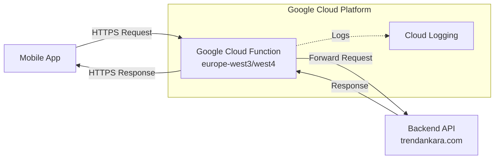

# Design Document - GCP Proxy Gateway

## Overview

The GCP Proxy Gateway is a lightweight Google Cloud Function that acts as a transparent proxy between the TrendAnkara mobile application and its backend API server. It solves SSL certificate configuration issues by leveraging Google's managed SSL infrastructure, allowing immediate restoration of mobile app functionality without modifying the backend server.

## Architecture

The solution implements a simple reverse proxy pattern using Google Cloud Functions with minimal overhead:



## Components and Interfaces

### Component 1: Proxy Function (index.js)
- **Purpose:** Main HTTP handler that receives requests and forwards them to the backend
- **Interfaces:**
  - HTTP trigger endpoint accepting all methods (GET, POST, PUT, DELETE, PATCH, OPTIONS)
  - Request/Response transformation for header management
- **Dependencies:**
  - @google-cloud/functions-framework (HTTP function framework)
  - axios (HTTP client for backend requests)
- **Configuration:**
  - TARGET_API_BASE: Backend server URL (https://trendankara.com)
  - Memory: 128MB (optimized for cost)
  - Timeout: 30 seconds
  - Region: europe-west3 or europe-west4

### Component 2: CORS Handler
- **Purpose:** Manages Cross-Origin Resource Sharing for mobile app compatibility
- **Interfaces:**
  - Sets required CORS headers on all responses
  - Handles OPTIONS preflight requests
- **Headers Managed:**
  - Access-Control-Allow-Origin: *
  - Access-Control-Allow-Methods: GET, POST, PUT, DELETE, OPTIONS, PATCH
  - Access-Control-Allow-Headers: Content-Type, Authorization, X-Platform, X-App-Version, X-Device-ID, Accept
  - Access-Control-Max-Age: 3600

### Component 3: Request Forwarding Engine
- **Purpose:** Transforms and forwards requests to the backend server
- **Interfaces:**
  - URL construction from request path
  - Header filtering and forwarding
  - Query parameter preservation
  - Request body forwarding for applicable methods
- **Header Processing:**
  - Preserves mobile app headers (X-Platform, X-App-Version, X-Device-ID)
  - Removes Google Cloud specific headers
  - Maintains authentication headers

### Component 4: Error Handler
- **Purpose:** Provides structured error responses for various failure scenarios
- **Error Types:**
  - 504 Gateway Timeout: Backend response exceeds timeout
  - 502 Bad Gateway: Backend server unreachable
  - 500 Internal Server Error: Unexpected proxy errors
- **Error Format:**
  ```json
  {
    "error": "Error Type",
    "message": "User-friendly message"
  }
  ```

## Data Models

### Request Model
```javascript
{
  method: string,           // HTTP method
  path: string,            // Request path
  headers: {               // Request headers
    'content-type': string,
    'authorization': string,
    'x-platform': string,
    'x-app-version': string,
    'x-device-id': string
  },
  query: object,           // Query parameters
  body: any                // Request body (for POST, PUT, PATCH)
}
```

### Response Model
```javascript
{
  status: number,          // HTTP status code
  headers: {              // Response headers
    'content-type': string,
    'cache-control': string,
    // CORS headers
  },
  data: any               // Response body
}
```

### Proxy Configuration
```javascript
{
  runtime: 'nodejs18',
  memory: '128MB',
  timeout: '30s',
  minInstances: 0,        // Scale to zero
  maxInstances: 100,      // Support concurrent users
  region: 'europe-west3', // or 'europe-west4'
  env: {
    TARGET_API_BASE: 'https://trendankara.com',
    NODE_ENV: 'production'
  }
}
```

## API Endpoint Mapping

All endpoints are transparently proxied with the following pattern:

| Original Backend URL | Proxy URL |
|---------------------|-----------|
| `https://trendankara.com/api/mobile/v1/*` | `https://[REGION]-[PROJECT].cloudfunctions.net/trendankara-proxy/api/mobile/v1/*` |
| `https://trendankara.com/api/admin/*` | `https://[REGION]-[PROJECT].cloudfunctions.net/trendankara-proxy/api/admin/*` |

## Error Handling

### Error Scenarios

1. **Backend Timeout**
   - **Handling:** Return 504 status with timeout message
   - **User Impact:** Request fails with clear timeout indication
   - **Logging:** Log timeout duration and endpoint

2. **Backend Unreachable**
   - **Handling:** Return 502 status with bad gateway message
   - **User Impact:** Request fails with server unavailability message
   - **Logging:** Log connection error details

3. **Invalid Request**
   - **Handling:** Forward backend's 4xx response unchanged
   - **User Impact:** Receives original validation error from backend
   - **Logging:** Log request details for debugging

4. **Proxy Internal Error**
   - **Handling:** Return 500 status with generic error message
   - **User Impact:** Request fails with internal error message
   - **Logging:** Full error stack trace for investigation

## Deployment Architecture

### Google Cloud Project Setup
```bash
# Project creation and configuration
gcloud projects create [PROJECT_ID]
gcloud config set project [PROJECT_ID]

# Enable required APIs
gcloud services enable cloudfunctions.googleapis.com
gcloud services enable cloudbuild.googleapis.com
```

### Function Deployment
```bash
gcloud functions deploy trendankara-proxy \
  --runtime nodejs18 \
  --trigger-http \
  --allow-unauthenticated \
  --entry-point proxyRequest \
  --region europe-west3 \
  --memory 128MB \
  --timeout 30s \
  --min-instances 0 \
  --max-instances 100
```

## Mobile App Integration

### Configuration Update
```javascript
// Before (Direct connection with SSL issues)
const API_BASE = 'https://trendankara.com/api/mobile/v1';

// After (Through proxy)
const API_BASE = 'https://europe-west3-[PROJECT].cloudfunctions.net/trendankara-proxy/api/mobile/v1';
```

### Environment Variable Support
```javascript
const PROXY_BASE_URL = process.env.EXPO_PUBLIC_PROXY_URL ||
  'https://europe-west3-trendankara-proxy.cloudfunctions.net/trendankara-proxy';
```

## Testing Strategy

### Unit Testing
- Test CORS header generation
- Test URL construction logic
- Test error response formatting
- Mock axios for backend request testing

### Integration Testing
- Test actual proxy forwarding with test backend
- Verify header forwarding accuracy
- Test all HTTP methods
- Validate query parameter handling

### End-to-End Testing
- Deploy to staging project first
- Test all mobile app API endpoints
- Verify authentication flow works
- Test error scenarios with backend offline

## Performance Considerations

### Optimization Strategies
- Minimal memory allocation (128MB)
- Lightweight dependencies (only essential packages)
- No request/response transformation beyond headers
- Efficient error handling without stack traces in production

### Expected Performance
- Cold start: ~1-3 seconds
- Warm response: ~50-200ms added latency
- Throughput: 100+ requests per second per instance
- Auto-scaling: 0-100 instances based on load

## Security Considerations

### Data Protection
- No logging of request/response bodies
- Authentication tokens passed through without inspection
- No data persistence or caching
- Minimal IAM permissions (default service account)

### Network Security
- All connections use HTTPS/TLS
- Google manages SSL certificates
- No direct exposure of backend server
- Request validation delegated to backend

## Monitoring and Observability

### Cloud Logging
- All requests logged with method, path, and status
- Error details logged for debugging
- Performance metrics (response times)
- No sensitive data in logs

### Metrics
- Request count by endpoint
- Error rate by type
- Response time distribution
- Cold start frequency

## Rollback Strategy

### Immediate Rollback
```javascript
// Revert mobile app configuration
const API_BASE = 'https://trendankara.com/api/mobile/v1';
```

### Gradual Migration
- Deploy proxy function
- Test with subset of users
- Monitor for issues
- Full rollout after validation
- Keep proxy as fallback option